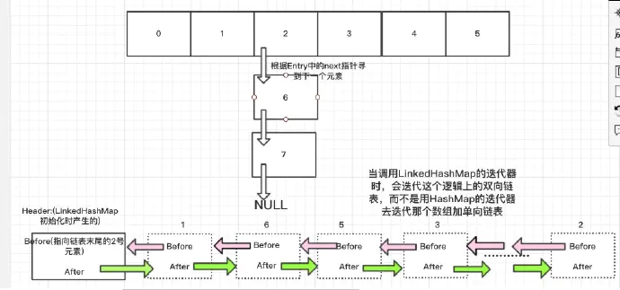

[toc]
# LinkedHashMap
##  LinkedHashMap和HashMap区别

大多数情况下，只要不涉及线程安全问题，Map基本都可以使用HashMap，**不过HashMap有一个问题，就是迭代HashMap的顺序并不是HashMap放置的顺序，也就是无序**。HashMap的这一缺点往往会带来困扰，因为有些场景，我们期待一个有序的Map.这就是我们的LinkedHashMap,看个小Demo:

```java
public static void main(String[] args) {
    Map<String, String> map = new LinkedHashMap<String, String>();
    map.put("apple", "苹果");
    map.put("watermelon", "西瓜");
    map.put("banana", "香蕉");
    map.put("peach", "桃子");

    Iterator iter = map.entrySet().iterator();
    while (iter.hasNext()) {
        Map.Entry entry = (Map.Entry) iter.next();
        System.out.println(entry.getKey() + "=" + entry.getValue());
    }
}

输出为：
apple=苹果
watermelon=西瓜
banana=香蕉
peach=桃子

```
可以看到，在使用上，LinkedHashMap和HashMap的区别就是LinkedHashMap是有序的。
上面这个例子是根据插入顺序排序，此外，LinkedHashMap还有一个参数决定是否在此基础上再根据访问顺序(get,put)排序,记住，是在插入顺序的基础上再排序，后面看了源码就知道为什么了。看下例子:

```java
public static void main(String[] args) {
    Map<String, String> map = new LinkedHashMap<String, String>(16,0.75f,true);
    map.put("apple", "苹果");
    map.put("watermelon", "西瓜");
    map.put("banana", "香蕉");
    map.put("peach", "桃子");

    map.get("banana");
    map.get("apple");

    Iterator iter = map.entrySet().iterator();
    while (iter.hasNext()) {
        Map.Entry entry = (Map.Entry) iter.next();
        System.out.println(entry.getKey() + "=" + entry.getValue());
    }
}
输出为：
watermelon=西瓜
peach=桃子
banana=香蕉
apple=苹果

```
## LinkedHashMap底层
1. LinkedHashMap继承自HashMap,它的新增(put)和获取(get)方法都是复用父类的HashMap的代码，只是自己重写了put给get内部的某些接口来搞事情，这个特性在C++中叫钩子技术，在Java里面大家喜欢叫多态，其实多态这个词并不能很好的形容这种现象。
2. LinkedHashMap的数据存储和HashMap的结构一样采用(数组+单向链表)的形式，只是在每次节点Entry中增加了用于维护顺序的before和after变量维护了一个双向链表来保存LinkedHashMap的存储顺序，当调用迭代器的时候不再使用HashMap的的迭代器，而是自己写迭代器来遍历这个双向链表即可。
3. HashMap和LinkedHashMap内部逻辑图如下:
   
## 利用LinkedHashMap实现LRU缓存

LRU即Least Recently Used，最近最少使用，也就是说，当缓存满了，会优先淘汰那些最近最不常访问的数据。我们的LinkedHashMap正好满足这个特性，为什么呢？当我们开启accessOrder为true时，最新访问(get或者put(更新操作))的数据会被丢到队列的尾巴处，那么双向队列的头就是最不经常使用的数据了。比如:
如果有1 2 3这3个Entry，那么访问了1，就把1移到尾部去，即2 3 1。每次访问都把访问的那个数据移到双向队列的尾部去，那么每次要淘汰数据的时候，双向队列最头的那个数据不就是最不常访问的那个数据了吗？换句话说，双向链表最头的那个数据就是要淘汰的数据。

此外，LinkedHashMap还提供了一个方法，这个方法就是为了我们实现LRU缓存而提供的，removeEldestEntry(Map.Entry<K,V> eldest) 方法。该方法可以提供在每次添加新条目时移除最旧条目的实现程序，默认返回 false。

简陋的LRU缓存:
```java
public class LRUCache extends LinkedHashMap
{
    public LRUCache(int maxSize)
    {
        super(maxSize, 0.75F, true);
        maxElements = maxSize;
    }

    protected boolean removeEldestEntry(java.util.Map.Entry eldest)
    {
        //逻辑很简单，当大小超出了Map的容量，就移除掉双向队列头部的元素，给其他元素腾出点地来。
        return size() > maxElements;
    }

    private static final long serialVersionUID = 1L;
    protected int maxElements;
}

```
其实 LinkedHashMap 几乎和 HashMap 一样：
从技术上来说，不同的是它定义了一个 Entry<K,V> header，这个 header 不是放在 Table 里，它是额外独立出来的。LinkedHashMap 通过继承 hashMap 中的 Entry<K,V>,并添加两个属性 Entry<K,V> before,after,和 header 结合起来组成一个双向链表，来实现按插入顺序或访问顺序排序。如何维护这个双向链表了，就是在get和put的时候用了钩子技术(多态)调用LinkedHashMap重写的方法来维护这个双向链表，然后迭代的时候直接迭代这个双向链表即可。
