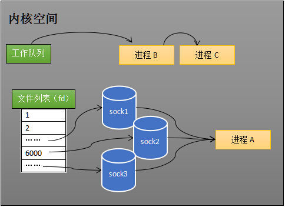
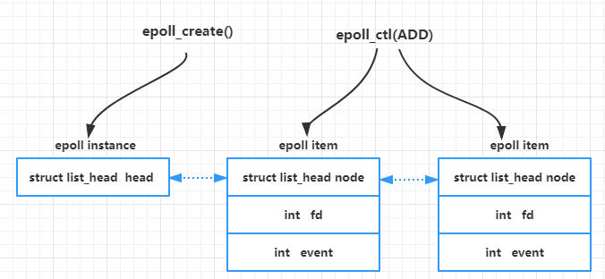
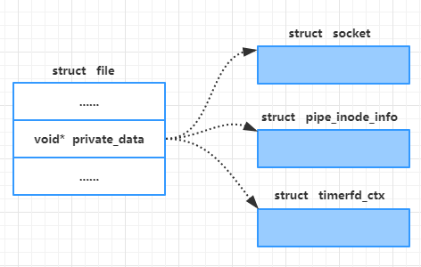
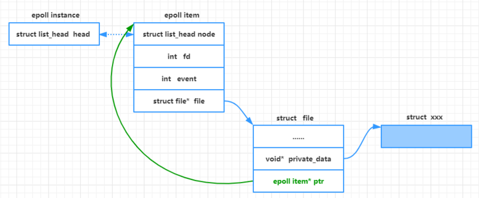
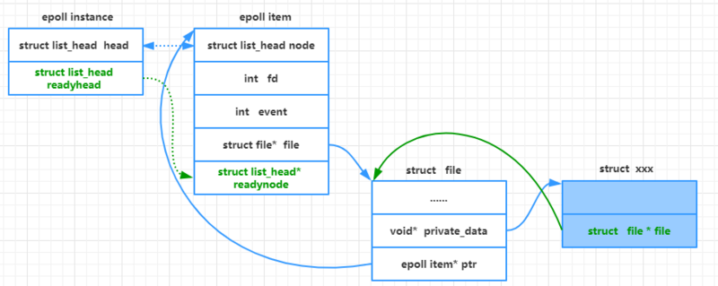
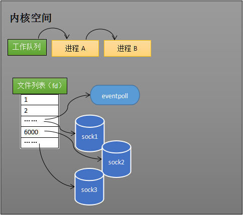
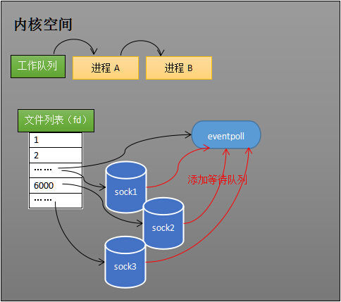
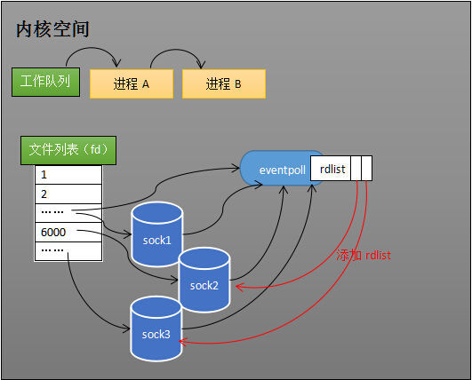
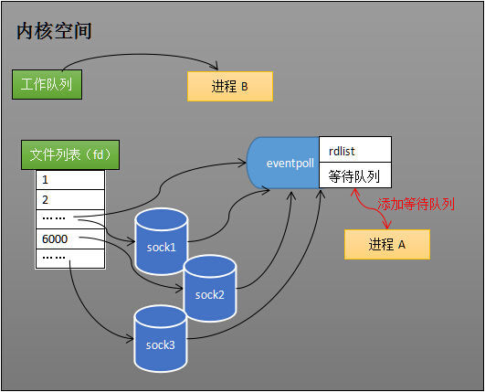
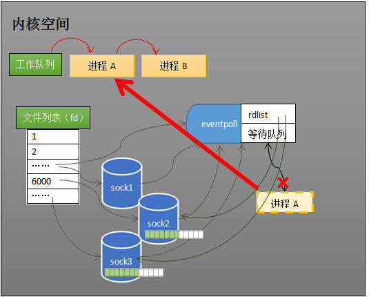

[TOC]


# BIO,NIO,AIO 总结

 Java 中的 BIO、NIO和 AIO 理解为是 Java 语言对操作系统的各种 IO 模型的封装。程序员在使用这些 API 的时候，不需要关心操作系统层面的知识，也不需要根据不同操作系统编写不同的代码。只需要使用Java的API就可以了。

在讲 BIO,NIO,AIO 之前先来回顾一下这样几个概念：同步与异步，阻塞与非阻塞。

**同步与异步**

- **同步：** 同步就是发起一个调用后，被调用者未处理完请求之前，调用不返回。
- **异步：** 异步就是发起一个调用后，立刻得到被调用者的回应表示已接收到请求，但是被调用者并没有返回结果，此时我们可以处理其他的请求，被调用者通常依靠事件，回调等机制来通知调用者其返回结果。

**同步和异步的区别最大在于异步的话调用者不需要等待处理结果，被调用者会通过回调等机制来通知调用者其返回结果。**

**阻塞和非阻塞**

- **阻塞：** 阻塞就是发起一个请求，调用者一直等待请求结果返回，也就是当前线程会被挂起，无法从事其他任务，只有当条件就绪才能继续。
- **非阻塞：** 非阻塞就是发起一个请求，调用者不用一直等着结果返回，可以先去干其他事情。

举个生活中简单的例子，你妈妈让你烧水，小时候你比较笨啊，在那里傻等着水开（**同步阻塞**）。等你稍微再长大一点，你知道每次烧水的空隙可以去干点其他事，然后只需要时不时来看看水开了没有（**同步非阻塞**）-->==主动轮询==。后来，你们家用上了水开了会发出声音的壶，这样你就只需要听到响声后就知道水开了，在这期间你可以随便干自己的事情，你需要去倒水了（**异步非阻塞**）--->==回调通知==。


## 1. BIO (Blocking I/O)

同步阻塞I/O模式，数据的读取写入必须阻塞在一个线程内等待其完成。

### 1.1 传统 BIO

BIO通信(一请求一应答)模型图如下：


采用 **BIO 通信模型** 的服务端，通常由一个独立的 Acceptor 线程负责监听客户端的连接。我们一般通过在`while(true)` 循环中服务端会调用 `accept()` 方法等待接收客户端的连接的方式监听请求，请求一旦接收到一个连接请求，就可以建立通信套接字在这个通信套接字上进行读写操作，此时不能再接收其他客户端连接请求，只能等待同当前连接的客户端的操作执行完成， 不过可以通过多线程来支持多个客户端的连接，如上图所示。

如果要让 **BIO 通信模型** 能够同时处理多个客户端请求，就必须使用多线程（主要原因是`socket.accept()`、`socket.read()`、`socket.write()` 涉及的三个主要函数都是同步阻塞的），也就是说它在接收到客户端连接请求之后为每个客户端创建一个新的线程进行链路处理，处理完成之后，通过输出流返回应答给客户端，线程销毁。这就是典型的 **一请求一应答通信模型** 。我们可以设想一下**如果这个连接不做任何事情的话就会造成不必要的线程开销**，不过可以通过 **线程池机制** 改善，线程池还可以让线程的创建和回收成本相对较低。使用`FixedThreadPool` 可以有效的控制了线程的最大数量，保证了系统有限的资源的控制，实现了N(客户端请求数量):M(处理客户端请求的线程数量)的伪异步I/O模型（N 可以远远大于 M），下面一节"伪异步 BIO"中会详细介绍到。

**我们再设想一下当客户端并发访问量增加后这种模型会出现什么问题？**

**在 Java 虚拟机中，线程是宝贵的资源，线程的创建和销毁成本很高，除此之外，线程的切换成本也是很高的**。尤其在 Linux 这样的操作系统中，线程本质上就是一个进程，创建和销毁线程都是重量级的系统函数。如果并发访问量增加会导致线程数急剧膨胀可能会导致线程堆栈溢出、创建新线程失败等问题，最终导致进程宕机或者僵死，不能对外提供服务。

### 1.2 伪异步 IO

为了解决同步阻塞I/O面临的一个链路需要一个线程处理的问题，后来有人对它的线程模型进行了优化一一一后端通过一个线程池来处理多个客户端的请求接入，形成客户端个数M：线程池最大线程数N的比例关系，其中M可以远远大于N.通**过线程池可以灵活地调配线程资源，设置线程的最大值，防止由于海量并发接入导致线程耗尽。**

伪异步IO模型图：


采用线程池和任务队列可以实现一种叫做伪异步的 I/O 通信框架，它的模型图如上图所示。当有新的客户端接入时，将客户端的 Socket 封装成一个Task（该任务实现java.lang.Runnable接口）投递到后端的线程池中进行处理，JDK 的线程池维护一个消息队列和 N 个活跃线程，对消息队列中的任务进行处理。**由于线程池可以设置消息队列的大小和最大线程数，因此，它的资源占用是可控的，无论多少个客户端并发访问，都不会导致资源的耗尽和宕机**。

伪异步I/O通信框架采用了线程池实现，因此避免了为每个请求都创建一个独立线程造成的线程资源耗尽问题。不过因为它的底层仍然是同步阻塞的BIO模型，因此无法从根本上解决问题。

### 1.3 代码示例

下面代码中演示了BIO通信（一请求一应答）模型。我们会在客户端创建多个线程依次连接服务端并向其发送"当前时间+:hello world"，服务端会为每个客户端线程创建一个线程来处理。代码示例出自闪电侠的博客，原地址如下：        

[https://www.jianshu.com/p/a4e03835921a](https://www.jianshu.com/p/a4e03835921a)

### 1.4 总结
这个模型最本质的问题在于，严重依赖于线程。但线程是很"贵"的资源，主要表现在：

1. 线程的创建和销毁成本很高，在Linux这样的操作系统中，线程本质上就是一个进程。创建和销毁都是重量级的系统函数。
2. 线程本身占用较大内存，像Java的线程栈，一般至少分配512K～1M的空间，如果系统中的线程数过千，恐怕整个JVM的内存都会被吃掉一半。
3. 线程的切换成本是很高的。操作系统发生线程切换的时候，需要保留线程的上下文，然后执行系统调用。如果线程数过高，可能执行线程切换的时间甚至会大于线程执行的时间，这时候带来的表现往往是系统load偏高、CPU使用率特别高（超过20%以上)，导致系统几乎陷入不可用的状态。
4. 容易造成锯齿状的系统负载。因为系统负载是用活动线程数或CPU核心数，一旦线程数量高但外部网络环境不是很稳定，就很容易造成大量请求的结果同时返回，激活大量阻塞线程从而使系统负载压力过大。

在活动连接数不是特别高（小于单机1000）的情况下，这种模型是比较不错的，可以让每一个连接专注于自己的 I/O 并且编程模型简单，也不用过多考虑系统的过载、限流等问题。**线程池本身就是一个天然的漏斗，可以缓冲一些系统处理不了的连接或请求**。但是，当面对十万甚至百万级连接的时候，传统的 BIO 模型是无能为力的。因此，我们需要一种更高效的 I/O 处理模型来应对更高的并发量。


## 2. NIO (New I/O)

### 2.1 NIO 简介

 NIO是一种==同步非阻塞的I/O模型==，在Java 1.4 中引入了NIO框架，对应 java.nio 包，提供了 Channel , Selector，Buffer等抽象类。
 
NIO中的N可以理解为Non-blocking，不单纯是New。它**支持面向缓冲的，基于通道的I/O操作方法**。 NIO提供了与传统BIO模型中的 `Socket` 和 `ServerSocket` 相对应的 `SocketChannel` 和 `ServerSocketChannel` **两种不同的套接字通道实现,两种通道都支持阻塞和非阻塞两种模式**。
阻塞模式使用就像传统中的支持一样，比较简单，但是性能和可靠性都不好；
非阻塞模式正好与之相反。
对于低负载、低并发的应用程序，可以使用同步阻塞I/O来提升开发速率和更好的维护性；对于高负载、高并发的（网络）应用，应使用 NIO 的非阻塞模式来开发。

### 2.2 NIO的特性/NIO与IO区别

如果是在面试中回答这个问题，我觉得首先肯定要从 NIO 流是非阻塞 IO 而 IO 流是阻塞 IO 说起。然后，可以从 NIO 的3个核心组件/特性为 NIO 带来的一些改进来分析。如果，你把这些都回答上了我觉得你对于 NIO 就有了更为深入一点的认识，面试官问到你这个问题，你也能很轻松的回答上来了。
==另外非阻塞只是针对套接字的，文件IO还是阻塞的，只是从面向字节流变成了面向缓冲区==

#### 1)Non-blocking IO（非阻塞IO）

**IO流是阻塞的，NIO流是不阻塞的。**

Java NIO使我们可以进行非阻塞IO操作。比如说，单线程中从通道读取数据到buffer，同时可以继续做别的事情，当数据读取到buffer中后，线程再继续处理数据。写数据也是一样的。另外，非阻塞写也是如此。一个线程请求写入一些数据到某通道，但不需要等待它完全写入，这个线程同时可以去做别的事情。

Java IO的各种流是阻塞的。这意味着，当一个线程调用 `read()` 或  `write()` 时，该线程被阻塞，直到有一些数据被读取，或数据完全写入。该线程在此期间不能再干任何事情了

#### 2)Buffer(缓冲区)

**IO 面向流(Stream oriented)，而 NIO 面向缓冲区(Buffer oriented)。**
Bufer用于和NIO通道进行交互，数据是从通道读入缓冲区，从缓冲区写入到通道中。
**缓冲区本质上是一块可以写入数据，然后可以从中读取数据的内存。这块内存被包装成NIO Buffer对象，并提供了一组方法，用来方便的访问该块内存。**
==Buffer是一个对象==，它包含一些要写入或者要读出的数据。在NIO类库中加入Buffer对象，体现了新库与原I/O的一个重要区别。在面向流的I/O中·可以将数据直接写入或者将数据直接读到 Stream 对象中。虽然 Stream 中也有 Buffer 开头的扩展类，但只是流的包装类，还是从流读到缓冲区，而 NIO 却是直接读到 Buffer 中进行操作。

**Buffer的三个属性：**
- capacity
- position
- limit

后两者的含义取决于buffer是读模式还是写模式。
**capacity**
- 作为一个内存块，Buffer有一个固定的大小值，也叫“capacity”.你只能往里写capacity个byte、long，char等类型。一旦Buffer满了，需要将其清空（通过读数据或者清除数据）才能继续写数据往里写数据。

**position**
- 当你写数据到Buffer中时，position表示当前的位置。初始的position值为0.当一个byte、long等数据写到Buffer后， position会向前移动到下一个可插入数据的Buffer单元。position最大可为capacity – 1.
- 当读取数据时，也是从某个特定位置读。当将Buffer从写模式切换到读模式，position会被重置为0. 当从Buffer的position处读取数据时，position向前移动到下一个可读的位置。

**limit**
- ==在写模式下，Buffer的limit表示你最多能往Buffer里写多少数据==。 写模式下，limit等于Buffer的capacity。
- ==当切换Buffer到读模式时， limit表示你最多能读到多少数据==。因此，当切换Buffer到读模式时，limit会被设置成写模式下的position值。换句话说，你能读到之前写入的所有数据（limit被设置成已写数据的数量，这个值在写模式下就是position）

在NIO库中，所有数据都是用缓冲区处理的。在读取数据时，它是直接读到缓冲区中的; 在写入数据时，写入到缓冲区中。任何时候访问NIO中的数据，都是通过缓冲区进行操作。

最常用的缓冲区是 ByteBuffer,一个 ByteBuffer 提供了一组功能用于操作 byte 数组。除了ByteBuffer,还有其他的一些缓冲区，事实上，每一种Java基本类型（除了Boolean类型）都对应有一种缓冲区。

#### 3)Channel (通道)
NIO的通告类似流，但又有些不同：
- 既可以从通道中读取，又可以写数据到通道。但流的读写通常是单向的。
- 通道可以异步读写
- 通道中多个数据总是要先读到一个buffer，或者总是从一个buffer中写入。

Channel的实现类有很多，` FileChannel`,`SocketChannel`，等。
**如果两个通道中有一个是FileChannel，那你可以直接将数据从一个channel传输到另外一个Channel中**

#### 4)Selector (选择器)
Selector是Java NIO中可以检测多个NIO通道，并能够知晓通道是否做好读写准备的一个组件。这样一个单独的线程可以管理多个channel，从而管理多个网络连接。
NIO有选择器，而IO没有。
**为什么使用Selector？**
- 仅用单个线程来处理多个channel的好处是，只需要更少的线程来处理多个通道。事实上，可以只用一个线程处理所有通道。对于操作系统来说，线程之间的上下文切换开销很大，而且每个线程都i要占用系统的一些资源。


==与Selector一起使用时，Channel必须处于非阻塞模式下。这意味着不能将FileChannel与Selector一起使用，因为FileChannel不能切换到非阻塞模式。而Socket通道都可以。==


**选择器用于使用单个线程处理多个通道。** 因此，它需要较少的线程来处理这些通道。线程之间的切换对于操作系统来说是昂贵的。 因此，为了提高系统效率选择器是有用的。


### 2.3  NIO 读数据和写数据方式
通常来说NIO中的所有IO都是从 Channel（通道） 开始的。

- 从通道进行数据读取 ：创建一个缓冲区，然后请求通道读取数据。
- 从通道进行数据写入 ：创建一个缓冲区，填充数据，并要求通道写入数据。

数据读取和写入操作图示：


### 2.4 NIO核心组件简单介绍

NIO 包含下面几个核心的组件：

- Channel(通道)
- Buffer(缓冲区)
- Selector(选择器)

整个NIO体系包含的类远远不止这三个，只能说这三个是NIO体系的“核心API”。我们上面已经对这三个概念进行了基本的阐述，这里就不多做解释了。

### 2.5 代码示例

代码示例出自闪电侠的博客，原地址如下：        

[https://www.jianshu.com/p/a4e03835921a](https://www.jianshu.com/p/a4e03835921a)

客户端 IOClient.java 的代码不变，我们对服务端使用 NIO 进行改造。以下代码较多而且逻辑比较复杂，大家看看就好。
为什么大家都不愿意用 JDK 原生 NIO 进行开发呢？从上面的代码中大家都可以看出来，是真的难用！除了编程复杂、编程模型难之外，它还有以下让人诟病的问题：

- JDK 的 NIO 底层由 epoll 实现，该实现饱受诟病的空轮询 bug 会导致 cpu 飙升 100%
- 项目庞大之后，自行实现的 NIO 很容易出现各类 bug，维护成本较高，上面这一坨代码我都不能保证没有 bug

Netty 的出现很大程度上改善了 JDK 原生 NIO 所存在的一些让人难以忍受的问题。

### 3. AIO (Asynchronous I/O)

AIO 也就是 NIO 2。在 Java 7 中引入了 NIO 的改进版 NIO 2,它是异步非阻塞的IO模型。异步 IO 是基于事件和回调机制实现的，也就是应用操作之后会直接返回，不会堵塞在那里，当后台处理完成，操作系统会通知相应的线程进行后续的操作。

AIO 是异步IO的缩写，虽然 NIO 在网络操作中，提供了非阻塞的方法，但是 NIO 的 IO 行为还是同步的。对于 NIO 来说，我们的业务线程是在 IO 操作准备好时，得到通知，接着就由这个线程自行进行 IO 操作，IO操作本身是同步的。（除了 AIO 其他的 IO 类型都是同步的，这一点可以从底层IO线程模型解释，推荐一篇文章：[《漫话：如何给女朋友解释什么是Linux的五种IO模型？》](https://mp.weixin.qq.com/s?__biz=Mzg3MjA4MTExMw==&mid=2247484746&amp;idx=1&amp;sn=c0a7f9129d780786cabfcac0a8aa6bb7&source=41#wechat_redirect) ）

就目前来说 AIO 的应用还不是很广泛，Netty 之前也尝试使用过 AIO，不过又放弃了。

## IO多路复用
当IO编程呢个过程中，当需要同时处理多个客户端请求时候，可以利用多线成或IO多路复用技术进行处理。后者最大的优势就是是用少量线程同时处理多个客户端请求，减少了系统开销。
### select
select的实现思路很直接。假如程序同时监视如下图的sock1、sock2和sock3三个socket，那么在调用select之后，操作系统把进程A分别加入这三个socket的等待队列中。
\
当任何一个socket收到数据后，中断程序将唤起进程。将进程从所有的等待队列中移除，加入到工作队列里面。
==在我看来select就是，把某个进程放入socket的等待队列中，然后fds这个socket数组保存所有的socket，select轮询数组，如果没有信息就阻塞。当socket来信息了，唤醒线程然后遍历fds找到有数据流的socket，然后讲该线程移除所有的socket等待队列，到工作队列去执行==
**缺点：**
- **每次调用select都需要将进程加入到所有监视socket的等待队列，每次唤醒都需要从每个队列中移除。** 这里涉及两次遍历，并且每次都要讲需要监视的整个fds列表传递给内核。遍历开销过大，所以规定了select的最大监视数量，最多1024个。
- 进程被唤醒后，程序并不知道那些socket收集到数据，**需要再遍历一次**。
- 
**注意：**
- 这里只解释了select的一种情形。当程序调用select时，内核会先遍历一遍socket，如果有一个以上的socket接收缓冲区有数据，那么select直接返回，不会阻塞。这也是为什么select的返回值有可能大于1的原因之一。如果没有socket有数据，进程才会阻塞。

## select和poll的缺点
对于普通的本地应用，`select` 和 `poll`可能就很好用了，但对于像C10K这类高并发的网络场景，`select` 和 `poll`就捉襟见肘了。
```C
int select(int nfds, fd_set *readfds, fd_set *writefds,
           fd_set *exceptfds, struct timeval *timeout);
           
int poll(struct pollfd *fds, nfds_t nfds, int timeout);
```
他们有一个共同点，用户需要将**监控**的文件描述符打包当作参数传入，每次调用时买这个集合都会从用户空间拷贝到内核空间。==这么做的原因是内核对这个集合是无记忆的==。对于大部分应用来说这都是浪费，因为应用需要监控的描述符在大部分时间内基本变化不大。

## epoll的改进
相对于select的优化措施：
1. 描述符添加--内核可以记下用户关心的那些文件的那些事件
2. 事件发生--内核可以记下那些文件的那些事件真正发生了，当用户前来获取时，能把结果提供给用户。

总的来说：epoll使用一个文件描述符管理多个描述符，将用户关系的文件描述符的事件存放到内核的一个事件表中，这样在用户空间和内核空间的copy只需一次。

**描述符添加：** 既然要有记忆，那么理所当然内核需要一个数据结构来保存(epoll_create创建)。类似一个链表，链表上每个节点一定是epoll_clt添加上去的，每一项都记录了描述符fd和感兴趣的事件组合event。

**事件发生：** 事件由多种类型，其中POLLIN表示可读事件是用户使用最多的。
那么现在需要将这些刻度时间和前面的保存事件的数据结构关联起来。在linux中，每个文件描述符都在内核都有一个struct file结构对应。这个结构都有一个private_data指针，根据文件的实际类型指向不同的数据结构。


那么最简单的作发就是在链表节点中增加一个指向struct file的指针，在struct file中增加一个指会链表节点的指针。

为了能记录有事件发生的文件，我们还需要在epoll_instance中增加一个就绪链表readylist，在private_data指针指向的各种数据结构中增加一个指针回指到 struct file，在epoll item中增加一个挂接点字段，当一个文件可读时，就把它对应的epoll item挂接到epoll_instance。


在这之后，用户通过系统调用下来读取readylist就可以知道哪些文件就绪了。


当某个进程调用epoll_create方法时，内核会创建一个eventpoll对象。eventpoll对象也是文件系统中的一员，和socket一样，他也会有等待队列。

创建一个代表该epoll的eventpoll对象是必须的，因为内核要维护“就绪列表”等数据，“就绪列表”可以作为eventpoll的成员。
**维护监视列表**
创建epoll对象后，可以用epoll_ctl添加或删除所要监听的socket。以添加socket为例，如下图，如果通过epoll_ctl添加sock1、sock2和sock3的监视，内核会将eventpoll添加到这三个socket的等待队列中。

==当socket收到数据后，中断程序会操作eventpoll对象，而不是直接操作进程。==
**接收数据**
当socket收到数据后，中断程序会给eventpoll的“就绪列表”添加socket引用。如下图展示的是sock2和sock3收到数据后，中断程序让rdlist引用这两个socket。

eventpoll对象相当于是socket和进程之间的中介，socket的数据接收并不直接影响进程，而是通过改变eventpoll的就绪列表来改变进程状态。
当程序执行到epoll_wait时，如果rdlist已经引用了socket，那么epoll_wait直接返回，如果rdlist为空，阻塞进程。
**例子**
假设计算机中正在运行进程A和进程B，在某时刻进程A运行到了epoll_wait语句。如下图所示，内核会将进程A放入eventpoll的等待队列中，阻塞进程。

当socket接收到数据，中断程序一方面修改rdlist，另一方面唤醒eventpoll等待队列中的进程，进程A再次进入运行状态（如下图）。也因为rdlist的存在，进程A可以知道哪些socket发生了变化。


==epoll总结：==
在 select/poll中，进程只有在调用一定的方法后，内核才对所有监视的文件描述符进行扫描，而epoll事先通过epoll_ctl()来注册一 个文件描述符，一旦基于某个文件描述符就绪时，内核会采用类似callback的回调机制，迅速激活这个文件描述符，当进程调用epoll_wait() 时便得到通知。(此处去掉了遍历文件描述符，而是通过监听回调的的机制。这正是epoll的魅力所在。)

# [I/O的几种模式](https://segmentfault.com/a/1190000003063859?utm_source=sf-related)/一篇雄文
**IO模式：**
对于一次IO访问（以read举例），数据会先被拷贝到操作系统内核的缓冲区中，然后才会从操作系统内核的缓冲区拷贝到应用程序的地址空间。所以说，当一个read操作发生时，它会经历两个阶段：
1. 等待数据准备 (Waiting for the data to be ready)
2. 将数据从内核拷贝到进程中 (Copying the data from the kernel to the process)

正式因为这两个阶段，linux系统产生了下面五种网络模式的方案。
- 阻塞 I/O（blocking IO）
- 非阻塞 I/O（nonblocking IO）
- I/O 多路复用（ IO multiplexing）
- 信号驱动 I/O（ signal driven IO）
- 异步 I/O（asynchronous IO）
  
## **阻塞I/O**
在linux中，默认情况下所有的socket都是blocking，一个典型的读操作流程大概是这样：

当用户进程调用了recvfrom这个系统调用，kernel就开始了IO的第一个阶段：准备数据（对于网络IO来说，很多时候数据在一开始还没有到达。比如，还没有收到一个完整的UDP包。这个时候kernel就要等待足够的数据到来）。这个过程需要等待，也就是说数据被拷贝到操作系统内核的缓冲区中是需要一个过程的。而在用户进程这边，整个进程会被阻塞（当然，是进程自己选择的阻塞）。当kernel一直等到数据准备好了，它就会将数据从kernel中拷贝到用户内存，然后kernel返回结果，用户进程才解除block的状态，重新运行起来。
**也就是等待就绪和拷贝过程都是一直阻塞。**

## **非阻塞IO**
linux下，可以通过设置socket使其变为non-blocking。当对一个non-blocking socket执行读操作时，流程是这个样子：

当用户进程发出read操作时，如果kernel中的数据还没有准备好，那么它并不会block用户进程，而是立刻返回一个error。从用户进程角度讲 ，它发起一个read操作后，并不需要等待，而是马上就得到了一个结果。用户进程判断结果是一个error时，它就知道数据还没有准备好，于是它可以再次发送read操作。一旦kernel中的数据准备好了，并且又再次收到了用户进程的system call，那么它马上就将数据拷贝到了用户内存，然后返回。
**数据准备阶段会用户进程不断来轮询是否准备完成，没有准备完成立即返回。数据拷贝阶段阻塞。非阻塞IO是针对一个文件的，我只有一个需求..所以我只需要不停的来轮询你这个文件是否搞定。**

## **I/O 多路复用(IO multiplexing)**
**IO多路复用是针对一个进程**
IO multiplexing就是我们说的select，poll，epoll，有些地方也称这种IO方式为event driven IO。==select/epoll的好处就在于单个process就可以同时处理多个网络连接的IO==。它的基本原理就是select，poll，epoll这个function会不断的轮询所负责的所有socket，当某个socket有数据到达了，就通知用户进程。


==当用户进程调用了select，那么整个进程会被block==，而同时，kernel会“监视”所有select负责的socket，当任何一个socket中的数据准备好了，select就会返回。这个时候用户进程再调用read操作，将数据从kernel拷贝到用户进程。
==**虽然是阻塞的，但是由于一个进程可以监控多个socket所以在有很多数据流的时候效率会很快。**==
```
所以，I/O 多路复用的特点是通过一种机制一个进程能同时等待多个文件描述符，而这些文件描述符（套接字描述符）其中的任意一个进入读就绪状态，select()函数就可以返回。
```
这个图和blocking IO的图其实并没有太大的不同，事实上，还更差一些。因为这里需要使用两个system call (select 和 recvfrom)，而blocking IO只调用了一个system call (recvfrom)。但是，用select的优势在于它可以同时处理多个connection。

所以，如果处理的连接数不是很高的话，使用select/epoll的web server不一定比使用multi-threading + blocking IO的web server性能更好，可能延迟还更大。select/epoll的优势并不是对于单个连接能处理得更快，而是在于能处理更多的连接。）
- **为什么IO多路复用要搭配非阻塞IO**
**在IO multiplexing Model中，实际中，对于每一个socket，一般都设置成为non-blocking，但是，如上图所示，整个用户的process其实是一直被block的。** 只不过process是被select这个函数block，而不是被socket IO给block
==上面加粗的这句话的解释：==
宏观上看起来是一个用户进程select被阻塞，实际上内部对于每个socket是非阻塞的。这是因为当某个socket接收缓冲区有新数据分节到达，然后**select报告这个socket描述符可读，但随后可能会发生意外丢弃这个数据，这时候调用read则无数据可读。** 如果socket没有被设置nonblocking，此read将阻塞当前线程。
**所以可以看出**，select返回某个描述符读写就绪，并不意味着接下来的读写操作全过程就一定不会阻塞。==所以I/O多路复用绝大部分时候是和非阻塞的socket联合使用。==

## **异步IO**

用户进程发起read操作之后，立刻就可以开始去做其它的事。而另一方面，从kernel的角度，当它受到一个asynchronous read之后，首先它会立刻返回，所以不会对用户进程产生任何block。**然后，kernel会等待数据准备完成，然后将数据拷贝到用户内存，当这一切都完成之后，kernel会给用户进程发送一个signal，告诉它read操作完成了。** 所有操作都由内核自己完成。

## 总结
- **blocking和non-blocking的区别**
  调用blocking IO会一直block住对应的进程直到操作完成，而non-blocking IO在kernel还准备数据的情况下会立刻返回。
- **synchronous IO和asynchronous IO的区别**
在说明synchronous IO和asynchronous IO的区别之前，需要先给出两者的定义。POSIX的定义是这样子的：
- - A synchronous I/O operation causes the requesting process to be blocked until that I/O operation completes;
- - An asynchronous I/O operation does not cause the requesting process to be blocked;

两者的区别就在于synchronous IO做”IO operation”的时候会将process阻塞。按照这个定义，之前所述的blocking IO，non-blocking IO，IO multiplexing都属于synchronous IO。

有人会说，non-blocking IO并没有被block啊。这里有个非常“狡猾”的地方，**定义中所指的”IO operation”是指真实的IO操作，就是例子中的recvfrom这个system call**。non-blocking IO在执行recvfrom这个system call的时候，如果kernel的数据没有准备好，这时候不会block进程。但是，==当kernel中数据准备好的时候，recvfrom会将数据从kernel拷贝到用户内存中，这个时候进程是被block了，在这段时间内，进程是被block的==。

而asynchronous IO则不一样，当进程发起IO 操作之后，就直接返回再也不理睬了，直到kernel发送一个信号，告诉进程说IO完成。在这整个过程中，进程完全没有被block。

**各个IO Model的比较如图所示：**

通过上面的图片，可以发现non-blocking IO和asynchronous IO的区别还是很明显的。在non-blocking IO中，虽然进程大部分时间都不会被block，但是它仍然要求进程去主动的check，并且当数据准备完成以后，也需要进程主动的再次调用recvfrom来将数据拷贝到用户内存。而asynchronous IO则完全不同。它就像是用户进程将整个IO操作交给了他人（kernel）完成，然后他人做完后发信号通知。在此期间，用户进程不需要去检查IO操作的状态，也不需要主动的去拷贝数据。

