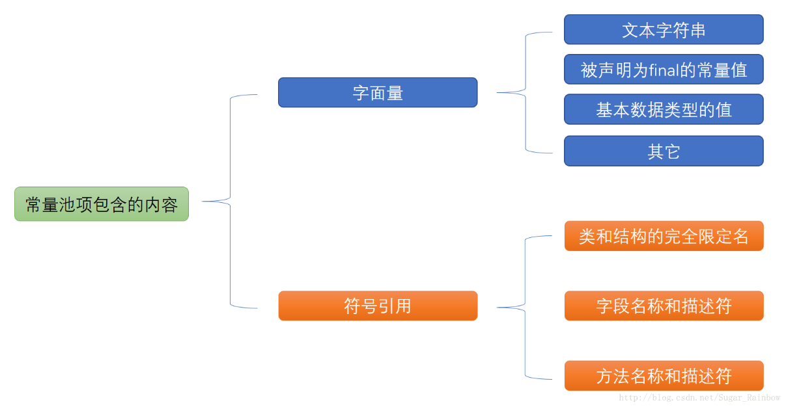
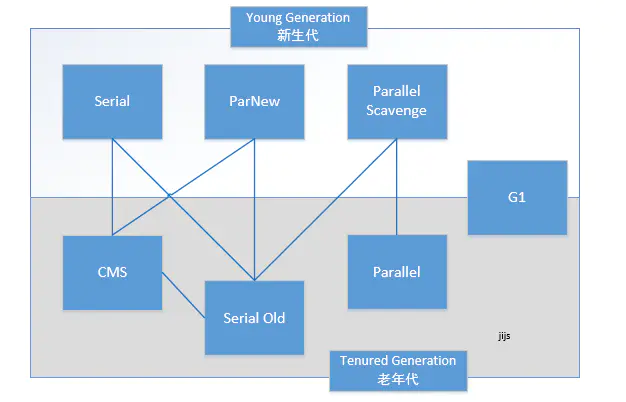
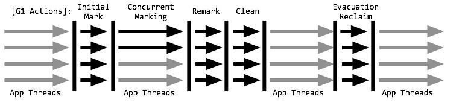
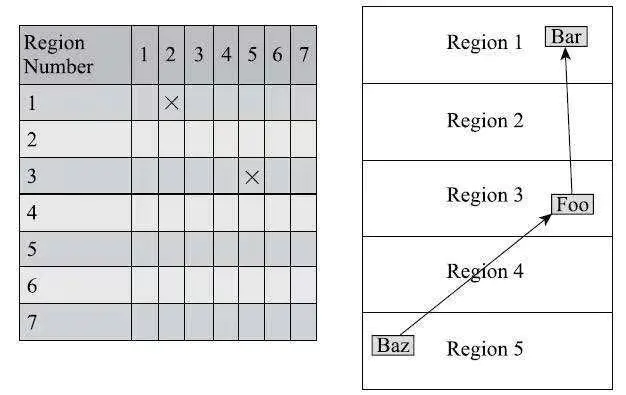
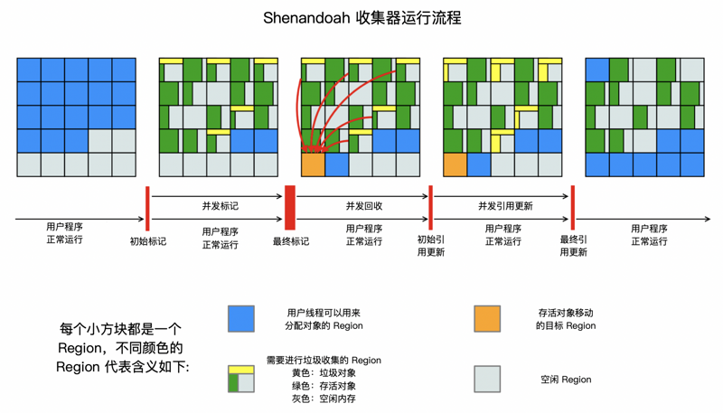
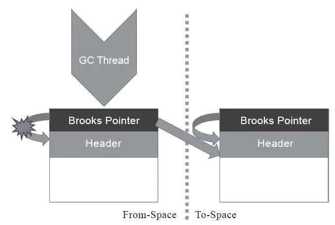
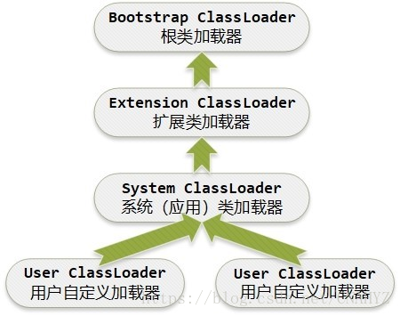
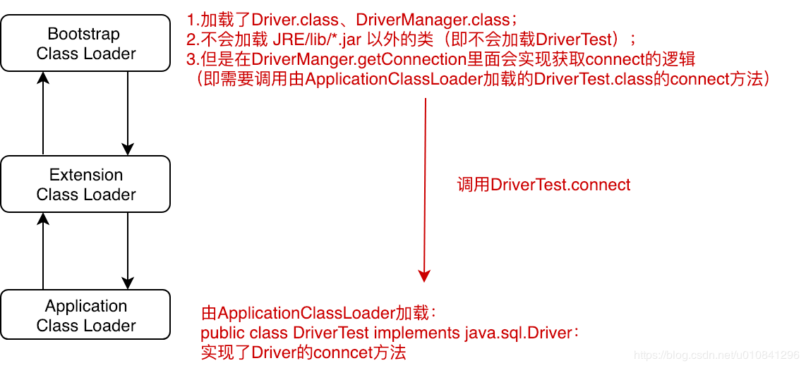
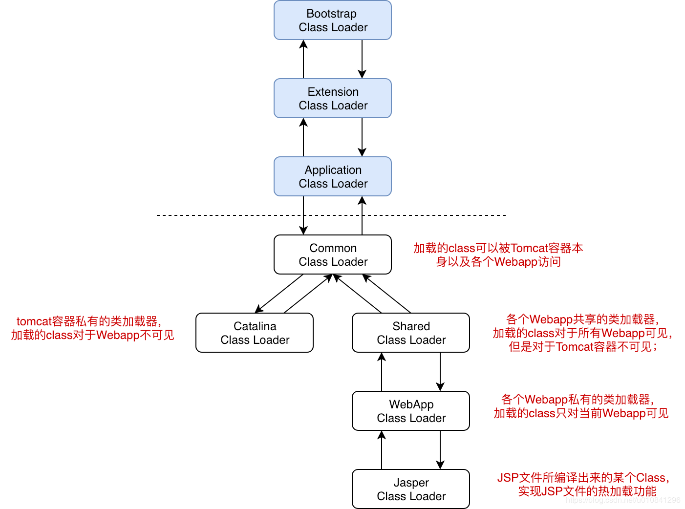
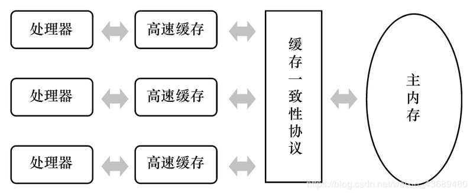

[toc]

# 第二章：Java 内存区域与内存溢出异常

## 1.运行时数据区域


Java 虚拟机执行 java 的过程中会把他所管理的内存划分为若干个不同的数据区域。
这些区域有各自的用途，以及创建，销毁的时间。(随着虚拟机进程的启动而一直存在，有些区域依赖用户线程的启动和结束而建立和销毁)

<div align="center">  

</div>

### 1.1 程序计数器(programing counter register)

- 是一块较小的内存空间，可以当成**当前线程**所执行的==字节码的行号指示器==。
- 字节码解释器的功能：通过改变这个计数器的值来选取下一条需要执行的字节码指令，这是程序控制流的指示器(分支，循环，转跳，异常处理，线程回复等)
- 由于 java 虚拟机的多线程是由线程轮流切换，分配处理器执行时间实现的。**在任何一个确定的时刻，一个处理器内核都只会执行一条线程中的指令**，因此为了线程切换后可以恢复到正确的执行位置，==每一个线程==都需要一个单独的程序计数器。
- 每一个线程的程序计数器部分的内存区域互不影响，独立存在-----**_线程私有内存_**。
  如果线程正在执行 java 方法，计数器记录的是正在执行的==虚拟机字节码指令地址==;若执行 Native 本地方法，计数器值应为空。

**所以为什么为空？**：<font color="red">C++解释：</font>当线程中调用 native 方法的时候，则重新启动一个新的线程，那么新的线程的计数器为空则不会影响当前线程的计数器，相互独立。。也就是说程序计数器是为我们的线程的**java 字节码文件**进行服务的，而不是其他语言，**本地的一些方法大多数都会直接映射到其原生平台，没有我们 jvm 什么事情**。

《Java 虚拟机规范》中未规定程序计数器此内存区域内的溢出异常。

### 1.2 Java 虚拟机栈

- 虚拟机栈是线程私有的
- 生命周期=线程
- 虚拟机栈描述 Java 方法执行的线程内存模型：每个方法被执行的时候，java 虚拟机会同步创建一个栈帧用域存储局部变量表，操作数栈，动态链接，方法出口等信息。---每个方法被调用，直到执行完毕的过程对应着**一个栈桢在虚拟机栈中入栈和出栈的过程**。
- 通常我们日常所说的虚拟机中的**栈**指的就是**Java 虚拟机栈**，更是特指虚拟机栈中的**局部变量表**部分。
- 局部变量表存放了编译期可知的各种 Java 虚拟机基本数据类型(short,int,...,references(**对象引用，她并不等同于对象本身，可能是一个指向对象起始地址的引用指针，也可能是指向一个代表对象句柄或其他与此对象相关的位置**))。
- **方法运行期间不会改变局部变量表的大小**。即不会改变变量槽的数量，**虚拟机真正使用多大的内存空间来实现一个变量槽，是完全有虚拟机实现自行决定的**---(一个变量槽占 32bit，还是 64 比特)。

《规范》中，对此内存区域规定两种 u 异常：

1. 线程请求深度大于虚拟机所允许最大深度---StackOverflowError
2. 如果 java 虚拟机栈动态扩展，当栈扩展无法申请到最够的内存--OutOfMemoryError

### 1.3 本地方法栈

- 和 Java 虚拟机栈作用类似，区别是虚拟机栈位 java 方法提供服务，而此栈为本地方法执行服务。
  异常情况：
  与虚拟机栈相同

### 1.4 Java 堆

- Java 堆是虚拟机所管理的内存中最大的一部分。
- Java 堆是被==所有线程共享==的一块内存区域，**虚拟机启动时创建**。
- ==此内存区域唯一是存放对象实例==，几乎所有对象实例都在这里分配内存。
- Java 堆是垃圾收集器管理内存的区域，又被称为 GC 堆
- 从分配内存的角度看，所有线程共享的 Java 堆中可以划分出多个==线程私有的分配缓冲区(TLAB)==,以提升对象分配时的效率。**不过无论如何划分，都不会改变 Java 堆中存储内容的共性---只能是对象的实例**，Java 堆细分的目的只是为了更好的进行内存回收，或内存分配。
- Java 堆可以处于物理上不连续的内存空间中，但逻辑上是连续的。但是对于大对象，例如数组对象，虚拟机常连续存放。

异常规定：

1. Java 堆无法在分配内存，无法扩展，抛出---OutOfMemoryError

### 1.5 方法区

- 各个线程共享的内存区域，它用来**存储被虚拟机加载的类型信息，常量，静态变量**。即时编译器编译后的代码缓存等数据
- JDK8 以前，很多人把方法区等同于永久代。本质上这二者并不等价，只是用永久代实现了方法区，这使得 HotSpot 的垃圾收集器分代设计扩展到方法区，方便设计。其他某些虚拟机时没用永久代概念的。这种设计方式， 反而导致更容易遇到内存溢出问题。JDK8 之后，终于把原先永久代中所有信息全部移入元空间。
  在此之后，使用元空间来实现方法区
  异常规定：

1. 方法区无法满足新的内存分配--OutOfMemoryError

#### 1.5.1运行时常量池
- ==class常量池包括==(在class文件中，被加载到内存中后就是运行时常量池)：

1. 字面量(文本字符串/final等)
2. 符号引用
类和接口的全限定名
字段名称和描述符
方法名称和描述符
- **class 文件中存在常量池(非运行时常量池)**，其在编译阶段就已经确定；JVM 规范对 class 文件结构有着严格的规范，必须符合此规范的 class 文件才会被 JVM 认可和装载。
- 运行时常量池中保存着一些 class 文件中描述的符号引用，同时还会将这些符号引用所翻译出来的直接引用存储在 运行时常量池中。
- 
- ==**运行时常量池是方法区的一部分/注意字符串常量池是在堆里的**==。这里用与存放编译期生成的各种字面量与符号引用。再类加载后把class常量池中的一部分存放到运行时常量池中。
- 运行时常量池和 Class 文件常量池的重要区别是，**具备动态性**。Java 语言并不要求常量一定只在编译期产生，**也就是说**非预置入 Class 文件常量池的内容也能进入**方法区运行时常量池**。运行期间也可以放入该常量池。
**这里所说的常量包括：** 基本类型包装类（包装类不管理浮点型，整形只会管理-128到127）和String（也可以通过String.intern()方法可以强制将String放入常量池）

- ==字符串常量池==，1.7之前在方法区，之后移入堆中。专门存放字符串

  
  异常规定：
  隶属于方法区，所以和方法区一样。

### 1.7 直接内存

- 注意，这不是虚拟机运行时数据区的一部分，也不是《规范》定义的内存区域，但是会被平凡使用并可能导致 OutOfMemoryError。
- JDK4 中加入了 NIO 类，引入了一种基于通道的缓冲区，可以使用 Native 函数库直接**分配堆外内存**，然后通过存储在==Java 堆==里面的 DirectByteBuffer
  规定异常：
  本机直接内存的分配，不会受到 Java 堆大小限制，但是既然是内存，一定会受到本基机总内存限制。当各个内存区域总和大于物理内存限制，会报错：OutOfMemoryError

## 2 HotSpot 虚拟机对象

这只讨论最简单的 new 创建对象

#### 2.1 对象创建

当 Java 虚拟机遇到一条字节码 new 指令时

1. 首先检查这个指令的参数是否能够在常量池中定位到一个类的符号引用，并检查这个符号引用代表的类是否已经被加载，解析和初始化。如果没有必须先执行类加载
2. 类加载检查通过后，虚拟机为新生对象分配内存，==对象所需内存大小在类加载完成之后，完全确定。==
3. 对于内存分配，分为两种 a. 指针碰撞，单纯的物理上连续的顺序划分。b.空闲列表，即物理上不连续的分配，虚拟机必须要维护一个列表，记录那些内存是可用的。
4. 选择那种分配方式，由 Java 堆是否规整决定。如果采用的垃圾收集器带有空间压缩整理的能力，用空闲列表，否则就是指针碰撞。

除了对象内存分配，还需要考虑**线程安全**问题：有可能出现再给 A 分配内存，指针还没来得及修改，对象 B 又同时使用用了原来的指针分配内存。

两种方法 ：

1. 对分配内存控键的动作进行同步处理---采用 CAS 配上失败重试的方法保证更新操作的原子性。**CAS 不懂，要看资料**
2. 吧内存分配这个动作按照线程划分在不同的空间中进行--即在 Java 堆中预先分配一小块内存，称之为 TLAB。哪个线程要分配，就在那个现成的本地缓冲区 TLAB 中分配。

内存分配完成后，虚拟机必须讲分配到的内存空间(不包括对象头)初始化。TLAB 其实可以把这部完成

设置对象：例如对象时哪一个类的实例，如何才能找到类的元数据信息，对象的哈希码，GC 分代年龄信息等等。这些需要放置到对象头中。

此时，在虚拟机中对象已经产生了，但是在程序员视角中，对象创建才刚刚开始---构造函数。即，Class 文件中的`<init>()`方法还没有执行，所有字段时默认值，对象所需的自愿和状态未加载。---随后才会逐一构造

### 2.2 对象的内存布局

HotSpot 虚拟机对象的对象头部分包括两类信息。

1. 用于存储对象自身的运行时数据。例如哈希码，GC 分代年龄，锁状态标志等等。这部分数据的长度在 32 位和 64 位的虚拟机中分别为 32bit 和 64bit。但是实际上对象要存储的运行时数据很多，已经超出了 32，64 位 BitMap 的极限。由于对象头里的信息，与对象自身无关的数据，我们将 Mark Word 设计成**动态定义的数据结构**
   在==对象未被同步锁锁定==的情况下，32 位 hotspot 虚拟机中，25bit 用于存储对象哈希码，4bit 分代年龄，2bit 用于存储锁标志位，1bit 固定为 0。其他状态如下：

| 存储内容                              | 标志位 | 状态             |
| ------------------------------------- | ------ | ---------------- |
| 对象哈希码，对象分代年龄              | 01     | 未锁定           |
| 指向锁记录的指针                      | 00     | 轻量级锁定       |
| 指向重量级锁的指针                    | 10     | 膨胀(重量级锁定) |
| 空，不需要记录信息                    | 11     | GC 标记          |
| 偏向线程 ID，偏向时间戳，对象分代年龄 | 01     | 可偏向           |

2. 类型指针，即对象指向它的类型元数据的指针---**Java 虚拟机通过这个指针确定该对象是那个类的实例**。但是并不是所有的虚拟机实现都必须在对象数据上保留类型指针。
   ==此外，如果对象是一个 Java 数组==，那再对象头中还必须有一块用于记录数组的长度，数组长度不确定，虚拟机无法从对象的元数据中推断出数组大小。

# 第三章 垃圾收集器与内存分配策略

为什么需要垃圾收集？
当需要排查内存各种内存溢出、内存泄漏问题时；当垃圾收集成为系统高并发的瓶颈时，我们必须对原本“内部自动化的”的技术进行监控和调节。
程序计数器，虚拟机栈，本地方法栈，这些随着线程而生，线程而灭。栈中的栈桢随着方法的进入和推出进行出栈和入站工作，每一个栈桢中分配多少内存，在类结构确定下来时就已经确定，所以这几个区域的内存分配和回收都具备**确定性**，方法结束内存自然回收，所以一般不关注这部分的垃圾回收。
Java 堆和方法区则有着显著的**不确定性**，只有处于运行期间我们才能知道要创建什么对象，多少对象，这涉及到**内存分配和动态回收**

## 3.1 如何判断对象死亡？

### 3.1.1 引用计数法

在对象中添加一个引用计数器，有一个地方引用，计数器值+1；当引用失效，计数器值-1；任意时刻计数器值为 0 的对象就不再被使用。
**但是此方法无法解决对象之间循环引用的问题。**

### 3.1.2 可达性分析算法

通过可达性分析算法来判断对象是否存活。算法的基本思路时通过一系列被叫“GC Root”的根对象作为起始**节点集**，从这些根节点开始根据引用关系乡下搜索(搜索的路劲被称之为"引用链")，如果某个对象 GC root 无法引用，则证明此对象不能再被使用。
**==GC root 有以下几种：==**

1. 虚拟机栈（栈桢中的本地变量表）中引用的对象，譬如各个线程被调用的方法堆栈中使用到的参数，局部变量，临时变量等
2. 方法区中类静态属性引用的对象
3. 方法区中常量引用的对象
4. 本地方法中 JNI(native 方法)引用的对象
5. Java 虚拟机内部的引用
6. 被同步锁只有的对象
7. 反应 JVM 虚拟机内部情况的 JMXBean，JVMTI 中注册的回调、本地代码等

### 3.1.3 引用的分类

过去仅仅讲引用分为：引用和未引用，过于简单。
JDK1.2 之后堆引用的概念进行了扩充，将引用分为四种，强度依次减弱：

1. **强引用**：传统的引用定义，代码中普遍存在。无论任何情况，只要强引用关系还在，垃圾收集器永远不会回收。
2. **软引用：** 用来描述一些还有用但是非必须的对象。只被软引用关联着的对象，在系统将要发生内存溢出异常前，会把这些对象列进回收范围中做二次回收，如果还不够，抛出内存溢出。
3. **弱引用：** 比软引用强度更低，仅能存活到下一次垃圾收集发生为止。
4. **虚引用：** 又称为幽灵引用，甚至无法通过它来获取一个对象实例，唯一目的只是为了能在这个对象被收集器回收的时候收到一个系统通知。

### 3.1.4 对象的生死

即使在可达性分析算法中判定为不可达的对象，也不是一定要被回收。宣告一个对象死亡至少要经过两次标记：

1. 可达性分析后发现没有与 GCroot 相连的引用链，第一次标记，随后进行筛选。筛选的条件是该对象是否有必要执行 finalize()方法。如果该对象没有覆盖此方法，或已经执行过此方法(只能执行一次)，那么虚拟机将认为没有必要执行该方法。
   若判断该对象有必要执行 finalize()方法，该对象会被放与 F-Queue 中，并新建一个线程去执行(此执行指标是会触发，但不一定等待执行结束，可以防止万一该线程出现死循环导致回收系统崩溃)。
2. 第二次标记则在 F-Queue 中，堆队列中的对象进行小规模标记，如果某对象在 finalize()中成功拯救自己--重新建立某种引用，则不会被回收。

注意：任何一个对象的 finalize()方法都只会被系统自动调用一次，如果对象面临下一次回收，不会再被执行。

**_！最好不要使用 finalize()方法_**

### 3.1.5 方法区回收

方法区(HptSopt 中的永久代或者元空间)的回收是没有性价比的，因为方法区回收的条件极其苛刻，收集性价比往往不高。
方法区回收的内容：废弃常量池中的内容和不再使用的类型。
前者和回收 java 堆类似
后者比较麻烦，需要同时满足三个条件：1. 该类所有实例都被回收。2. 该类的类加载器已经被回收，除非精心设计过，否则很难。3. 该类对应的 `java.lang.Class`方法没有在任何地方被引用---也就是无法被反射拿到。

## 3.2 垃圾收集算法

本文只讨论追踪式垃圾收集。

#### 3.2.1 分代收集理论

目前大多数垃圾收集器都遵循分代收集理论(应该只有 ZGC 不是？)
**该理论建立在两个假说之上:**

1. 弱分代假说：绝大多数对象都是朝生夕灭的
2. 强分代假说:熬过越多次垃圾回收的对象，越难以消亡。

这两个分代假说奠定了垃圾收集器的设计原则：收集器应该将 Java 堆划分出不同的区域，然后将回收对象以具年龄分配到不同的区域中存储。
**对于朝生夕灭的对象，做垃圾回收时应当关注如何保留少量存货，而不是标记大量将要被回收的对象。对于强分代，应当把他们集中在一起，虚拟机将会以较低的频率收集这个区域。**

Java 堆划分为不同区之后，垃圾收集器被允许每次之回收一个部分区域--Minor GC，Major GC Full GC。通常会被划分为新生代和老年代，在新生代中每次收集对象都有大量的对象死去，每次收集后存活的少量对象**会被逐步**的放入老年代中存放。
但前述方式存在**跨代引用问题**：新生代中对象可能跨代引用老年代对象，为了找出跨代的问题，不得不需要在 GC root 外全局扫描所有老年代对象，但是这会造成巨大的性能消耗。

**存在第三条理论：**

3. 跨代引用假说：跨代引用相对于同代引用来说仅占极少数。
   即，存在互相引用关系的两个对象，应该趋于同生同灭。

依据第三条假说，不需要再为极少数的跨代引用扫描全区，也不需要浪费空间记录每一个对象是否存在以及存在哪些跨代引用。只需要咋**新生代**生建立一个全局数据结构(**记忆集**)，该结构将老年代划分为若干个区，表示出老年代的哪一块内存存在跨代引用。运行时只有包含了跨代引用指定区域的老年代对象才会被加入 GC Root 扫描。

#### 3.2.1 标记-清除算法

最早最基础的算法。算法分为标记和清楚两个阶段
首先标记处所有需要回收的对象，在标记完成之后，同意回收掉所有被标记的对象；也可以反过来，标记存活对象，统一回收未标记的。
标记过程就是可达性算法啦。
**缺点：**

1. 执行效率不稳定，Java 堆汇中包含大量的对象，必须进行大量的标记和清除动作，导致执行效率随着对象数量增长而降低。
2. 内存空间的碎片化问题。标记清除后会产生大量不连续的内存碎片，可能导致日后分配大对象无法找到连续的而不得不触发垃圾收集动作。

#### 3.2.2 标记-复制算法

这是一种半区复制的垃圾收集算法，他将可用的内存按容量划分为大小相等的两块，每次只适用其中一块。当一半的内存使用完了，则复制存活对象到另一半，清楚现有空间。
**缺点：**
浪费了一半内存空间，过于奢侈。

过后又出现一种更优化的半区复制分代策略：具体做法是**把新生代分为一块较大的 Eden 空间，和两块较小的 Survivor 空间，每次分配只是用 Eden 和其中一块 survivor。发生垃圾收集时，将任然存活的对象一次性复制到另一块 survivor 上，然后清理本身。**
HptSpot 虚拟机默认 Eden 和 survivor 的比例是 8：1，也就可用空间为新生代的 90%。当然不能保证每次存活对象都再 10%以内，所以当超出时，借助其他内存区域进行分配担保。

**为什么需要两个 survivor：**
==设置两个 Survivor 区最大的好处就是解决了碎片化。==

**假设现在只有一个 survivor 区：**
刚刚新建的对象在 Eden 中，一旦 Eden 满了，触发一次 Minor GC，Eden 中的存活对象就会被移动到 Survivor 区。
这样继续循环下去，下一次 Eden 满了的时候，问题来了，此时进行 Minor GC，Eden 和 Survivor 各有一些存活对象，如果此时把 Eden 区的存活对象硬放到 Survivor 区，很明显这两部分对象所占有的内存是不连续的，也就导致了内存碎片化。

白色框分别代表 Eden 区（大）和 Survivor 区（小）

碎片化带来的风险是极大的，严重影响 JAVA 程序的性能。堆空间被散布的对象占据不连续的内存，最直接的结果就是，堆中没有足够大的连续内存空间。

顺理成章的，应该==建立两块 Survivor 区==，刚刚新建的对象在 Eden 中，经历一次 Minor GC，Eden 中的存活对象就会被移动到第一块 survivor space S0，Eden 被清空；等 Eden 区再满了，就再触发一次 Minor GC，Eden 和 S0 中的存活对象又会被复制送入第二块 survivor space S1（这个过程非常重要，因为这种复制算法保证了 S1 中来自 S0 和 Eden 两部分的存活对象占用连续的内存空间，避免了碎片化的发生）。S0 和 Eden 被清空，然后下一轮 S0 与 S1 交换角色，如此循环往复。如果对象的复制次数达到 16 次，该对象就会被送到老年代中。


上述机制最大的好处就是，==整个过程中，永远有一个 survivor space 是空的，另一个非空的 survivor space 无碎片。==

#### 3.2.3 标记-整理算法

标记整理算法一般针对老年代算法。因为老年代存活率较高，不适合复制，同时我们也不想浪费内存空间。

如果**移动存活对象**，尤其是在老年代这种每次回收都有大量对象存活的区域，移动对象并更新引用是极大的负担。==另外这种移动对象的操作必须**全程暂停用户程序**才能进行==。

如果**不移动对象**，采用标记清除算法，弥散再空间中的碎片文件会影响**程序吞吐量**。
即，关注吞吐量的收集器采用标记整理算法，关注低延迟的收集器采用标记清除算法。

或是采用和稀泥方式，平时多数时间采用标记清楚算法，当内存空间的碎片化程度影响对象分配的时候，采用标记整理手机一次。实际上 CMS 面临空间碎片过多时就这样采用标记整理算法。

## 3.3 HotSPot 算法细节实现

### 3.3.1 根节点枚举

迄今为止，**所有收集器在根节点枚举这一步骤时都必须暂停用户线程**。现在可达性分析算法耗时最长的查找引用链的过程，已经可以做到与用户线程一起并发，但是根节点枚举这一步骤始终还是必须在一个能**保障一致性的快照中**得以进行。(即，枚举期间必须被冻结在某个时间节点)。
目前主流垃圾收集器都是用准确式垃圾手机(虚拟机可以知道内存中所有位置对应的类型)，虚拟机有办法直接得到内存中某位置的引用，实际上 HotSpot 使用 OopMao 的数据结构来存储。

#### 3.3.2 安全点 safepoint

可能导致引用变化的关系非常多，如果所有都用 OopMap 存储，需要大量额外空间。所以只需要在特定位置进行记录信息即可---**安全点**。
安全点决定了用户程序执行时并非在代码指令流的任意位置都能够停顿下来开始垃圾收集，儿是**强制要求必须大导安全点后才能够暂停**。
安全点的设置要考虑两个问题：

1. 安全点的设置不能太少导致收集器等待时间够长，也不能太多以至于增大内存运行负荷。
2. 如何在垃圾收集发生时让所有线程都跑到最近的安全点。我们采用两种方案：
   1. **抢先式中断**：不需要线程的执行代码主动配合，垃圾收集发生时，系统闲全部中断所有用户线程，如果中断不在安全上，重启该条线程，跑到安全点停止。
      目前几乎没有采用这种方式。
   2. **主动式中断**：设置一个标志位，各个线程执行过程时会主动轮询这个标志，一旦发生中断，标志位为真时，个线程在最近的安全点主动中断挂起。（轮询操作很频繁，所以必须高效，在 HotSpot 中使用内存保护陷阱的方式，只需要一条汇编指令即可完成）

#### 3.3.3 安全区域

安全点记之保证了程序执行时，在不太长的时间内就会可以进入垃圾收集过程的安全点。但是**程序不执行的时候是个麻烦(线程被挂起，入 sleep()，wait())**,此时线程无法响应虚拟机的中断请求，无法自己到安全点中断挂起自己。此时我们需要安全区域

**安全区域：**确保能够在某一段代码片段之中，引用关系不会发生变化，因此，在这个区域中任意地方开始垃圾收集都是安全的。
当哟个胡执行到安全区域的代码时：

1. 首先会表示自己一斤进入安全区域，此时如果进行垃圾收集不必管安全区的代码
2. 当线程离开安全区域，检查虚拟机是否完成根节点枚举
3. 如果完成，线程继续，如果未完成，一直等待。

#### 3.3.4 记忆集与卡表

记忆集：解决对象跨代引用带来的问题，该数据结构可以避免把整个老年代放入 GC Root 扫描。
**这是一种用于记录从非收集区域指向收集区域的指针集合的抽象数据结构。**收集器只需要通过记忆集判断出某一块非收集区域是否存在有指向收集区域的指针即可，并不需要详细了解跨代指针的全部细节。
**精度选择**:

1. 字长精度：每个记录精确到一个机器字长，该字长长度内包含跨代指针
2. 对象精度：精确到对象，对象内有跨代指针
3. 卡精度：精确到某一个区域，区域内存在跨代指针。

第三种使用最多，通过**卡表(card table)**的方式去实现记忆集，卡表示记忆集的具体实现，定义记忆集的记录精度，与堆内存的映射关系。
通常字节数组 Card_Table 中的每一个元素都对应着其表示的内存区域中一块特定大小的内存块，这个内存块被称之为**卡页**(通常是 2 的 N 次幂)。
一个卡也得内存中通常包含不止一个对象，只要卡业内有一个或多个对象的字段存在跨代指针，那么将对应卡表的数组元素的值标识为 1，此时这个元素**变脏**。当发生垃圾收集时，只需要把标识为 1 的区域对象放入 GC Root 中扫描即可。

#### 3.3.5 写屏障

卡表如何维护，如何标识？
当有其他分代区域中对象引用了本区域对象时，其对应的卡表元素就应该变脏，变脏的时间点原则上应该发生在引用类型字段赋值的那一刻。我们需要一个机器码层面的手段，把维护卡表的动作放在每一个赋值操作之中。
HotSpot 中通过**写屏障技术**来维护卡表状态。**写屏障可以看作在虚拟机层面对”引用类型字段赋值“这个动作的 AOP 切面，在引用对象赋值的时候会产生一个环绕通知，赋值前后都在写屏障的覆盖范畴**。赋值前时写前屏障，赋值后是写后屏障。

除了写屏障之外，在高并发场景下 还面临**伪共享**的问题。当多线程修改相互独立的变量时，如果这些变量恰好在同一个 cache Line 时，就会彼此印象而导致性能降低。
由于一个卡表占一个字节，可能多个卡表占据一个 Cache Line ，就会导致更新卡表时恰好写入同一个缓存行而影响性能。

为了避免伪共享问题，简单的解决方案时不采用无条件的写屏障，而是先检查卡表标记，只有该卡表均未被标记国时才将其标记为变脏。

#### 3.3.6 并发的可达性分析

可达性分析必须要在一个保障一致性的快照中进行，此时用户线程必须冻结。在初始的根节点枚举中 GC Root 相对是极少数，并且在 OopMap 的加持下，停顿时间相对固定。但是在随后的根节点扫描中，与 Java 堆容量成正比。
首先我们要解决并发扫描时对象消失的问题：

1. **增量更新：**当出现新的指向关系时，记录下这个新插入的引用，并发扫描结束之后，从该记录重更新扫描。CMS

2. **原始快照：**当删除只想关系时，记录删除引用，并发扫描结束之后，从删除点重新扫描。G1,Shenandoah
   以上无论是删除还是新增的记录操作都是通过**写屏障**实现的

### 3.4 经典垃圾收集器


上面为新生代收集器，下面是老年代收集器。如果两个收集器之间存在连线，就说明它们可以搭配使用。

新生代的收集器使用复制算法，
老年代使用并发标记清除（CMS）或标记-整理算法。
序号|收集器|收集范围|算法|执行类
-|-|-|-|-|-
1| Serial| 新生代| 复制| 单线程|
2 |ParNew| 新生代| 复制 |多线程并行|
3 |Parallel |新生代| 复制| 多线程并行|
4| Serial Old| 老年代| 标记整理| 单线程|
5 |CMS| 老年代| 标记清除| 多线程并发|
6| Parallel Old| 老年代| 标记整理| 多线程|
7 |G1 |全部 |复制算法，标记-整理| 多线程|

#### 3.4.1 Serial(串行 GC)收集器

Serial 收集器是一个新生代收集器，单线程执行，使用复制算法。它在进行垃圾收集时，必 须暂停其他所有的工作线程(用户线程)。是 Jvm client 模式下默认的新生代收集器。对于限定单个 CPU 的环境来说，Serial 收集器由于没有线程交互的开销，专心做垃圾收集自然可以获得最高的单 线程收集效率。
迄今为止，serial 依然是客户端模式下的默认新生代收集器，简单高效，对于内存资源受限的环境，他是所有收集器里内存消耗最小的。由于没有线程交互的开销，性能效率高。
收集器.webp>)

#### 3.4.2 ParNew(并行 GC)收集器

ParNew 收集器其实就是 serial 收集器的多线程并行版本，除了使用多条线程进行垃圾收集之外，其余行为与 Serial 收集器一样。该收集器是服务端模式下的默认模式，另外这是**CMS 作为老年代收集器的默认搭配新生代收集器。**

收集器.webp>)

#### 3.4.3 Parallel Scavenge(并行回收 GC)收集器

Parallel Scavenge 收集器也是一个新生代收集器，它也是使用复制算法的收集器，又是并行多线程收集器。parallel Scavenge 收集器的目标则是达到一个 **==可控制的吞吐量==**。

==吞吐量= 程序运行时间/(程序运行时间 + 垃圾收集时间)==，虚拟机总共运行了 100 分钟。其中垃圾收集花掉 1 分钟，那吞吐量就是 99%。
**停顿越短时间就越是和需要与用户交互或需要保证服务响应质量的程序，良好的响应速度能提升用户体验。
高吞吐量则可以最搞笑的利用处理器资源，因快完成程序运算任务，主要是和在后台运算而不需要太多交互的分析任务。**

**使用如下 2 个参数进行控制吞吐量:**

1.** -XX:MaxGCPauseMillis：最大垃圾收集停顿时间**
MaxGCPauseMillis 参数允许的值是一个大于 0 的毫秒数，收集器将尽力保证内存回收花费的时间不超过设定值。不过这个时间并不是万能的，不会设置的小一点系统收集速度会变得更快，**垃圾收集停顿时间缩短是以牺牲吞吐量和新生代空间为代价的**。系统把新生代调小，收集停顿时间缩短，但是会导致垃圾回收的频率增大，原先十秒收集一次，停顿 100ms，现在 50 秒手机一次，停顿 70ms，停顿时间减少的同时，吞吐量同时下降。

2. **-XX:GCTimeRatio：垃圾收集时间占总时间比率**
   GCTimeRatio 参数的值应当是一个大于 0 小于 100 的整数，也就是垃圾收集时间占总时间的比率，相当于是==吞吐量的倒数==。如果把此参数设置为 19，那允许的最大 GC 时间就占总时间的 5%（即 1 /（1+19）），==默认值为 99==，就是允许最大 1%（即 1 /（1+99））的垃圾收集时间。

由于 parallel scavenge 与吞吐量密切相关，所以又被称之为**吞吐量优先收集器**。还有第三个参数：
**-XX:+UserAdptiveSizePolicy**：该参数被激活后，不需要人工置顶新生代大小，eden，survivor 区比例等，**虚拟机会根据当前系统运行情况收集性能监控信息，动态调整这些参数以提供最合适的停顿时间或者最大的吞吐量。**

#### 3.4.4 Serial Old(串行 GC)收集器

Serial Old 是 Serial 收集器的老年代版本，它同样使用一个单线程执行收集，使用 **“标记-整理”算法**。主要使用在 Client 模式下的虚拟机。如果在 Server 模式下，它主要还有两大用途：一个是在 JDK 1.5 及之前的版本中与 Parallel Scavenge 收集器搭配使用，另外一个就是作为 CMS 收集器的后备预案。如果 CMS 收集器出现 Concurrent Mode Failure，则 Serial Old 收集器将作为后备收集器。

#### 3.4.5 Parallel Old(并行 GC)收集器

Parallel Old 是 Parallel Scavenge 收集器的老年代版本，使用多线程并发和 **“标记-整理**”算法。
在注重吞吐量或处理器资源稀缺的场合使用

收集器.webp>)

#### 3.4.6 CMS(并发 GC)收集器

CMS(Concurrent Mark Sweep)收集器是一种以获取最短回收停顿时间为目标的收集器。CMS 收集器是基于“标记-清除”算法实现的，整个收集过程大致分为 4 个步骤：

1. 初始标记(CMS initial mark)
2. 并发标记(CMS concurrenr mark)
3. 重新标记(CMS remark)
4. 并发清除(CMS concurrent sweep)

其中**初始标记、重新标记这两个步骤任然需要停顿其他用户线程**。初始标记仅仅只是标记出 GC ROOTS 能直接关联到的对象，速度很快，并发标记阶段是进行 GC ROOTS 根搜索算法阶段，会判定对象是否存活。
重新标记阶段则是为了**修正并发标记期间**，因用户程序继续运行而导致标记产生变动的那一部分对象的标记记录，这个阶段的停顿时间会被初始标记阶段稍长，但比并发标记阶段要短。

由于整个过程中耗时最长的==并发标记和并发清除过程中，收集器线程都可以与用户线程一起工作==，所以整体来说，CMS 收集器的内存回收过程是与用户线程一起并发执行的。

**CMS 收集器的优点：并发收集、低停顿**
CMS 还远远达不到完美，器主要有**三个显著缺点：**

1. CMS 收集器对 CPU 资源非常敏感。(事实上面向并发设计的程序都对处理器资源敏感)
   在并发阶段，==虽然不会导致用户线程停顿，但是会占用 CPU 资源而导致引用程序变慢，总吞吐量下降==。CMS 默认启动的回收线程数是：(CPU 数量+3)/4。（建议 CPU 个数最少 4 个）。

2. 无法处理浮动垃圾
   **浮动垃圾**：程序运行时会不断伴随新的垃圾对象产生，这一部分垃圾对象出现在标记过程结束以后，CMS 无法再当此收集中处理他们，必须在下一次收集时清理掉。
   在做垃圾回收的过程中用户线程也再执行（并行执行），所以需要预留一部分空间给用户线程使用。**必须要留一部分空间供并发收集时的程序运作使用。**
   可以使用-XX:CMSInitiatingOccupancyFraction（jdk1.6 默认为 92%）参数来设置，预留多少空间开始做 GC。如果在垃圾回收的过程中，剩余空间不足仍然满足不了用户线程生成对象所需要的空间，就会出现 ==“Concurrent Mode Failure”失败，这时候虚拟机将启动后备预案：临时启用 Serial Old 收集器来重新进行老年代的垃圾收集==，这样停顿时间就很长了。

3. CMS 是基于“**标记-清除”** 算法实现的收集器，使用“标记-清除”算法收集后，**会产生大量碎片**。
   空间碎片太多时，将会给对象分配带来很多麻烦，比如说大对象，**内存空间找不到连续的空间来分配不得不提前触发一次 Full GC**。为了解决这个问题，CMS 收集器提供了一个-XX:UseCMSCompactAtFullCollection 开关参数，用于在 Full GC 之后增加一个碎片整理过程，还可通过-XX:CMSFullGCBeforeCompaction 参数设置执行多少次不压缩的 Full GC 之后，跟着来一次碎片整理过程。

#### 3.4.7G1（Garbage First）里程碑式成果

G1（Garbage First）垃圾回收器开创了**面向局部收集的设计思路和基于 Region 的内存布局形式。** 主要面向服务端。
G1 是用在 heap memory 很大的情况下，把 heap 划分为很多很多的 region 块，然后并行的对其进行垃圾回收。
G1 垃圾回收器在清除实例所占用的内存空间后，还会做内存压缩。
G1 垃圾回收器回收 region 的时候基本不会 STW，而是基于 most garbage 优先回收 的策略来对 region 进行垃圾回收的。

**停顿事件模型**：能够支持在一个长度为 M 毫秒的时间片段内，小号在垃圾收集上的时间大概率不超过 N 毫秒这样的目标。
G1 可以**面向内存任何部分**来组成回收集进行回收，衡量标准不再是属於那个分代，儿是那块内存中存放的垃圾数量最多，回收收益最大。

G1 开创基于 Region 的堆内存布局，式实现这个目标的关键，虽然 G1 也准寻分代收集理论设计，但是：**G1 不在坚持固定大小以及固定数量的分代收集区域划分**，而是把连续的 Java 堆划分为多个大小相等的独立 Region，每个 Region 根据需要扮演分代和区，收集器能够对扮演不同角色的区域采用不同的策略。
**Region 中还有一类特殊的 Humongous 区域，专门存储大对象。**G1 认为只要超过 Region 容量一半就是大对象，通常 Region 在 1MB-32MB，对于超过一个 Region 的大对象，将会被存入连续的 Region 中。(通常把大对象当作老年代)
G1 保留老年代和新生代的概念，**但是二者不是固定的了**，他们将是一系列离散区域的动态集合，每次回收将 Region 作为最小单元，每次收集到 Region 空间的整数倍。
G1 收集器跟踪各个 Region 里面垃圾堆积的价值，维护一个优先列表，**每次根据用户设定的收集停顿时间，优先处理价值受益最大的区域。**


一个 region 有可能属于 Eden，Survivor 或者 Tenured 内存区域。图中的 E 表示该 region 属于 Eden 内存区域，S 表示属于 Survivor 内存区域，T 表示属于 Tenured 内存区域。图中空白的表示未使用的内存空间。G1 垃圾收集器还增加了一种新的内存区域，叫做 Humongous 内存区域，如图中的 H 块。这种内存区域主要用于存储大对象-即大小超过一个 region 大小的 50%的对象。

**G1 收集需要解决的问题**：

1. Region 里面的跨 Region 引用如何解决。
   每个 Region 都会维护自己的记忆集，记忆集会记录下别的 Region 只想自己的指针并标记的卡页范围。但是由于 Region 数量太多所以维护的记忆集很多，G1 收集器会占用更多的内存负担。
2. 并发标记阶段如何保证收集线程与用户线程互不干扰？
   G1 采用原始快照(SATB)算法来实现。
   此外垃圾收集器对用户线程的影响还体现在回收过程中新创建对象的内存分配上，程序要继续运行一定会创建新对象。G1 为每个 Region 设计了两个名为**TAMS 的指针，把 Region 一部分空间划分出来并用域并发回收过程中的新对象分配，并发回收时新对象一定被分配到这两个指针范围内。** 垃圾收集器默认存活，不会被纳入回收。
   如果**内存回收速度，赶不上内存分配速度**，G1 收集器被迫冻结用户线程，进行长时间停顿执行 Full GC
3. 如何建立可靠的停顿预测模型
   **G1 收集器的停顿预测模型是以衰减均值理论为基础实现的**。在垃圾收集过程中，G1 收集器会记录每个 Region 回收的好事，每个记忆集里脏卡数量等成本，并分析的雏军之等。Region 统计更新越快，越能决定其回收的价值，然后通过这些信息预测现在开始回收有哪些 Region 组成回收集才可以在不超过期望停顿时间的约束下去的最高收益。

G1 收集器运作过程划分为四个步骤：

1. **初始标记：** G1 收集器仅仅标记下所有的 GC Root 能直接挂链的对象，并修改 TAMS 的值，让下一阶段用户线程并发运行时，能在正确的区域分配对象。该过程是和 Minor GC 的暂停过程一起的，所以耗时很短。
2. **并发标记：** 从 GCRoot 开始进行可达性分析，递归扫描整个对立的对象。耗时较长，但可以和用户并发执行，扫描安安城后，重新处理 STAB 记录下的并发时有引用变动的对象。
3. **最终标记：** 对用户线程做短暂暂停，用域处理并发阶段结束后遗留下来的最后少量的 STAB。
4. **筛选回收：**各个 Region 的回收价值和成本排序，根据用户的期望停顿时间来指定回收计划，自由选择组成回收集，**把据欸的那个回收的 Region 存活对象复制到空的 Region 中，在清理掉整个旧的 Region**，==涉及对象移动，必须暂停用户线程==。
   G1 回收器除了并发标记外，其余阶段也是用户线程停顿的。并非存粹的追求低延迟，停顿用户线程能够最大幅度的提高垃圾收集效率，保证吞吐量，
   **存粹的追求低延迟，去找 ZGC!**



**G1 中虽然可以指定用户期望停顿时间，但是这不是万能的**。如果设置过低可能出现，由于停顿目标时间过短，导致每次回收集只占据堆内存极小一部分，收集速度跟不上内存分配速度，最终栈满堆栈，出发 Full GC。

**G1 和 CMS 比较**
==优点:==
可控制最大提顿时间，分 Region 内存布局，按收益动态回收；
G1 整体上基于标记-整理算法实现的收集器，但从局部(两个 Region)上时基于标记-复制算法实现，无论如何意味着 G1 运作期间不会产生内存空间碎片，垃圾收集完之后可以提供完整规格的可用内存。
==缺点==：
G1 比 CMS 有更大的内存占用和执行时额外的负载。
内存占用：无论新生代还是老年代，G1 需要维护每个 Region 的记忆集，而 CMS 只有一个，并且仅仅是老年代到新生代的引用。
执行负载上：CMS 使用写后屏障来维护卡表；而 G1 除了这个之外，**还需要实现 STAB，还需要写前屏障来跟踪并发时的指针变化**，在用户程序运行过程中会产生由跟踪引用带来的额外负担。
由于 G1 的写屏障比 CMS 消耗更多资源，所以 CMS 的写屏障实现时直接同步操作，而**G1 不得不实现为一个消息队列**，吧写屏障和写后屏障都放入队列中，然后异步执行。

目前在小内存应用上 CMS 表现大概率会好于 G1，大内存会反过来。这个平衡点大约在
6-8GB。

### 3.6 低延迟垃圾收集器（最后在加上吧）

#### 3.6.1 Shenandoah
OpenJDK12的正式特性之一。这个项目的目标是实现一种能在任何堆内存大小下都可以把垃圾收集的停顿时间限制在十毫秒以内的垃圾收集器。该目标一位置shenandoah相比CMS和G1，不仅要进行并发的垃圾标记，还要并发的进行对象清理后的整理工作。
Shenandoah与G1有相似的堆内存布局，在初始标记、并发标记等许多阶段的处理思路保持高度一致，甚至共享了一部分代码。
shenandoah也是使用基于region的堆内存布局，同样有用于存放发对象的humongous region，默认的回收策略也同样是优先处理回收价值最大的region。但是它与G1有明显的三点不同：
1. **支持并发的整理算法**，G1的回收阶段是可以进行多线程并发的，但不能与用户线程并发。
2. 目前shenandoah**默认不使用分代收集**，即不会有专门的新生代Region或老年代Region存在
3. shenandoah**摒弃**了在G1中耗费大量内存和计算资源去维护的**记忆集**，改用名==连接矩阵==的全局数据结构来记录跨Region的引用关系，降低了处理跨代指针时的记忆集维护消耗，也降低了为共享问题发生的概率。
   
**矩阵的XX应该是画错位置了**
Shenandoah收集器的工作过程一共有九个阶段，下图只画了最核心的三个阶段并发标记、并发回收、并发引用更新。

- **初始标记（Initial Marking）：** 与G1一样，只标记与GC Roots直接关联的对象，这个阶段仍是“**Stop The World**”的，但**停顿时间与堆大小无关，只与GC Roots的数量相关**。--*在新版中初始标记阶段之前还有三个阶段，但是可以不太严谨的理解为对应于以前分代收集中的Minor GC*
- **并发标记（Concurrent Marking）** ：与G1一样，从GC Root开始对堆中对象进行可达性分析，找出存活的对象，可与用户线程并发执行，**不会造成停顿**，时间的长度**取决于堆中存活对象的数量和对象图的结构复杂度**。
- **最终标记（Final Marking）**：与G1一样，处理剩余的SATB扫描，并在这个阶段统计出回收价值最高的Region，将这些Region构成一组回收集（Collection Set），会有一小段短暂的停顿。
- **并发清理（Concurrent Cleanup）**：这个阶段用于清理那些整个区域内连一个存活对象都没有找到的Region（这类Region被称为Immediate Garbage Region）。
- **并发回收（Concurrent Evacuation）** ：==核心差异==。首先把回收集里面的存活对象先复制一份到其他未被使用的Region之中，然后通过读屏障和Brooks Pointers转发指针技术来解决在垃圾回收期间用户线程继续读写被移动对象的问题，并发回收阶段运行的时间长短**取决于回收集的大小**。
- **初始引用更新（Initial Update Reference）** ：并发回收阶段复制对象结束后，还需要把堆中所有指向旧对象的引用修正到复制后的新地址，这个操作称为引用更新。引用更新的初始化阶段实际上并未做什么具体的处理，设立这个阶段只是为了建立一个线程集合点，确保所有并发回收阶段中进行的收集器线程都已完成分配给它们的对象移动任务而已。初始引用更新时间很短，会产生一个非常短暂的停顿。
- **并发引用更新（Concurrent Update Reference）** ：真正开始进行引用更新操作，这个阶段是与用户线程一起并发的，时间长短取决于内存中涉及的引用数量的多少。并发引用更新与并发标记不同，它不再需要沿着对象图来搜索，只需要按照内存物理地址的顺序，线性地搜索出引用类型，把旧值改为新值即可。
- **最终引用更新（Final Update Reference）**：解决了堆中的引用更新后，还要修正存在于GCRoots中的引用。会产生一个非常短暂的停顿，停顿时间只与GC Roots的数量相关。
- **并发清理（Concurrent Cleanup）：** 经过并发回收和引用更新之后，整个回收集中所有的Region已再无存活对象，所以最后再调用一次并发清理过程来回收这些Region的内存空间，供以后新对象分配使用。
  
**Brooks Pointers转发指针技术**
复制对象这件事情如果将用户线程冻结起来再做那是相当简单的，但如果==两者必须要同时并发进行的话，就变得复杂起来了。其困难点是在移动对象的同时，用户线程仍然可能不停对被移动的对象进行读写访问==，移动对象是一次性的行为，但移动之后整个内存中所有指向该对象的引用都还是旧对象的地址，这是很难一瞬间全部改变过来的。Brooks Pointer 转发指针技术是来实现对象移动与用户程序并发的一种解决方案。

Brooks 在原有对象布局结构的最前面统一增加一个新的引用字段，在正常不处于并发移动的情况下，该引用指向对象自己（类似句柄，一个是放在句柄池中，一个是放在对象头前面），在对象移动的时候我们只需要将Brooks Pointer指向新对象，在对象访问过程中，只通一条mov指令就可以完成对新对象的访问了，如图： 

假设有三个操作并发执行：
1. 收集器线程扶志了新的对象副本
2. 用户线程更新对象的某个字段
3. 收集器线程更新转发指针的引用值为新副本地址
**2和3的顺序不能颠倒，否则用户线程只会在旧副本上更新**
==但是必须针对转发指针的访问操作采用同步措施，让收集器线程或用户线程转发指针的访问只有其中之一能够成功，另外一个必须等待执行==，实际上当**写操作**发生时，Shenandoah收集器是**通过CAS（Compare And Swap）操作**，来保证收集器线程或者用户线程只有其中之一可以进行修改操作，以此来保证并发时对象访问的正确性。
**优点：** 延迟低
**缺点：** 高运行负担使得吞吐量下降；使用大量的读写屏障，尤其是读屏障，增大了系统的性能开销；

#### 3.6.2 ZGC
和 Shenandoah 同属于超低延迟的垃圾收集器，但在吞吐量上比 Shenandoah 有更优秀的表现.**ZGC收集器是一款基于Region内存布局的，(暂时)不设分代的，使用了都屏障、染色指针和内存多重映射等技术来实现可并发的标记-整理算法的，以低延迟为首要目标的一款垃圾收集器。**

**ZGC 的内存布局**
与 Shenandoah 和 G1 一样，ZGC 也采用基于 Region 的堆内存布局，但与它们不同的是， ZGC 的 Region 具有**动态性，也就是可以动态创建和销毁，容量大小也是动态的**，有大、中、小三类容量:

- 小型 Region (Small Region)：容量固定为 2MB，用于放置小于 256KB 的小对象。
- 中型 Region (M edium Region)：容量固定为 32MB，用于放置大于等于 256KB 但小于 4MB 的对
象。
- 大型 Region (Large Region)：容量不固定，可以动态变化，但==必须为 2MB 的整数倍==，用于放置 4MB 或以上的大对象。==每个大型 Region 中只会存放一个大对象==，这也预示着虽然名字叫作“大型 Region”，但它的实际容量完全有可能小于中型 Region，最小容量可低至 4MB。

**核心内容**
与 Shenandoah 一样，ZGC 在工作过程中也几乎是全程与用户程序并发的，重点**也是实现了标记-整理算法的整理阶段可以与用户程序并发执行**。但是二者的实现方式不同，Shenandoah 是在对象身上添加转发指针的方法，而 ZGC 则是直接在指针上动手脚，也就是传说中的**染色指针 (Colored Pointers)**，这个指针就是 Java 对象的引用,他直接把标记信息记录在引用对象的指针上。
`Object o = new Object();`
其中“o” 只是一个引用，也就是指针，指向存在堆上的对象实例，引用自身也是要占内存的，普通引用在32位机器占4个字节，在64位机器上，开启压缩指针 (-XX:+UseCompressedOops) 的话占4个字节，不开启的话占8个字节。ZGC 的染色指针结构如下 (不支持32位机器和压缩指针)：
尽管Linux下64位指针的高18位不能用来寻址，但剩余46位指针所能支持的64TB内存可以满足当下服务器的要求，鉴于此，ZGC的染色指针技术将其中高4位提取出来做标志信息。通过这些标志位，虚拟机可以直接从之阵中看到其引用对象的三色标记状态、是否进入了重分配集(是否被移动过)、是否只能通过finalize()方法才能被访问到。--==*同时也因为此操作进一步压缩了地址空间，直接导致ZGC能够管理的内存不可以超过4TB。*

得益于染色指针上标志位的支持，ZGC 也可以像 Shenandoah 那样，实现了在移动存活对象的过程中可以与用户程序并发执行，且效率更高。ZGC 还用到了很多其他的黑科技，原理过于复杂，具体细节懒得敲了...P119。

#### 3.6.3 Epsilon
 G1、Shenandoah 和 ZGC 等都是越来越复杂，越来越先进， 而 JDK 11 新加入的 Epsilon 却是反其道而行，这**款收集器不会做任何垃圾收集的操作，也许叫做“内存分配器”更加合适**。虽然很奇葩，但是它还是有用武之地的，比如越来越火的**微服务领域，如果系统运行时间很短，在堆内存耗尽之前就可以结束，那么垃圾收集也就没有任何意义**了，这正是 Epsilon 的使

# 第七章 虚拟机类加载机制

Java 虚拟机把描述类的数据从 Class 文件加载到内存，并对数据进行，连接(校验，准备，解析)和初始化，最终形成可以被虚拟机直接使用的 Java 类型，这整个过程被称之为**类加载机制**。
在 Java 语言里，类的加载，连接和初始化过程都是在**程序运行期间**完成的，这种策略为 Java 应用==提供了极高的扩展性和灵活性，Java 依赖运行期动态加载和动态链接这个特点，天生具备动态扩展的语言特性==。(多态)

## 7.1 类加载时机


一个类型从被加载到虚拟机内存中开始，到卸载出内存为止，经历--加载--连接(验证，准备，解析)-初始化-使用-卸载七个阶段。
加载--验证，准备-初始化--卸载,这五个顺序是固定的，类型的加载过程按照这种顺序按部就班的开始，而解析阶段不一定，某些情况在初始化之后在开始 ==支持 Java 语言的运行时绑定。==
什么情况需要开始类加载过程的**加载**：

1. 遇到 new ,getstatic,putstatic 或 invokestatic 这四条字节码指令时候，如果类型没有进行过初始化，则需要先出发其初始化阶段。
   _这四条指令会被调用的场景_
   1. 使用 new 关键字实例化对象
   2. 读取或设置一个类型的静态字段(**final 修饰，或编译器已经放入常量池的静态字段除外**)
   3. 调用一个类型的静态方法的时候
2. 使用 java.lang.reflect 包的方法对类型进行反射调用的时候，如果类型没有进行初始化，则要先出发其初始化。
3. 当初始化类的时候，发现其父类还未初始化，需要先进行父类的初始化
4. 当虚拟机启动时，用户需要制定一个主类(main)，虚拟机会先初始化这个主类
5. 当使用 JDK 1.7 的动态语言支持时，如果一个 java.lang.invoke.MethodHandle 实例最后的解析结果为 REF_getStatic、REF_putStatic、REF_invokeStatic 的方法句柄，并且这个方法句柄所对应的类还没初始化，则需要先触发初始化。
6. 接口中定义了 JDK8 新加入的默认方法时，如果这个接口的实现类发生了初始化，那么该方法要在其之前就被初始化。
   有且仅有这 6 种会触发类型进行初始化的场景，被称之为**主动引用**，除此之外所有的引用类型的方式都不出发初始化，被称之为**被动引用**。
7. 通过子类引用父类的静态字段，不会导致子类初始化。==对于静态字段，只有直接定义这个字段的类才会被初始化。==

```java
class SuperClass {
    static {
        System.out.println("SuperClass init!");
    }
    public static int value = 123;
}

class SubClass extends SuperClass {
    static {
        System.out.println("SubClass init!");
    }
}

public class NotInitialization {
    public static void main(String[] args) {
        System.out.println(SubClass.value);
        // SuperClass init!
    }
}
```

2. 通过数组定义来引用类，不会触发此类的初始化。数组类比较特殊，并不会触发类型本身的初始化，而是触发了由虚拟机自动生成的，继承于 Object 的子类的名为'[LSuperClass'的类初始化阶段，创建动作由字节码 newarray 触发。
   也由于这个原因，Java 种对数组的访问比较安全。

```java
class SuperClass2 {
    static {
        System.out.println("SuperClass init!");
    }
    public static int value = 123;
}

public class NotInitialization2 {
    public static void main(String[] args) {
        SuperClass2[] superClasses = new SuperClass2[10];
    }
}
```

3.==常量在编译阶段会存入调用类的常量池中，本质上并没有直接引用到定义常量的类==，因此不会触发定义常量的类的初始化。
编译阶段通过传播优化，常量存储到 NotInitialization 类的常量池中，任何对该常量的引用，实际都被转化为自身常量池的引用。
NotInitialization 的 Class 文件中并没有 ConstClass 类的符号引用入口，==实际上这两个类在编译成 Class 之后就没有任何联系了。==

```java
class ConstClass {
    static {
        System.out.println("ConstClass init!");
    }

    public static final String HELLO_BINGO = "Hello Bingo";
}

public class NotInitialization3 {
    public static void main(String[] args) {
        System.out.println(ConstClass.HELLO_BINGO);
    }
}
```

接口的加载：
接口加载与类加载最大的区别在于，第三种触发方式：**当一个类在初始化时，要求其父类全部都已经初始化过了，但是一个接口在初始化时，并不要求其父接口全部都完成了初始化，当真正用到父接口的时候才会初始化。**

## 7.2 类加载的过程

### 7.2.1 加载

JVM 需要完成 3 件事：

1. 通过类的全限定名(各种意义上的绝对路径)获取该类的二进制字节流。
2. 将二进制字节流所代表的静态结构转化为方法区的运行时数据结构。
3. 在内存中创建一个代表该类的 java.lang.Class 对象，作为方法区这个类的各种数据的访问入口。

==怎样获取类的二进制字节流，JVM 没有限制==。除了从编译好的 .class 文件中读取，还有以下几种方式：

```
从 zip 包中读取，如 jar、war 等
从网络中获取
通过动态代理生成代理类的二进制字节流
从数据库中读取
....
```

相对于类加载过程的其他阶段，非数组类型的加载(准确的说是获取二进制字节流的方式)接待是开发人员可控性最强的部分。
加载阶段**既可以使用虚拟机里内置的引导类加载器来完成，也可以由用户自定义的类加载器去完成**，实现根据自己的想法赋予应用程序获取运行代码的动态性。(==现在我还无法理解这个的好处，需要查阅资料==)
**对于数组而言**情况略有不同，数组类本身不通过类加载器创建，==它是由虚拟机直接在内从中动态构造出来的==，不过数组类与类加载器任然有密切关系，因为**数组类的元素类型(Element Type)本身还是需要类加载器来完成加载的**，数组类的创建过程如下：

1. 如果数组的组件类型(Component Type，数组去掉维度的部分,`int[][]`中的 int 部分)是引用类型(即 `非基础类型[]`数组),采用前述方法加载这个组件类型，并且数组将被标识在加载该组件类型的类加载器的类名称空间上。
   ==一个类型必须与类加载器一起确定唯一性==
2. 如果数组组件类不是引用类型，虚拟机将会把数组标记为**引导类加载器关联**
3. 数组类的可访问性与他的组件类的可访问性一致。

类加载结束后：**Java 虚拟机外部的二进制字节流按照虚拟机所设定的格式存储在方法区之中**。此后操作都会在方法区内进行，并且方法区中的数据存储格式完全由虚拟机自行定义。

**加载阶段与连接阶段的部分内容交叉进行，但这两个阶段的开始仍然保持先后顺序。**

### 7.2.2 验证

确保 Class 文件的字节流中包含的信息符合当前虚拟机的要求，并且不会危害虚拟机自身的安全。
因为 Class 文件并不一定只能由 Java 源码编译而来，可以以由任何方式产生，在字节码层面造成破坏。
验证阶段是否严谨，直接决定 Java 虚拟机是否能承受恶意代码的攻击，从代码量和消耗的执行性能上来看，验证阶段的工作量很达。
验证阶段大致包括以下四个部分：

1. 文件格式验证：==只有通过这个验证，这段字节流才被允许进入 Java 虚拟机内存的方法区中进行存储，所以后面三个验证阶段全部是基于方法区的存储结构上进行的，不会再读区操作字节流==
2. 元数据验证
3. 字节码验证 ：对方法体进行校验分析
4. 符号引用验证：发生在虚拟机将符号引用转化为直接引用的时候，属於解析部分

### 7.2.3 准备

**准备阶段是为类中定义的变量(静态变量)分配内存并设置初始值的阶段。**，在虚拟机模型概念上这些类都应该在方法区中分配内存，JDK7 之前，HotSpot 使用永久代来实现方法区时，在逻辑上是符合的。JDK8 之后，==类变量会随着 Class 对象一起存放在 Java 堆中==，此时内存分配就只是一种概念了。
**注意**：

1. 在准备阶段，这里进行的内存分配仅仅是==类变量==，不包括实例变量，实例变量会在对象实例化随着对象一起分配到 Java 堆中。
2. 这里所说的初始值，通常情况下是数据类型的默认值。只有在进行==初始化==阶段才会赋值。 
3. 当然还有"不通常"的情况，字段被修饰为 final 类型时候，会变成==常类变量==，在准备阶段虚拟就就会为其赋值。(在编译阶段其实就已经放入常量池)

```java
/**
 * 准备阶段过后的初始值为 0 而不是 123，这时候尚未开始执行任何 Java 方法
 */
public static int value = 123;

/**
 * 同时使用 final 、static 来修饰的变量（常量），并且这个变量的数据类型是基本类型或者 String 类型，就生成 ConstantValue 属性来进行初始化。
 * 没有 final 修饰或者并非基本类型及 String 类型，则选择在 <clinit> 方法中进行初始化。
 * 准备阶段虚拟机会根据 ConstantValue 的设置将 value 赋值为 123
 */
public static final int value = 123;
```

### 7.2.4 解析

**虚拟机将常量池内的符号引用替换为直接引用**。会把该类所引用的其他类全部加载进来（ 引用方式：继承、实现接口、域变量、方法定义、方法中定义的本地变量）

**符号引用：** 一个 java 文件会编译成一个 class 文件。在编译时，java 类并不知道所引用的类的实际地址，因此只能使用符号引用来代替。引用目标不一定在虚拟机内存中。
**直接引用：** 直接指向目标的指针（指向方法区，Class 对象）、指向相对偏移量（指向堆区，Class 实例对象）或指向能间接定位到目标的句柄。引用的目标必须在虚拟机内存中。

对方法或字段的访问，会在解析阶段对他们的可访问性(public，protect，defult，private)进行检查。
对同一个符号引用进行多次解析请求时很常见的，所以除了 `invokedynamic`指令之外，**虚拟机可以实现对第一次解析结果进行缓存。**
对于`invokedynamic`它对应的引用称之为，动态调用点限定符，**必须等到程序实际运行到这条指令时，解析动作才能进行**。
解析动作主要针对类或接口，字段，类方法，接口方法，方法类型，方法句柄和调用限定符这 7 类符号应用，分别对应常量池的 8 中常量类型。
这里包含前四种 P274,后四种在第八章

1. 类或接口的解析
2. 字段解析
3. 方法解析
4. 接口方法解析

### 7.2.5 初始化

类加载过程的最后一步，是执行类构造器 `<clinit>()`方法的过程。
除了类加载阶段，用户可以自定义类加载器的方式局部参与，其他部分都由虚拟机来主导控制。直到初始化阶段，Java 虚拟机才真正开始执行类中编写的 Java 程序代码，将主权移交给应用程序。
在`准备阶段`变量已经赋了默认值，在初始化阶段会根据程序编码进行真正的初始化。初始化阶段就是执行`<clinit>()`的过程，
`<init>()`与 `<clinit>()` 介绍：  
https://docs.oracle.com/javase/specs/jvms/se8/html/jvms-2.html#jvms-2.9

https://blog.csdn.net/u013309870/article/details/72975536

`<init>()`：**为 Class 类实例构造器**，对非静态变量解析初始化，一个类构造器对应个。

`<clinit>()`：**为 Class 类构造器对静态变量**，静态代码块进行初始化，该方法是由编译器自动收集类中所有的==类变量赋值语句和静态代码块==中的语句合并而成的，通常一个类对应一个，不带参数，且是 void 返回。

**加载顺序**：
<clinit>() 方法是由**编译器自动收集类中的所有类变量的赋值动作语句和静态块**（static {}）中的语句合并产生的，编译器收集的**顺序由语句在源文件中出现的顺序所决定**。

静态语句块中==只能访问定义在静态语句块之前的变量==，定义在它之后的变量，在前面的静态语句块中可以赋值，但不能访问。

```java
static {
    i = 0;  // 给后面的变量赋值，可以正常编译通过
    System.out.println(i);  // 使用后面的变量，编译器会提示“非法向前引用”
}
static int i = 1;
```

虚拟机会==保证在子类的 <clinit>() 方法执行之前，父类的 <clinit>() 方法已经执行完毕==。
由于父类的 <clinit>() 方法先执行，意味着父类中定义的静态语句块要优先于子类的变量赋值操作。

```java
static class Parent {
    static {
        A = 2;
    }
    public static int A = 1;
}

static class Sub extends Parent {
    public static int B = A;
}

public static void main(String[] args) {
    System.out.println(Sub.B);  // 输出 1
}
```

1. ==`<clinit>()`方法对于类或接口来说不是必须==：当一个类没有静态语句块，也没有对类变量的赋值操作，那么编译器可以不为这个类生成 `<clinit>()` 方法
2. 接口中不能使用静态语句，但仍然有变量初始化的赋值操作，所以也会生成`<clinit>()` 方法，**但接口执行`<clinit>()` 方法不需要执行父接口的`<clinit>()` 方法**，因为只有当父类接口中定义的变量被使用时，父类接口才会被初始化。
3. 虚拟机会保证一个类的 <clinit>() 方法在多线程环境中被正确加锁、同步。如果多个线程同时去初始化一个类，那么只会有一个线程去执行这个类的 <clinit>() 方法。
   另外，如果执行初始化的线程出错，其他线程被唤醒后不会重新进入原先的那个`<clinit>()` 方法。==同一个类加载器下一个类型只会被初始化一次。==

### 7.2.6 测试类加载顺序的代码

```java
public class JvmTest {

    public static JvmTest jt = new JvmTest();

    public static int a;
    public static int b = 0;

    static {
        a++;
        b++;
    }

    public JvmTest() {
        a++;
        b++;
    }

    public static void main(String[] args) {
        /**
         * 准备阶段：为 jt、a、b 分配内存并赋初始值 jt=null、a=0、b=0
         * 解析阶段：将 jt 指向内存中的地址
         * 初始化：jt 代码位置在最前面，这时候 a=1、b=1
         *          a 没有默认值，不执行，a还是1，b 有默认值，b赋值为0
         *          静态块过后，a=2、b=1
         */
        System.out.println(a);  // 输出 2
        System.out.println(b);  // 输出 1
    }
}
```

执行流程：

1. 准备阶段，赋默认值
   此时 jt=null,a=0,b=0
2. 解析阶段，将 jt 指向内存中真实地址
3. 初始化阶段：clinit()方法按照 static 顺序，收集静态变量，静态代码块，并初始化。

   此时：jt 在第一个，指向的是 JvmTest()，所以先执行构造方法中的`a++,b++`，所以 a=1,b=1。

   然后继续执行静态变量 a 没有默认值，不执行，
   此时 a=1，b 有默认值，赋值为 0

   继续执行静态代码块，`a++,b++`，
   此时 a=2,b=1

## 7.3 类加载器

“通过一个类的全新啊定名来获取描述该类的二进制字节流“这个动作在 Java 虚拟机之外完成，以便让应用程序自己决定加载需的累，实现这个动作的代码被称为"类加载器"。

### 7.3.1 类与类加载器

**对于任意一个类，都必须油价在它的类加载器和这个类本身一起共同确立其在 Java 虚拟机中的唯一性**，每一个类加载器，都拥有一个独立的类名称空间。
即：比较两个类是否相等，只有这两个类是由同一个类加载器加载的前提下才有意义，否则即便这两个类来源同一个 Class 文件，被同一个 Java 虚拟机加载，==只要类加载器不同，类一定不相等==，包括但不限于 equal()方法等。

### 7.3.2 双亲委派模型

从虚拟机的角度来说，只存在两种不同的类加载器：一种是**启动类加载器(Bootstrap ClassLoader)**，hotspot 中使用 C++实现，是虚拟机自身的一部分；另一种就是**其他所有类加载器**，这些类加载器由 Java 实现，独立存在于虚拟机之外，并且全部都继承于抽象类 java.lang.ClassLoader。

从开发人员角度来看，自 JDK1.2 起，Java 一直保持着三层类加载器、双亲委派的类加载架构。

#### 7.3.2.1 **JDK8 以及之前：**

1. **Bootstrap Class Loader：** 根类（或叫启动、引导类加载器）加载器
   JDK 自带的一款类加载器，用于加载 JDK 内部的类。Bootstrap 类加载器用于加载 JDK 中`$JAVA_HOME/jre/lib`下面的那些类。
   它负责加载 Java 的核心类（如 `String、System` 等）。它比较特殊，因为它是由原生 C++代码实现的，并不是 `java.lang.ClassLoader`的子类，所以下面的运行结果为 `null：`

   ```java
   public class TestJdkCl {
   public static void main(String[] args) {
   System.out.println(String.class.getClassLoader());
   }
   }
   ```

2. **Extension Class Loader** 扩展类加载器
   主要用于加载 JDK 扩展包里的类。一般`$JAVA_HOME/lib/ext`下面的包都是通过这个类加载器加载的，这个包下面的类基本上是以`javax`开头的。另外，我们可以通过把自己开发的类打包成 JAR 文件放入扩展目录来为 Java 扩展核心类以外的新功能。

3. **System ClassLoader/Application Class Loader** ：系统类加载器
   它负责在 JVM 启动时加载来自 Java 命令的-classpath 选项、java.class.path 系统属性，或 CLASSPATH 环境变量所指定的 JAR 包和类路径。
   用来加载开发人员自己平时写的应用代码的类的，加载存放在 classpath 路径下的那些应用程序级别的类的。
   程序可以通过 ClassLoader 的静态方法 getSystemClassLoader 来获取系统类加载器：

   ```java
   public class TestJdkCl {
   //获取主类的类加载器
   public static void main(String[] args) {
   System.out.println(TestJdkCl.class.getClassLoader().getClass().getName());
   System.out.println(ClassLoader.getSystemClassLoader().getClass().getName());
   }
   }

   ```

   类加载器之间的层次关系被称之为，双亲委派模型。
   
   **双亲委派模型除了顶层的启动类加载器外，其余的类加载器都应有自己的父类加载**，==这里的加载器之间的父子关系，不是以继承关系来实现的，而是组合来复用==
   **双亲委派的工作过程：** 当一个类加载器收到了类加载请求，不会自己先加载，而是它会把这个请求委派给父（parent）类加载器去完成，依次递归，因此所有的加载请求最终都被传送到顶层的启动类加载器中。==只有在父类加载器无法加载该类时子类才尝试从自己类的路径中加载该类==。
   （注意：类加载器中的父子关系并不是类继承上的父子关系，而是类加载器实例之间的关系。）

**双亲委派优点**

1. 安全，可避免用户自己编写的类动态替换 Java 的核心类，如 java.lang.String
2. 避免全限定命名的类重复加载(使用了 findLoadClass()判断当前类是否已加载)

问题：可不可以自己写个 String 类(也是自定义的 String 为何没加载到？

```
不可以。
因为在类加载中，会根据双亲委派机制去寻找当前java.lang.String是否已被加载。
由于启动类加载器已在启动时候加载了所以不会再次加载，因此使用的String是已在java核心类库加载过的String，而不是新定义的String。
```

```java
//这里为了测试，将其的包名改成与jdk的rt.jar中的java.lang.String一致。
package java.lang;   
public class String {
    static {
        System.out.println(11);
    }
    private String(int i) {
        System.out.println(i);
    }
    //注意：核心类库的String是没有main方法的，因为他找到的核心类库String, 所以报找不到main()方法错误.
    public static void main(java.lang.String[] args) {
        String s = new String(1);
        System.out.println(s);
    }
}
```

#### 7.3.2.2 **Java9 的改变**

1. 扩展类加载器被平台类加载器取代。既然整个 JDK 都基于模块化进行构建，其中的 Java 类库以天然的满足可扩展需求，无需再保留原目录。
2. 平台类加载器和一弄程序类加载器都不在派生自`java.net.URLClassLoader`，如果有程序直接以来这种继承关系，代码可能会在高版本中崩溃。
   现在启动类加载，平台类加载器，应用程序类加载器全部继承于`jdk.internal.loader.BuiltinClassLoader`。
   并且此时，启动类加载器是 Java 虚拟机和 Java 类库共同协作实现的类加载器。
3.


虽然 JDK9 种任然维持着三层类加载器和双亲委派架构，但类加载器的委派关系发生了变动。当 PlatFormCLassLoader 以及 ApplicationClassLoader 收到加载请求的时候，在委派给父加载器前，会先判断该类是否能够归属到某个系统模块中去，如果可以，就会优先委派给那个模块的加载器完成加载。

**三个内置的类加载器一起协作来加载类:**

- 当应用程序类加载器需要加载类时，它将搜索定义到所有类加载器的模块。 如果有合适的模块定义在这些类加载器中，则该类加载器将加载类，这意味着应用程序类加载器现在可以委托给引导类加载器和平台类加载器。  如果在为这些类加载器定义的命名模块中找不到类，则应用程序类加载器将委托给其父类，即平台类加载器。 如果类尚未加载，则应用程序类加载器将搜索类路径。 如果它在类路径中找到类，它将作为其未命名模块的成员加载该类。 如果在类路径中找不到类，则抛出 ClassNotFoundException 异常。
- 当平台类加载器需要加载类时，它将搜索定义到所有类加载器的模块。 如果一个合适的模块被定义为这些类加载器中，则该类加载器加载该类。 这意味着平台类加载器可以委托给引导类加载器以及应用程序类加载器。 如果在为这些类加载器定义的命名模块中找不到一个类，那么平台类加载器将委托给它的父类，即引导类加载器。
- 当引导类加载器需要加载一个类时，它会搜索自己的命名模块列表。 如果找不到类，它将通过命令行选项-Xbootclasspath/a 指定的文件和目录列表进行搜索。 如果它在引导类路径上找到一个类，它将作为其未命名模块的成员加载该类。

#### 7.3.2.3 破坏双亲委派机制

- 通过预加载的方式;
- 通过 Thread.getContextClassLoader();

1. **预加载方式**
   在某些情况下父类加载器需要委托子类加载器去加载 class 文件，受到加载范围的限制，父类加载器无法加载到需要的文件。
   以 Driver 接口为例，由于`Driver`接口定义在 jdk 当中的，而其实现由各个数据库的服务商来提供，比如 mysql 的就写了 MySQL Connector，那么问题就来了，`DriverManager`（也由 jdk 提供）要加载各个实现了`Driver`接口的实现类，然后进行管理，**但是`DriverManager`由启动类加载器加载，只能记载 JAVA_HOME 的 lib 下文件，而其实现是由服务商提供的，由系统类加载器加载，这个时候就需要启动类加载器来委托子类来加载 Driver 实现**，从而破坏了双亲委派，这里仅仅是举了破坏双亲委派的其中一个情况。

**拿 sql 连接来说：**
（1）java.sql.DriverManager：rt.jar 包中的类，通过 Bootstrap 加载器加载。
（2）DriverTest：开发人员自定义的实现了 java.sql.Driver 接口的类型，通过 App 加载器加载。

开发人员通过`DriverManager.registerDriver`方法把自己实现的获取连接的`Driver`实现类加载并注册到`DriverManager`中。
然后`DriverManager.getConnection`方法会遍历所有注册的`Driver`，并触发`Driver`的`connect`接口来获取连接。
**（即绕过在`DriverManager`所在的 Bootstrap 加载器，因为 Bootstrap 加载器不能加载开发人员实现的 Driver 类）**

定义一个 DriverTest 类，实现 rt.jar 里面的 java.sql.Driver 接口

```java
public class DriverTest implements Driver {
    static {
        try {
            java.sql.DriverManager.registerDriver(new DriverTest());
            System.out.println("who load DriverTest: " + DriverTest.class.getClassLoader());
        } catch (SQLException E) {
            throw new RuntimeException("Can't register driver!");
        }
    }

    @Override
    public Connection connect(String url, Properties info) throws SQLException {
        return new Connection() {
        //此处省略一堆代码......
        }
    }

	//启动代码
    public static void main(String[] args) {
        try {
			//由AppClassLoader加载DriverTest类
			Class.forName("com.jenson.pratice.classloader.DriverTest");
            System.out.println("who load DriverManager: "+DriverManager.class.getClassLoader());
            //通过rt.jar中的DriverManager去获取链接，DriverManager由BootstrapClassLoader加载
            Connection connection = DriverManager.getConnection("jdbc://");

        } catch (Exception e) {
            e.printStackTrace();
        }
    }
}

```

此时运行 main 方法打印：

```
who load DriverTest: sun.misc.Launcher$AppClassLoader@18b4aac2
who load DriverManager: null
Process finished with exit code 0
---------------------
DriverManager是由Bootstrap加载器的，因而获取不了Bootstrap加载器，所以为null。
从父委派模型的机制上看，因为rt.jar是由Bootstrap加载器加载的，所以里面的类，都不能用到rt.jar以外的类。

```

**那么 DriverManager.getConnection 是怎么调用 DriverTest（App 加载器）的 getConnection 方法呢？**
==因为父委派模型的限制，DriverManager 不可能自己去加载 DriverTest，DriverTest 的加载实际上是由 AppClassLoader 完成的==，DriverTest 里面会往 DriverManager 中注册一个驱动。

```java
public class DriverTest implements java.sql.Driver {
    static {
        try {
        	//在这里注册
            java.sql.DriverManager.registerDriver(new DriverTest());
        } catch (SQLException E) {
            throw new RuntimeException("Can't register driver!");
        }
    }

```

对于 DriverManager 而言，**他不关注 driver 的加载，他只需要遍历“registeredDrivers”，然后检查驱动类是否能被“调用类的类加载器”识别**，如果可以识别，则调用 driver.connect 方法（即 DriverTest 中的实现）

```java
 public class DriverManager{
    private static Connection getConnection(
        String url, java.util.Properties info, Class<?> caller) throws SQLException {
        //省略一堆代码
        for(DriverInfo aDriver : registeredDrivers) {
        //在这里做安全校验
if(isDriverAllowed(aDriver.driver, callerCL)) {
                try {
                    println("    trying " + aDriver.driver.getClass().getName());
                    //在这里调用DriverTest的connect方法
                    Connection con = aDriver.driver.connect(url, info);
                    if (con != null) {
                        // Success!
                        println("getConnection returning " + aDriver.driver.getClass().getName());
                        return (con);
                    }
                } catch (SQLException ex) {
                    if (reason == null) {
                        reason = ex;
                    }
                }
                //省略一堆代码


```

**整体的流程是这样的**


所以可以看到，在 DriverManager 中要调用 DriverTest 的方法，并没有通过“父委派模型”去加载 DriverTest，而是由下层的类加载器自行完成类的加载。这里实际上是绕过了“父委派模型”的机制。

#### 7.3.2.4 关于 tomcat 的类加载机制


从图中的委派关系中可以看出：

1. CommonClassLoader 能加载的类都可以被 Catalina ClassLoader 和 SharedClassLoader 使用，从而实现了公有类库的共用。
2. CatalinaClassLoader 和 Shared ClassLoader 自己能加载的类则与对方相互隔离。
3. WebAppClassLoader 可以使用 SharedClassLoader 加载到的类，但各 WebAppClassLoader 实例之间相互隔离。
4. JasperLoader 的加载范围仅仅是这个 JSP 文件所编译出来的那一个.Class 文件，它出现的目的就是为了被丢弃：当 Web 容器检测到 JSP 文件被修改时，会替换掉目前的 JasperLoader 的实例，并通过再建立一个新的 Jsp 类加载器来实现 JSP 文件的 HotSwap 功能。

**那么 tomcat 违背了父委派模型吗？**
tomcat 违背了父委派模型。
因为双亲委派模型要求除了顶层的启动类加载器之外，其余的类加载器都应当由自己的父类加载器加载。而 tomcat 不是这样实现，==tomcat 为了实现隔离性，没有遵守这个约定，每个 webappClassLoader 加载自己的目录下的 class 文件，不会传递给父类加载器。==

# 第 12 章 Java 内存模型

**内存模型**：通俗的理解为在特定的操作协议(MSI,MESI 等)下，对特定的内存或高速缓存进行读写访问的抽象过程。不同结构的我立即可能拥有不一样的内存模型，**Java 虚拟机也有自己的内存模型**，Java 虚拟机内存模型和 Java 内存模型，没有绝对意义上的关联。

## 12.1 概述

如果不希望处理器在大部分时间里都处于等待其他资源的空闲状态，计算机同时处理几项任务是最容易想到的。
一个服务端要同时对多个客户提供服务，是一个具体的并发应用场景。我们使用 **每秒事务处理数(TPS)** 来衡量服务性能的高低，他表示一秒内服务端平均能相应的请求总数。
对于计算量相同的任务，程序线程并发协调的有条不紊，效率自然越高。相反，线程之间频繁争用数据甚至可能死锁。

## 12.2 硬件效率的一致性

由于计算机的存储设备与处理器的运算速度有几个数量级的差距，所以现代计算机系统都不得不加入高速缓存(cache)，来作为内存和处理器之间的缓冲。
虽然基于 cache 解决了处理去与内存速度之间的矛盾，到那时为计算机系统带来更高的复杂度，引入了新的问题：**缓存一致性**。再多路处理器系统中，每个处理器都有字节高速缓存，而他们共享同一个主存--**共享内存多核系统**。

==当多个处理器的运算任务都设计同一块主内存区域时，可能导致各自的缓存数据不一致。==
为了解决一致性问题，需要各个处理器访问缓存时都准寻一些协议，在==读写时要根据协议来进行操作。==这类协议有 MSI,MESI 等等。
为了使处理器内部的运算单元尽量被充分利用，处理器可能会对数代码进行**乱序执行优化**。==处理器会在计算之后将乱序执行的结果重组，保证该执行结果和顺序执行的结果是一致的==，但不会保证程序中各个语句计算的先后顺序与输入代码的顺序一致。如果存在一个计算任务以来另外一个任务的中间结果，那么其顺序性不能能考代码的先后顺序来保证。
与硬件中处理器的乱序执行优化类似，Java 虚拟机的即时编译器种也有**指令重排序优华。**

## 12.3 Java 内存模型

Java 内存模型--屏蔽各种硬件和操作系统的内存访问差异，实现让 Java 再各种平台都能达到一致的内存访问效果。在此之前，C/C++等直接使用物理硬件和操作系统的内存模型，因此不同平台的内存模型差异导致跨平台的各种错误。
==总的来说 Java 内存模型主要目的是定义程序种**各种变量**的访问规则，即关注在虚拟机中把变量值存储到内存和从内存中去除变量值这样的底层细节。==
这里的**变量**和编程中的变量不同，他包括俗有实例字段，静态字段和构成数组对象的元素，但是不包括局部变量和方法参数--这部分是线程私有的。


### 12.3.1 主内存与工作内存

JVM 将内存组织为主内存和工作内存两个部分。

**主内存：**Java 内存种规定了所有变量都存储在主内存中，==是所有的线程所共享的,主要包括本地方法区和堆。==

**工作内存：**每个线程都有一个工作内存不是共享的，保存了被该线程使用的的变量的**主内存副本**，工作内存中主要包括两个部分：

1. 一个是属于该线程私有的栈。

2. 对主存部分变量拷贝的寄存器(包括程序计数器 PC 和 cup 工作的高速缓存区)。

==线程对对象所有的操作都必须在工作内存中进行，而不能直接读写主内存中的数据。线程之间无法直接访问对方的工作内存中的变量，线程间变量的传递均需要通过主内存来完成,即：线程、主内存、工作内存。==

### 12.3.2 内存间交互操作

关于主内存和工作内存之间具体的交互协议，即一个变量如何从主内存拷贝到工作内存、如何从工作内存同不会到主内存这一类实现细节，Java 内存模型中定义了 8 种操作。Jvm 虚拟机实现时必须保证下面的操作都是**原子性、不可再分的**：
**Lock(锁定)：** 作用于主内存中的变量，把一个变量标识为一条线程独占的状态。

**Unlock(解锁)：** 作用于主内存中的变量，把一个处于锁定状态的变量释放出来，之后可被其它线程锁定。

**Read(读取)：** 作用于主内存中的变量，把一个变量的值从主内存传输到线程的工作内存中。

**Load(加载)：** 作用于==工作内存==中的变量，把 read 操作从**主内存中得到的变量的值放入工作内存的变量副本中**。

**Use(使用)**：作用于==工作内存==中的变量，把工作内存中一个变量的值传递给执行引擎。

**Assign(赋值)：** 作用于==工作内存==中的变量，把一个从执行引擎接收到的值赋值给工作内存中的变量。==（意思是执行完必须把结果给变量）==

**Store(存储)：** 作用于==工作内存==中的变量，把工作内存中的一个变量的值传送到主内存中。

**Write(写入)：** 作用于主内存中的变量，把 store 操作从工作内存中得到的变量的值放入主内存的变量中。

在将变量从主内存读取到工作内存中，必须顺序执行 read、load；
要将变量从工作内存同步回主内存中，必须顺序执行 store、write。
**注意：** Java 内存模型只要求上述操作必须按==顺序执行，但是不要求连续==。即，read A，read B，load A ，load B 也是可以的。

**规定 8 种操作必须遵循以下规则：**

1. **不允许** `read` 和 `load、store` 和 `write` 操作之一单独出现。即不允许一个变量从主内存被读取了，但是工作内存不接受，或者从工作内存回写了但是主内存不接受。
2. **不允许**一个线程丢弃它最近的一个 `assign` 操作，即变量在工作内存**被更改后必须同步改更**改回主内存。
3. 工作内存中的变量在没有执行过 `assign` 操作时，不允许无意义的同步回主内存。
4. 在执行 `use` 前**必须已执行** `load，在执行` `store` 前**必须已执行** `assign。`
5. ==一个变量在同一时刻只允许一个线程对其执行 `lock` 操作==，一个线程可以对同一个变量执行多次 `lock`，但必须执行==相同次数==的 `unlock` 操作才可解锁。
6. 一个线程在 `lock` 一个变量的时候，将会**清空工作内存中的此变量的值**，执行引擎在 `use` 前必须重新 `read` 和 `load。`
7. 线程不允许 `unlock` 其他线程的 `lock` 操作。并且 `unlock` 操作必须是在本线程的 `lock` 操作之后。
8. 在执行 `unlock` 之前，**必须首先执行**了 `store` 和 `write` 操作。

但是以上太麻烦，后续将使用一个等效判断原则--**先行发生原则**，用来确定一个操作在并发环境下是否安全。

### 12.3.3 对于 volatile 型变量的特殊规则

volatile 是 java 虚拟机提供的最轻量的同步机制。
当一个变量被定义成 `volatile` 后将具备两项特性：

1. 保证变量对所有线程的可见性。**可见性：** 是指当一个线程修改了这个变量的值，新值对于其他线程来说是可以立即得知的。普通变量是做不到这一点的，普通变量必须再 A 线程对主内存进行会写后，B 线程读区主内存时候才能见到普通变量。
   ==`volatile` 保证了修改的新值能立即同步到主内存，以及每次使用前立即从主内存刷新。==
   `volatile` 变量在各个线程的工作内存中式不存在一致性问题的，==但是在 JAVA 里面的运算操作符并非原子操作，这导致 `volatile` 变量的运算在并发下一样是不安全的。==
   具体代码见：P444

   **使用场景注意条件：**
   a. 运算结果并依赖变量的当前值，或者能够确保只有单一的线程修改变量的值。
   b. 变量不需要与其他的状态变量共同参与不变约束
   对于**不符合**以上运算场景中，我们仍然要通过枷锁来保证原子性。

2. 禁止指令重排序优化。普通的变量仅会保证在该方法的执行过程中所有依赖赋值结果的地方都能获得正确的结果，但是不能保证变量赋值操作的顺序与程序代码的执行顺序一致。

**要回写双重检测单例代码**
**volatile 的实现原理：**
  有 `volatile` 修饰的变量，赋值后多执行了一个“`load addl \$0x0, (%esp)`”操作，这个操作相当于一个**内存屏障**（指令重排序时不能把后面的指令重排序到内存屏障之前的位置），只有一个 CPU 访问内存时，并不需要内存屏障；（什么是指令重排序：是指 CPU 采用了允许将多条指令不按程序规定的顺序分开发送给各相应电路单元处理）。
由于编译器和处理器都能执行指令重排优化。如果在指令间插入一条 Memory Barrier 则会告诉编译器和 CPU，不管什么指令都不能和这条 Memory Barrier 指令重排，**也就是说通过插入内存屏障，就能禁止在内存屏障前后的指令执行重排优化。内存屏障另外一个作用就是强制刷出各种 CPU 的缓存数据**，因此任何 CPU 上的线程都能读取到这些数据的最新版本。

**性能**
     `volatile` 的读性能消耗与普通变量几乎相同，但是写操作稍慢，因为它需要在本地代码中插入许多内存屏障指令来保证处理器不发生乱序执行。

### 12.3.4 针对 long 和 double 型变量的特殊规则

对于 64 位数据类型，虚拟机将没有被 `volatile` 修的的 64 为数据划分为两次 32 位的操作来进行，所以在程序执行时可能出现半个变量的数值。。不过基本不可能

### 12.3.5 原子性、可见性、有序性(重要)

实际上 Java 内存模型式都是围绕着在并发过程中如何处理原子性、可见性、有序性这三个特征拉建立的。

#### 12.3.5.1 原子性

原子性：==即一个操作或者多个操作要么全部执行并且执行过程不会被任何因素打断，要么就不执行==。
我们认为原子性变量操作包括：`read`,`load`,`assign`,`user`,`store`,`write`，**只有**基本数据类型的访问和读写都具备原子性。

```java
x = 10;         //语句1是直接将数值10赋值给x，也就是说线程执行这个语句的会直接将数值10写入到工作内存中，所以是有原子性的

y = x;         //语句2实际上包含2个操作，它先要去读取x的值，再将x的值写入工作内存，虽然读取x的值以及 将x的值写入工作内存 这2个操作都是原子性操作，但是合起来就不是原子性操作了

x++;           //语句3
x = x + 1;     //语句4
//同样的语句3和语句4，x++和 x = x+1包括3个操作：读取x的值，进行加1操作，写入新的值，所以也没有原子性
```

如果应用场景需要保证更大范围的原子性，则需要使用 `lock` 和 `unlock` 来保证--对应在代码中计是`synchronized`。

#### 12.3.5.2 可见性

可见性:==可见性是指当多个线程访问同一个变量时，一个线程修改了这个变量的值，其他线程能够立即看得到修改的值。==
Java 内存模型是通过修改变量后，将新值同步回主内存，在变量对取前刷新变量值，这种依赖主内存作为传递媒介的方式来实现可见性的。而 volatile 与普通变量的区别式。volatile 的特殊规则保证了新值能立即同步回主内存，以及每次使用前立即从主内存刷信，所以我们说 volatile 保证了多线程操作实变量的可见性。
**多线程里面没有满足可见性就会出现的问题**

```java

//线程1执行的代码
int i = 0;
i = 10;

//线程2执行的代码
j = i;

```

假若执行线程 1 的是 CPU1，执行线程 2 的是 CPU2。由上面的分析可知，当线程 1 执行 i =10 这句时，==会先把 i 的初始值加载到 CPU1 的高速缓存中==，然后赋值为 10，那么在 CPU1 的高速缓存当中 i 的值变为 10 了，却没有立即写入到主存当中。

然后此时线程 2 执行 j = i，它会先去主存读取 i 的值并加载到 CPU2 的缓存当中，==注意此时内存当中 i 的值还是 0==，那么就会使得 j 的值为 0，而不是 10.

这就是没有满足可见性，因为此时线程 1 对变量 i 修改了之后，线程 2 没有立即看到线程 1 修改的值

**怎么解决可见性问题**

1. 对于可见性，Java 提供了 volatile 关键字来保证可见性。当一个共享变量被 volatile 修饰时，它会保证修改的值会立即被更新到主存，当有其他线程需要读取时，它会去内存中读取新值。
2. 同时通过 synchronized 和 Lock 也能够保证可见性，synchronized 和 Lock 能保证同一时刻只有一个线程获取锁然后执行同步代码，并且在释放锁之前**必须**将对变量的修改刷新到主存当中。因此可以保证可见性。
3. ==final 关键字的可见性==：被 final 修师的字段在构造器中一旦被初始化完成，并且构造器没有把`this`的引用传递出去，那么在其他线程中就能看见 final 字段的值。**(内存屏障)**
   
>final基本类型
**写重排序的规则：**
   1）JMM禁止编译器把final域的写重排序到构造函数之外。
   2）编译器会在final域的写之后，构造函数return之前，插入一个StoreStore屏障。这个屏障 禁止处理器把final域的写重排序到构造函数之外
   写final域的重排序规则可以确保：在对象引用为任意线程可见之前，对象的final域已经被正确初始化过了，而普通域不具有这个保障。
**因此，写final域的重排序规则可以确保：在对象引用为任意线程可见之前，对象的final域已经被正确初始化过了，而普通域不具有这个保障。**
**读重排序的规则：**
   读final域的重排序规则是，在一个线程中，初次读对象引用与初次读该对象包含的final域，JMM禁止处理器重排序这两个操作（注意，这个规则仅仅针对处理器）。编译器会在读final域操作的前面插入一个LoadLoad屏障。
   **因此，读final域的重排序规则可以确保：在读一个对象的final域之前，一定会先读包含这个final域的对象的引用。**

>final引用类型
 **写重排序：**
 对于引用类型，写final域的重排序规则对编译器和处理器**增加了**如下约束：在构造函数内对一个final引用的对象的成员域的写入，与随后在构造函数外把这个被构造对象的引用赋值给一个引用变量，这两个操作之间不能重排序。
 **读重排序：**
 JMM可以确保读线程C至少能看到写线程A在构造函数中对final引用对象的成员域的写入。即C至少能看到数组下标0的值为1。而写线程B对数组元素的写入，读线程C可能看得到，也可能看不到。JMM不保证线程B的写入对读线程C可见，因为写线程B和读线程C之间存在数据竞争，此时的执行结果不可预知。
因此，对于引用类型，在原来规则的基本上，额外增加约束：禁止在构造函数对一**个final修饰的对象的成员域的写入**与随后**将这个被构造的对象的引用赋值给引用变量**重排序。

#### 12.3.5.3 有序性

有序性：==在 Java 内存模型中，允许编译器和处理器对指令进行重排序，但是重排序过程不会影响到单线程程序的执行，却会影响到多线程并发执行的正确性。==
a.一个线程中的所有操作必须按照程序的顺序来执行。
b.（不管程序是否同步）所有线程都只能看到一个单一的操作执行顺序，每个操作都必须原子执行且立刻对所有线程可见。

有序性里面虽然处理器会对指令进行重排序，但是它会保证程序最终结果会和代码顺序执行结果相同。

**Java 内存模型的有序性可以总结为一句话**：如果在本线程内观察，所有的操作都是有序的；如果在一个线程中观察另一个线程，所有的操作都是无序的。前半句是指“**线程内表现为串行的语义**”（Within-Thread As-If-Serial Semantics），后半句是指“**指令重排序**”现象和 **“工作内存与主内存同步延迟**”现象。

在 Java 里面，可以通过 `volatile` 关键字来保证一定的“有序性”（具体原理在下一节讲述）。另外可以通过 `synchronized` 和 `Lock` `来保证有序性，很显然，synchronized` 和 `Lock` 保证每个时刻是有一个线程执行同步代码，相当于是让线程顺序执行同步代码，自然就保证了有序性

### 12.3.6 先行发生原则

==先行发生原则式判断数据是否存在竞争，线程是否安全的非常有用的手段。== 来这个原则来解决并发环境下两个操作之间是否可能存在冲突。

Java 内存模型具备**先天的“有序性”**，即不需要通过任何手段就能够得到保证的有序性，这个通常也称为 happens-before 原则。如果两个操作的执行次序无法从 happens-before 原则推导出来，那么它们就不能保证它们的有序性，虚拟机可以随意地对它们进行重排序。

**下面就来具体介绍下 happens-before 原则（先行发生原则）：**

- 程序次序规则：一个线程内，按照代码顺序，书写在前面的操作先行发生于书写在后面的操作。(控制流顺序而不是代码顺序)
- 管程锁定规则：一个 unLock 操作先行发生于后面对同一个锁额 lock 操作
- volatile 变量规则：对一个变量的写操作先行发生于后面对这个变量的读操作。(**如果对 volatile 变量有一个写操作，那么后面的读操作一定会等这个写操作完成**)
- 传递规则：如果操作 A 先行发生于操作 B，而操作 B 又先行发生于操作 C，则可以得出操作 A 先行发生于操作 C
- 线程启动规则：Thread 对象的 start()方法先行发生于此线程的每个一个动作
- 线程中断规则：对线程 interrupt()方法的调用先行发生于被中断线程的代码检测到中断事件的发生
- 线程终结规则：线程中所有的操作都先行发生于线程的终止检测，我们可以通过 Thread.join()方法结束、Thread.isAlive()的返回值手段检测到线程已经终止执行
- 对象终结规则：一个对象的初始化完成先行发生于他的 finalize()方法的开始

**这 8 条规则中，前 4 条规则是比较重要的，后 4 条规则都是显而易见的。**

下面我们来解释一下前 4 条规则：

1. 对于程序次序规则来说，我的理解就是一段程序代码的执行在**单个线程**中看起来是有序的。
   注意，虽然这条规则中提到“书写在前面的操作先行发生于书写在后面的操作”，这个应该是程序看起来执行的顺序是按照代码顺序执行的，因为虚拟机可能会对程序代码进行指令重排序。虽然进行重排序，但是最终执行的结果是与程序顺序执行的结果一致的，它只会对不存在数据依赖性的指令进行重排序。因此，在单个线程中，程序执行看起来是有序执行的，这一点要注意理解。事实上，==这个规则是用来保证程序在单线程中执行结果的正确性，但无法保证程序在多线程中执行的正确性==。

2. 第二条规则也比较容易理解，也就是说无论在单线程中还是多线程中，同一个锁如果出于被锁定的状态，那么必须先对锁进行了释放操作，后面才能继续进行 lock 操作。

3. 第三条规则是一条比较重要的规则，如果一个线程先去写一个变量，然后一个线程去进行读取，那么写入操作肯定会先行发生于读操作。
4. 第四条规则实际上就是体现 happens-before 原则具备传递性。

# 第十三章 线程安全与锁优化

## 13.1 线程安全

**线程安全较为严格的定义**：当多个线程同时访问一个对象时，如果不用考虑这些线程在运行时环境下的调度和交替执行，也不需要进行额外的同步或者在调用方进行任何其他的协调操作，调用这个对象的行为都可以获得正确的结果，那就称这个对象事线程安全的。

该定义要求线程安全的代码都必须具备一个共同特征：
代码本身封装了所有必要的正确性保障手段(如互斥同步锁)，令调用者无需挂你性能多线程下的调用问题，无需自己实现任何措施来保证多线程环境下的正确调用。

### 13.1.1 Java 语言中的线程安全

按照线程安全的“**安全程度”由强至弱来排序**，将 Java 语言中各种操作共享的数据分为以下 5 类：**不可变、绝对线程安全、相对线程安全、线程兼容和线程对立。**

1. **不可变**
   不可变（Immutable）的对象一定是线程安全的，无论是对象的方法实现还是方法的调用者，都不需要再采取任何的线程安全保障措施。例如**final 关键字带来的可见性，** 只要一个不可变的对象被正确地构建出来（没有发生 this 引用逃逸的情况），那其外部的可见状态永远也不会改变，永远也不会看到它在多个线程之中处于不一致的状态。“不可变”带来的安全性是最简单和最纯粹的。
   Java 语言中，如果多线程共享的数据是一个基本数据类型，那么在定义时使用 final 关键字修饰，就可以保证他是不可变的。如果共享的是一个对象，那么需要保证对象内部行为不能影响其自身状态(最简单的就是，所有变脸都声明 final)

2. 绝对线程安全
   完全满足前一节的严格定义，一个类要达到“不管运行时环境如何，调用者都不需要任何额外的同步措施”通常需要付出很大的，甚至有时候是不切实际的代价。

3. 相对线程安全
   相对的线程安全就是我们通常意义上所讲的线程安全，它需要保证对这个**对象单独的操作是线程安全的**，我们在调用的时候不需要做额外的保障措施，但是对于一些特定顺序的连续调用，就可能需要在调用端使用额外的同步手段来保证调用的正确性。
   **大部分的线程安全类都属于这种类型**，例如 Vector、HashTable、Collections 的 synchronizedCollection（）方法包装的集合等。
   **注意**：这些对象内的方法是线程安全的，但不代表调用对象时候就不需要考虑同步手段了，例如，虽然操作时安全的，但切换操作时是无法保证线程安全的。
   代码例子见 P470.

4. 线程兼容
   线程兼容是指对象本身并不是线程安全的，但是可以通过在调用端正确地使用同步手段 来保证对象在并发环境中可以安全地使用，我们平常说一个类不是线程安全的，绝大多数时 候指的是这一种情况。Java API 中大部分的类都是属于线程兼容的，线程安全类(Vector、HashTable)所对应的集合类(ArrayList、HashMap)等。

5. 线程对立
   线程对立是指==无论调用端是否采取了同步措施，都无法在多线程环境中并发使用的代码==。由于 Java 语言天生就具备多线程特性，线程对立这种排斥多线程的代码是很少出现的，而且**通常都是有害的，应当尽量避免。**

### 13.1.2 线程安全实现

**互斥同步(悲观锁)**

互斥同步（Mutual Exclusion＆Synchronization）是常见的一种并发正确性保障手段。同步是指在多个线程并发访问共享数据时，保证共享数据在同一个时刻只被一个（或者是一些， 使用信号量的时候）线程使用。而互斥是实现同步的一种手段，临界区（Critical Section）、互斥量（Mutex）和信号量（Semaphore）都是主要的互斥实现方式。因此，在这 4 个字里面，互斥是因，同步是果；互斥是方法，同步是目的。

Java 中可以使用了 `synchronized` 关键字或 `java.util.concurrent（J.U.C）`包中的重入锁（`ReentrantLock`）来实现同步

互斥同步最主要的问题就是进行**线程阻塞和唤醒所带来的性能问题**，因此这种同步也称为**阻塞同步**（`Blocking Synchronization`）。从处理问题的方式上说，互斥同步属于一种**悲观**的并发策略，总是认为只要不去做正确的同步措施（例如加锁），那就肯定会出现问题，无论共享数据是否真的会出现竞争，它都要进行加锁（实际上虚拟机会优化掉很大一部分不必要的加锁）、用户态核心态转换、维护锁计数器和检查是否有被阻塞的线程需要唤醒等操作。
**关于 `synchronized` 的两个推论**：

1.  被 `synchronized` 修的同步块对**同一条线程**来说是可重入的。这意味着反复进入同步块也不会出现自己把自己锁死的情况，但是**锁了几次，就要解锁几次**。
2.  被 `synchronized` 修师的同步块在持有的锁的线程执行完毕并释放之前，**会无条件的阻塞后面其他线程进入，这意味着无法强制释放锁，无法对等待锁中断。**

持有锁是一个重量级的操作，Java 线程是迎着到操作系统的原生内核线程之上的，如果要阻塞或者唤醒一条线程，则需要操作系统帮忙来完成，这就不可避免**陷入用户态到核心态的转换中**，进行这种转换耗费处理器性能。

由于 `synchronized` 的局限性，除了这个关键字外，我们还可以**基于 Lock 接口，用户能够以非块结构来实现互斥同步**，从而摆脱语言特性的束缚，在类库的层面实现同步。
重入锁(`ReentrantLock`)是 `Lock` 最常见的实现，她与 `synchronized` 一样是**可重入的。**另外他还多了三个功能：

1. 等待可中断：当持有的锁线程长期不释放锁的时候，等待的线程可以选择放弃等待。
2. 公平锁：多个线程等待同一个锁时候，必须按照申请所的时间顺序来依次获得锁；而非公平锁中任何一个线程都有机会。不过一旦使用公平锁，性能急剧下降，影响吞吐量
3. 锁绑定多个条件：不懂，等看并发吧 ==**AQS**条件变量支持：并发之美 P128==

**非阻塞同步**

非阻塞同步：基于冲突检测的==乐观并发策略==，通俗地说，就是先进行操作，如果没有其他线程争用共享数据，那操作就成功了；如果共享数据有争用，产生了冲突，那就再采取其他的补偿措施（==最常见的补偿措施 就是不断地重试，直到成功为止==），这种乐观的并发策略的许多实现都**不需要把线程挂起，因此这种同步操作称为非阻塞同步**（Non-Blocking Synchronization）。
最多的就是比较交换： **CAS**（A 旧值，B 预期值，V 新值；如果 A=B，那么将 A 更新为 V）比较和交换操作。详情还是看并发吧

**无同步方案**

要保证线程安全，并不是一定就要进行同步，两者没有因果关系。==同步只是保证共享数据争用时的正确性的手段，如果一个方法本来就不涉及共享数据，那它自然就无须任何同步措施去保证正确性==，因此会有一些代码**天生就是线程安全**的。

两类天生就是线程安全代码：

1. **可重入代码（Reentrant Code）**：
   这种代码也叫做纯代码（Pure Code），可以在代码执行的任何时刻中断它，转而去执行另外一段代码（包括递归调用它本身），而在控制权返回 后，原来的程序不会出现任何错误。相对线程安全来说，可重入性是更基本的特性，它可以保证线程安全，即所有的可重入的代码都是线程安全的，但是并非所有的线程安全的代码都 是可重入的。
   可重入代码有一些共同的特征，例如不依赖存储在堆上的数据和公用的系统资源、用到 的状态量都由参数中传入、不调用非可重入的方法等。我们可以通过一个简单的原则来判断代码是否具备可重入性：**如果一个方法，它的返回结果是可以预测的，只要输入了相同的数 据，就都能返回相同的结果，那它就满足可重入性的要求，当然也就是线程安全的。**

2. **线程本地存储（Thread Local Storage）**：
   如果一段代码中所需要的数据必须与其他代码 共享，那就看看这些==共享数据的代码是否能保证在同一个线程==中执行？如果能保证，我们就可以把共享数据的可见范围限制在同一个线程之内，这样，无须同步也能保证线程之间不出 现数据争用的问题。
   符合这种特点的应用不少：比如生产者-消费者模式，一个请求对应一个服务器线程等等

## 13.3 锁优化

锁优化技术：适应性自旋（Adaptive Spinning）、锁消除 （Lock Elimination）、锁粗化（Lock Coarsening）、轻量级锁（Lightweight Locking）和偏向锁（Biased Locking）等，这些技术都是为了在线程之间更高效地共享数据，以及解决竞争问 题，从而提高程序的执行效率

### 13.3.1 自旋锁与自适应锁

自旋锁原理非常简单，如果持有锁的线程能在很短时间内释放锁资源，那么那些等待竞争锁的线程就**不需要做内核态和用户态之间的切换**进入阻塞挂起状态，==它们只需要等一等（自旋），等持有锁的线程释放锁后即可立即获取锁，这样就避免用户线程和内核的切换的消耗==。

**自旋不能代替阻塞：**
线程自旋是需要消耗 cup 的，说白了就是让 cup 在做无用功，==如果一直获取不到锁，那线程也不能一直占用 cup 自旋做无用功，所以需要设定一个自旋等待的最大时间==。
如果持有锁的线程执行的时间**超过自旋等待的最大时间**扔没有释放锁，就会导致其它争用锁的线程在最大等待时间内还是获取不到锁，这时**争用线程会停止自旋进入阻塞状态**。

**自旋锁的优缺点**

**优点：**
自旋锁尽可能的减少线程的阻塞，这对于锁的竞争不激烈，且占用锁时间非常短的代码块来说性能能大幅度的提升，因为自旋的消耗会小于线程阻塞挂起再唤醒的操作的消耗，这些操作会导致线程发生两次上下文切换！

**缺点：**
如果锁的**竞争激烈**，或者持有锁的线程需要**长时间占用锁执行同步块**，这时候就不适合使用自旋锁。因为自旋锁在获取锁前一直都是占用 cpu 做无用功，，同时有大量线程在竞争一个锁，会导致获取锁的时间很长，线程自旋的消耗大于线程阻塞挂起操作的消耗，其它需要 cup 的线程又不能获取到 cpu，造成 cpu 的浪费。所以这种情况下我们要关闭自旋锁。

**自旋锁时间阈值：**
自旋锁的目的是为了占着 CPU 的资源不释放，等到获取到锁立即进行处理。但是如何去选择自旋的执行时间呢？如果自旋执行时间太长，会有大量的线程处于自旋状态占用 CPU 资源，进而会影响整体系统的性能。因此自旋的周期选的额外重要！

==JVM 对于自旋周期的选择，jdk1.5 这个限度是一定的写死的，在 1.6 引入了适应性自旋锁，适应性自旋锁意味着自旋的时间不在是固定的了==，而是由前一次在同一个锁上的自旋时间以及锁的拥有者的状态来决定。**如果同一个对象前一次成功获得锁，那么这一次就会认为也能获得锁等待的长一点**。同时 JVM 还针对当前 CPU 的负荷情况做了较多的优化。

```
如果平均负载小于 CPUs 则一直自旋

如果有超过(CPUs/2)个线程正在自旋，则后来线程直接阻塞

如果正在自旋的线程发现 Owner 发生了变化则延迟自旋时间（自旋计数）或进入阻塞

如果 CPU 处于节电模式则停止自旋

自旋时间的最坏情况是 CPU 的存储延迟（CPU A 存储了一个数据，到 CPU B 得知这个数据直接的时间差）

自旋时会适当放弃线程优先级之间的差异
```

### 13.3.2 锁消除

**锁消除就是虚拟机根据一个对象是否真正存在同步情况，若不存在同步情况，则对该对象的访问无需经过加锁解锁的操作**。（比如说程序员使用了 StringBuffer 的 append 方法，因为 append 方法需要判断对象是否被占用，而如果代码不存在锁的竞争，那么这部分的性能消耗是无意义的。于是虚拟机在即时编译的时候就会将上面代码进行优化，也就是锁消除。）锁消除的以具来源于逃逸分析的数据支持，没看过不了解。

### 13.3.3 锁粗化

当我们在编写代码的时候，总推荐将同步块的作用范围限制的尽量小--仅在共享数据的实际作用域中才进行同步，这是为了使需要同步的操作数量尽可能少。但是当一系列的连续操作都对同一个对象反复枷锁和解锁，也会导致不必要的性能损耗。
例如：

```java
public static StringBuffer createStringBuffer(String str1, String str2) {
    StringBuffer sBuf = new StringBuffer();
    sBuf.append(str1);// append方法是同步操作
    sBuf.append(str2);
    sBuf.append("abc");
    return sBuf;
}
```

当频繁的对 sBuf 进行加锁、解锁，会造成性能上的损失。如果虚拟机探测到有一串零碎操作都是对同一对象加锁，将会把加锁同步的范围扩展到整个操作序列的外部，也就是在第一个和最后一个 append 操作之后。

```java
for(int i=0;i<100000;i++){
    synchronized(this){
        do();
}

//在锁粗化之后运行逻辑如下列代码
synchronized(this){
    for(int i=0;i<100000;i++){
        do();
}
```

### 13.3.4 偏向锁

偏向锁，顾名思义，它会偏向于第一个访问锁的线程。
如果在运行过程中，同步锁只有一个线程访问，不存在多线程争用的情况，则线程是不需要触发同步的，这种情况下，就会给线程加一个偏向锁。
如果在运行过程中，遇到了其他线程抢占锁，则持有偏向锁的线程会被挂起，JVM 会消除它身上的偏向锁，将**锁恢复到标准的轻量级锁**。

**偏向锁获取过程：**

1. 访问 Mark Word 中偏向锁的标识是否设置成 1，锁标志位是否为 01，确认为可偏向状态。

2. 如果为可偏向状态，则测试线程 ID 是否指向当前线程，如果是，进入步骤 5，否则进入步骤 3。

3. 如果线程 ID 并未指向当前线程，则通过 CAS 操作竞争锁。如果竞争成功，则将 Mark Word 中线程 ID 设置为当前线程 ID，然后执行 5；如果竞争失败，执行 4。

4. 如果 CAS 获取偏向锁失败，则表示有竞争。当到达全局安全点（safepoint）时获得偏向锁的线程被挂起，偏向锁升级为轻量级锁，然后被阻塞在安全点的线程继续往下执行同步代码。（撤销偏向锁的时候会导致 stop the word）

5. 执行同步代码。

**偏向锁的适用场景**
==始终只有一个线程在执行同步块，在它没有执行完释放锁之前，没有其它线程去执行同步块，在锁无竞争的情况下使用==，一旦有了竞争就升级为轻量级锁，升级为轻量级锁的时候需要撤销偏向锁，撤销偏向锁的时候会导致 stop the word 操作；
在有锁的竞争时，偏向锁会多做很多额外操作，尤其是撤销偏向所的时候会导致进入安全点，安全点会导致 stw，导致性能下降，这种情况下应当禁用；

**偏向锁的补充知识**：(未重写 hashcode 的前提下)
**identity hashcode:**如果我们没有重写默认的 hashcode 方法，默认的 hashcode 计算出的就是 identity hashcode，这个值是被存储在对象头中的，如果重写之后，就不能叫 identity hashcode 了，计算出的值也不会存储在对象头中。
==下文所说的 hashcode 都是 identity hashcode==

java 对象头保存了一个对象的非常多的信息。

1. 非数组对象的对象头中保存的是 Mark Word 和执行类源信息的指针

2. 数组对象除了上述两个信息之外还有额外的一个数组长度信息。

Mark Word 中保存的都是一个 java 对象所必须的信息，比如分代年龄等，identity hashcode 等。
**无锁状态下这些数据都是存储在对象头中的，但是当出现锁之后这行数据信息可能会发生变化**，就比如轻量级锁下会将对象的 Mark Word 利用 CAS 替换到栈帧中用于记录锁记录的空间中，然后对象头中原有的位置变成了指向锁记录的指针。重量级锁也类似，不过他指向的是一个 monitor 对象，也能记录下原来的 hashcode 和分代年龄等。关键就是在于，原本存储 Mark Word 的位置被指针占据了，轻量级和重量级锁都会找个位置存放原有信息。但是偏向锁没有地方来存原来的位置了，所以如果你一个对象计算了 hashcode 之后，没地方放了怎么办，这就是 hashcode 与轻量级锁的冲突问题，**一个对象如果计算了 hashcode 之后，锁就会膨胀，不能再做为偏向锁。**

### 13.3.5 轻量级锁

轻量级锁是由偏向所升级来的，偏向锁运行在一个线程进入同步块的情况下，当第二个线程加入锁争用的时候，偏向锁就会升级为轻量级锁.
**轻量级锁的加锁过程：**

1. 在代码进入同步块的时候，如果同步对象锁状态为无锁状态（锁标志位为“01”状态，是否为偏向锁为“0”），虚拟机首先将在当前线程的栈帧中建立一个名为锁记录（Lock Record）的空间，用于存储锁对象目前的 Mark Word 的拷贝，官方称之为 Displaced Mark Word。
   这时候线程堆栈与对象头的状态如图：
   

2. 拷贝对象头中的 Mark Word 复制到锁记录中；

3. 拷贝成功后，虚拟机将使用 CAS 操作尝试将对象的 Mark Word 更新为指向 Lock Record 的指针，并将 Lock record 里的 owner 指针指向 object mark word。如果更新成功，则执行步骤 4，否则执行步骤 5。

4. 如果这个更新动作成功了，那么这个线程就拥有了该对象的锁，并且对象 Mark Word 的锁标志位设置为“00”，即表示此对象处于轻量级锁定状态，这时候线程堆栈与对象头的状态如图所示。


5. 如果这个更新操作失败了，虚拟机首先会检查对象的 Mark Word 是否指向当前线程的栈帧，如果是就说明当前线程已经拥有了这个对象的锁，那就可以直接进入同步块继续执行。否则说明多个线程竞争锁，轻量级锁就要膨胀为重量级锁，锁标志的状态值变为“10”，Mark Word 中存储的就是指向重量级锁（互斥量）的指针，后面等待锁的线程也要进入阻塞状态。 而当前线程便尝试使用自旋来获取锁，自旋就是为了不让线程阻塞，而采用循环去获取锁的过程。

**总结**

**==synchronized 的执行过程：==**

1. 检测 Mark Word 里面是不是当前线程的 ID，如果是，表示当前线程处于偏向锁
2. 如果不是，则使用 CAS 将当前线程的 ID 替换 Mard Word，如果成功则表示当前线程获得偏向锁，置偏向标志位 1
3. 如果失败，则说明发生竞争，撤销偏向锁，进而升级为轻量级锁。
4. 当前线程使用 CAS 将对象头的 Mark Word 替换为锁记录指针，如果成功，当前线程获得锁
5. 如果失败，表示其他线程竞争锁，当前线程便尝试使用自旋来获取锁。
6. 如果自旋成功则依然处于轻量级状态。
7. 如果自旋失败，则升级为重量级锁。

上面几种锁都是 JVM 自己内部实现，当我们执行 synchronized 同步块的时候 jvm 会根据启用的锁和当前线程的争用情况，决定如何执行同步操作；

在所有的锁都启用的情况下线程进入临界区时会**先去获取偏向锁，如果已经存在偏向锁了，则会尝试获取轻量级锁，启用自旋锁，如果自旋也没有获取到锁，则使用重量级锁，没有获取到锁的线程阻塞挂起，直到持有锁的线程执行完同步块唤醒他们**；

偏向锁是在无锁争用的情况下使用的，也就是同步开在当前线程没有执行完之前，没有其它线程会执行该同步块，一旦有了第二个线程的争用，偏向锁就会升级为轻量级锁，如果轻量级锁自旋到达阈值后，没有获取到锁，就会升级为重量级锁；
==如果线程争用激烈，那么应该禁用偏向锁。==
