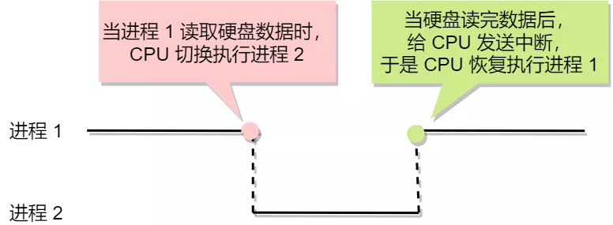
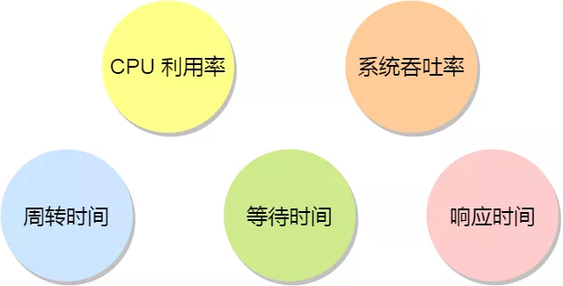

进程和线程基础
---
## 进程
进程是操作系统分配资源的最小单位。
原则上不可能在进程读取硬盘数据的时候cpu一直阻塞等待，所以当进程要从硬盘读取数据时，CPU 不需要阻塞等待数据的返回，而是去执行另外的进程。当硬盘数据返回时，CPU 会收到个中断，于是 CPU 再继续运行这个进程。

这种**多个程序、交替执行**的思想，就有 CPU 管理多个进程的初步想法。虽然单核cpu在任意时刻只会执行一个进程，但是在一段时间内可能执行了多个进程，以此产生并行的错觉，实际上是并发。

### 进程的状态
在一个进程的活动期间至少具备三种基本状态，即**运行状态、就绪状态、阻塞状态**。另外加上两个基本状态：创建和结束。构成以下五种：
- 运行：该时刻进程占用cpu
- 就绪：除了cpu时间片，获得了全部
- 阻塞：该进程等待某一事件发生
- 新建：
- 结束：

挂起状态：它表示进程没有占有物理内存空间。这跟阻塞状态是不一样，阻塞状态是等待某个事件的返回。由于虚拟内存管理原因，**进程的所使用的空间可能并没有映射到物理内存，而是在硬盘上，这时进程就会出现挂起状态**，另外调用 sleep 也会被挂起。挂起也分为两种：
**阻塞挂起状态：** 进程在外存（硬盘）并等待某个事件的出现；
**就绪挂起状态：** 进程在外存（硬盘），但只要进入内存，即刻立刻运行；

### 进程的控制结构
在操作系统中，是用**进程控制块（process control block，PCB）**数据结构来描述进程的。

**PCB 是进程存在的唯一标识**，这意味着一个进程的存在，必然会有一个 PCB，如果进程消失了，那么 PCB 也会随之消失。

**PCB具体包含的信息**
进程描述信息：进程标识符、用户标识符
进程控制和管理信息：进程当前状态、进程优先级
资源分配清单
cpu相关信息

**PCB如何组织？**
通常通过**链表**的方式进行组织，把具有相同状态的进程链在一起，组成各种队列。
- 就绪状态的进程在一起，称之为就绪队列
- 类似的还有阻塞队列
另外还有**索引方式**等。
### 进程的控制
**创建进程**

操作系统允许一个进程创建另一个进程，而且允许子进程继承父进程所拥有的资源。当子进程中止时候，它在父进程处继承的资源应当还给父进程。**(如果父进程一直很忙，没有去wait、waitpid子进程结束时留下的状态信息，那么已经结束的子进程数据结构无从清流，产生僵尸进程)**  同时中止父进程时同时也会终止其所有的子进程。 **(如果没有中止，就是孤儿进程马会杯pid=1的init进程托管)**
**创建进程的过程如下：**
- 为新进程分配一个唯一的进程标识号，并申请一个空白的 PCB，PCB 是有限的，若申请失败则创建失败；
- 为进程分配资源，此处如果资源不足，进程就会进入等待状态，以等待资源；
- 初始化 PCB；
- 如果进程的调度队列能够接纳新进程，那就将进程插入到就绪队列，等待被调度运行；

**终止进程**
三种方式中止进程：正常结束、异常结束、外界干预(Kill)
- 查找需要中止的进程PCB
- 如果出于执行状态则立即中止该进程的执行，然后讲CPU分配给其他进程
- 如果还有子进程，则应将其所有子进程中止
- 将该进程所拥有的全部资源都归还给父进程或操作系统。
- 讲其从PCB所在队列中删除
**阻塞进程**
一旦被阻塞，他只能由另一个进程唤醒
- 找到将要被阻塞的进程标识号对应的PCB
- 转为阻塞状态，停止运行
- PCB插入阻塞链表中
**唤醒进程**
- 在PCB阻塞队列中找到对应的PCB
- 从队列中移出，置为就绪住哪个太
- 这个PCB插入就绪队列，等待cpu分配时间

### 进程上下文切换
各个进程之间是共享 CPU 资源的，在不同的时候进程之间需要切换，**让不同的进程可以在 CPU 执行，那么这个一个进程切换到另一个进程运行，称为进程的上下文切换**。

**什么是CPU上下文切换？**
任务是交给 CPU 运行的，那么在每个任务运行前，CPU 需要知道任务从哪里加载，又从哪里开始运行。**操作系统需要事先帮 CPU 设置好 CPU 寄存器和程序计数器**。
cpu寄存器:CPU 内部一个容量小，但是速度极快的内存（缓存)。
程序计数器：用来存储 CPU 正在执行的指令位置、或者即将执行的下一条指令位置。
**CPU 寄存器和程序计数是 CPU 在运行任何任务前，所必须依赖的环境，这些环境就叫做 CPU 上下文。**
所谓的上下文切换就是保存当前寄存器和程序计数器状态，加载新的任务上下文到里面，开始从新位置执行。
所谓的**任务**，主要包含**进程、线程和中断**。所以，可以根据任务的不同，把 CPU 上下文切换分成：**进程上下文切换、线程上下文切换和中断上下文切换**。

**进程的上下文切换到底是切换什么呢？**
进程是由内核管理和调度的，所以进程的切换只能发生在内核态。

所以，**进程的上下文切换不仅包含了虚拟内存、栈、全局变量等用户空间的资源，还包括了内核堆栈、寄存器等内核空间的资源**。
通常，会把交换的信息保存在进程的 PCB，当要运行另外一个进程的时候，我们需要从这个进程的 PCB 取出上下文，然后恢复到 CPU 中，这使得这个进程可以继续执行，如下图所示：

**发生进程上下文切换有哪些场景？**
- 为了保证所有进程可以得到公平调度，CPU 时间被划分为一段段的时间片，这些时间片再被轮流分配给各个进程。这样，当某个进程的时间片耗尽了，就会被系统挂起，切换到其它正在等待 CPU 的进程运行；正常进程切换
- 进程在系统资源不足（比如内存不足）时，要等到资源满足后才可以运行，这个时候进程也会被挂起，并由系统调度其他进程运行；
- 当进程通过睡眠函数 sleep 这样的方法将自己主动挂起时，自然也会重新调度；
- 当有优先级更高的进程运行时，为了保证高优先级进程的运行，当前进程会被挂起，由高优先级进程来运行；
- 发生**硬件中断**时，CPU 上的进程会被中断挂起，转而执行内核中的中断服务程序；

### 线程
为什么要提出线程？
- 目前的多任务系统单进程的阻塞会导致很多问题。比如媒体读数据和解码播放
- 程序函数之间不是并发执行的，影响资源效率
- 多进程方式中，进程的切换开销较大。进程之间的通信问题解决麻烦。

于是提出了一个新的实体满足，实体之间可以并发运行，实体之间可以共享相同的地址空间。即，**线程是进程当中的一条执行流程。** 同一个进程中的多个线程之间可以共享代码段、数据段、打开的文件等资源，但每个线程都有一套独立的寄存器和栈(TCB)，这样可以确保现成的控制流相对独立。

**线程的优缺点？**
优点：
- 一个进程中可以同时存在多个线程
- 各个线程之间可以并发执行
- 各个线程之间可以共享地址空间和文件资源

缺点：
- 当进程中的一个线程崩溃，会导致所属进程的所有线程崩溃。

### 进程和线程的比较
- **进程是资源分配的单位，线程是cpu调度的单位**
- 进程拥有一个完整的资源平台，线程只占有必不可少的资源，比如站和寄存器，用来表明自身。
- 线程同一套具有就绪、阻塞、执行三种状态，同样具有状态之间的转换关系。
- 线程能减少并发执行的时间和空间开销。具体体现在
- - 线程创建更快，资源管理更少。
- - 终止时间更快，释放的资源少
- - 线程切换更快，线程有相同的地址空间，一个进程内的线程都有同一个页表。而进程的切换需要切换页表
- 线程之间的数据传递不需要经过内核。

### 线程的上下文切换
线程与进程最大的区别在于：**线程是调度的基本单位，而进程则是资源拥有的基本单位。**
所以，所谓操作系统的任务调度，实际上的调度对象是线程，而进程只是给线程提供了虚拟内存、全局变量等资源。
当然由于线程会有自己独有的自身标识和私有数据比如寄存器和栈，所以线程也是需要上下文切换的。

**线程上下文切换是什么？**
首先要看线程是不是一个进程的：
- 两个线程不是属于同一个进程，则切换的过程就跟进程上下文切换一样。
- **当两个线程是属于同一个进程，因为虚拟内存是共享的，所以切换时，虚拟内存这些资源就保存不懂，只需要切换线程私有数据、寄存器等不共享的数据。**

### 线程的实现
- 用户线程:用户空间实现的线程，不由内核管理的线程，是由用户态的线程库来完成线程的管理。
- 内核线程：内核中实现的线程，是由内核管理的线程
- 轻量级进程：内核中来支持用户线程(操作系统中的内核线程多路复用？)

**用户线程-内核线程的对应关系：**
- 多对一
- 一对一
- 多对多

### 用户线程是什么？有什么优缺点？
用户线程是基于用户态的线程管理库来实现的，所以线程控制块(TCB)也是在库里实现的，**操作系统是看不到TCB的，只能看见PCB。**
**所以用户线程的整个线程管理和调度，操作系统是不参与的，而是由用户级线程库函数来完成线程的管理，包括线程的创建、中止、同步和调度。**

用户线程模型：是一个多对一模型，多个线程模型对应一个内核线程

**用户线程的优点：**
- 线程控制块TCB是用户级线程库来维护的，所以可以用于任何操作系统
- 用户线程的切换也是线程库函数来完成的，无需内核态用户态转换，速度快。

**用户线程的缺点：**
- 由于操作系统不参与线程调度，如果一个线程发起了系统调度而阻塞，那进程所包含的用户线程不能执行。
- **当一个线程开始运行，除非它主动交出CPU全限，否则它所在的进程当中的其他线程无法运行，因为用户态的线程无法打断当前运行中的线程，他没有这个特权**，只有操作系统才有，但是用户线程不是由操作系统管理的。这个有意思
- **由于时间片片分配给进程**（时间片是给进程的！），所以和其他进程相比，多线程执行时候，每个线程的时间片较少。

### **那内核线程如何理解？存在什么优势和缺陷？**
**内核线程是由操作系统管理的**，线程对应的 TCB 自然是放在操作系统里的，这样线程的创建、终止和管理都是由**操作系统负责**。

内核线程模型是一对一的关系：线程-进程：

**内核线程的优点**：
- 在一个进程当中，如果某个内核线程发起系统调用而被阻塞，不会影响其他内核线程的运行
- 时间片分配给线程，多线程的进程获得更多CPU运行时间。

**内核线程的缺点：**
- 在支持内核线程的操作系统中，由内核来维护进程和线程的上下文信息PCB/TCB
- 线程的创建中止切换都是系统调用来进行的，所以开销较大。

### 如何理解轻量级进程？
轻量级进程（LWP）是内核支持的用户线程，一个进程可有一个或多个 LWP，每个 LWP 是跟内核线程一对一映射的，也就是 LWP 都是由一个内核线程支持。(一对多)
另外，LWP **只能由内核管理并像普通进程一样被调度**，Linux 内核是支持 LWP 的典型例子。

大多数系统中，**LWP与普通进程的区别也在于它只有一个最小的执行上下文和调度程序所需的统计信息。**一般来说，一个进程代表程序的一个实例，而 LWP 代表程序的执行线程，因为一个执行线程不像进程那样需要那么多状态信息，所以 LWP 也不带有这样的信息。

另外：**在 LWP 之上也是可以使用用户线程的，那么 LWP 与用户线程的对应关系就有三种：**
- 一对多
- 多对多
- 一对一

## 调度
一旦操作系统把进程切换到运行状态，也就意味着该进程占用着 CPU 在执行，但是当操作系统把进程切换到其他状态时，那就不能在 CPU 中执行了，于是操作系统会选择下一个要运行的进程。

选择一个进程运行这一功能是在操作系统中完成的，通常称为**调度程序**

**调度时机：** 当进程从一个运行状态到另外一个状态变化的时候，会触发一次调度。这些状态变化的时候，操作系统需要考虑是否要让新的进程给 CPU 运行，或者是否让当前进程从 CPU 上退出来而换另一个进程运行。

可以根据如何处理时钟中断，把调度算法分为两类：
- 非抢占式调度算法：一个进程一直运行到被阻塞或进程退出才调用另外一个进程。
- 抢占式调度算法：进程只运行某一个时间片，到了就挂起。通常意义上的**时间片机制**。

### 调度原则
1. 如果运行的程序，发生了 I/O 事件的请求，那 CPU 使用率必然会很低，因为此时进程在阻塞等待硬盘的数据返回。这样的过程，势必会造成 CPU 突然的空闲。**所以，为了提高 CPU 利用率，在这种发送I/O 事件致使 CPU 空闲的情况下，调度程序需要从就绪队列中选择一个进程来运行。**
2. 有的程序执行某个任务花费的时间会比较长，如果这个程序一直占用着 CPU，会造成系统吞吐量（CPU 在单位时间内完成的进程数量）的降低。所以，**要提高系统的吞吐率，调度程序要权衡长任务和短任务进程的运行完成数量。**
3. 从进程开始到结束的过程中，实际上是包含两个时间，分别是进程运行时间和进程等待时间，这两个时间总和就称为周转时间。进程的周转时间越小越好，**如果进程的等待时间很长而运行时间很短，那周转时间就很长，这不是我们所期望的，调度程序应该避免这种情况发生。**
4. 处于就绪队列的进程，也不能等太久，当然希望这个等待的时间越短越好，这样可以使得进程更快的在 CPU 中执行。**所以，就绪队列中进程的等待时间也是调度程序所需要考虑的原则**。
5. 对于鼠标、键盘这种交互式比较强的应用，我们当然希望它的响应时间越快越好，否则就会影响用户体验了。所以，**对于交互式比较强的应用，响应时间也是调度程序需要考虑的原则。**
五种调度原则总结：
- CPU 利用率：调度程序应确保 CPU 是始终匆忙的状态，这可提高 CPU 的利用率；
- 系统吞吐量：吞吐量表示的是单位时间内 CPU 完成进程的数量，长作业的进程会占用较长的 CPU 资源，因此会降低吞吐量，相反，短作业的进程会提升系统吞吐量；
- 周转时间：周转时间是进程运行和阻塞时间总和，一个进程的周转时间越小越好；
- 等待时间：这个等待时间不是阻塞状态的时间，而是进程处于就绪队列的时间，等待的时间越长，用户越不满意；
- 响应时间：用户提交请求到系统第一次产生响应所花费的时间，在交互式系统中，响应时间是衡量调度算法好坏的主要标准。

### 调度算法
对于单核CPU系中常见的调度算法：
1.    先来先得算法，非抢占式。**每次从就绪队列选择最先进入队列的进程，然后一直运行，直到进程退出或被阻塞，才会继续从队列中选择第一个进程接着运行。**
   对长作业有利，适用于cpu繁忙的作业系统，不适用于IO密集型的
2. 最短作业优先：优先选择运行时间短的进程来执行，提高系统吞吐量。容易造成极端现象，长作业无法执行。
3. 高响应比优先算法：权衡短作业和常做月，用一个计算公式来执行。`等待时间+服务时间/服务时间`
4. 时间片轮转：最简单最公平的算法。但是如果时间片太短会有太多上下文签环，太长可能想时间太长。
5. 最高优先级调度算法：就绪队列中选择按照优先级运行
6. 多级反馈队列算法：4+5的结合。
   - 「多级」表示有多个队列，每个队列优先级从高到低，同时优先级越高时间片越短。
   - 「反馈」表示如果有新的进程加入优先级高的队列时，立刻停止当前正在运行的进程，转而去运行优先级高的队列；
  **对于短作业可能可以在第一级队列很快被处理完。对于长作业，如果在第一级队列处理不完，可以移入下次队列等待被执行，虽然等待的时间变长了，但是运行时间也会更长了，所以该算法很好的兼顾了长短作业，同时有较好的响应时间。**