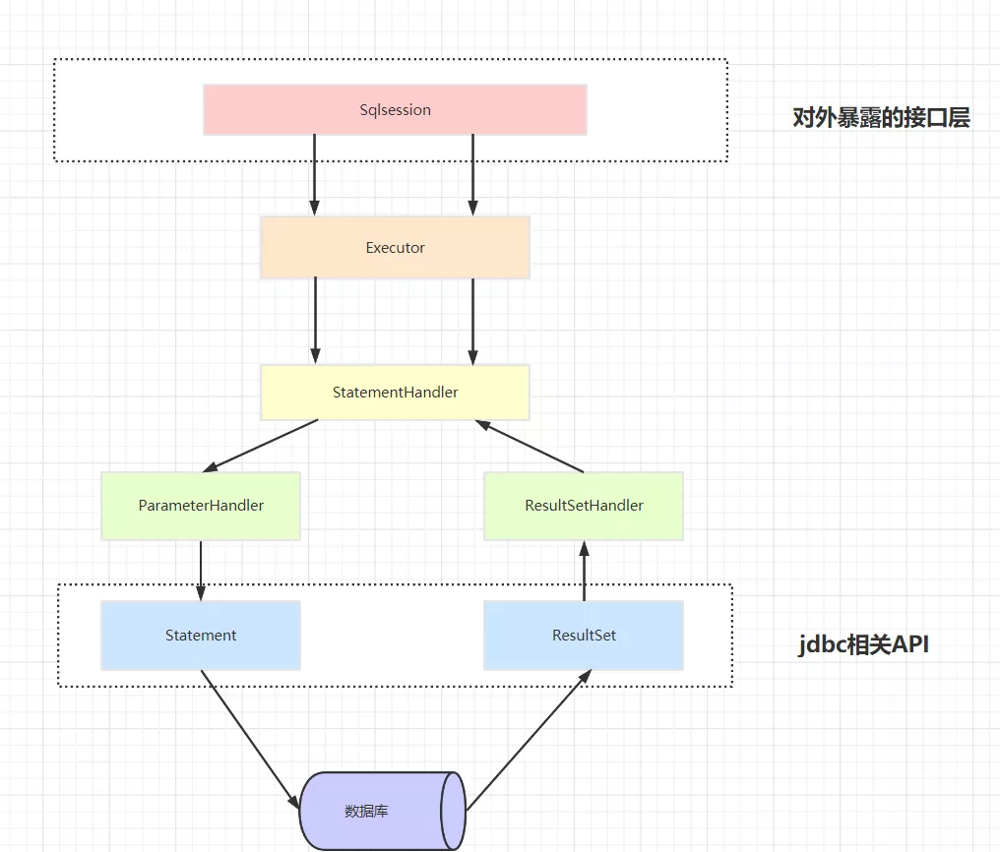
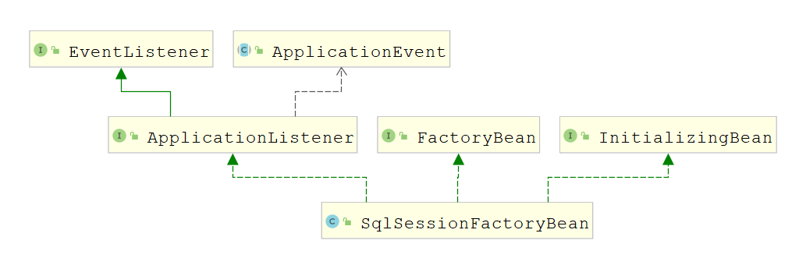

# Mybatis
---

正常Mybatis在执行Sql时起码需要经过下面几个流程：

- Executor负责维护缓存以及事务的管理，它会将对数据库的相关操作委托给StatementHandler完成
- StatementHandler会先通过ParameterHandler完成对Sql语句的参数的绑定
- 调用JDBC相关的API去执行Sql得到结果集，最后通过ResultHandler完成对结果集的封装。

## Mybaits中的事务管理
Mybatis中的事务管理主要有两种方式 
1. **使用JDBC的事务管理机制：** 即利用JDBC中的java.sql.Connection对象完成对事务的提交（commit()）、回滚（rollback()）、关闭（close()）等
**在mybatis-config.xml配置**
```xml
<transactionManager type="JDBC"/>
```
**这表示使用JDBC的事务管理机制**。
另外Mybatis默认是**关闭自动提交**的，也就是说**事务默认就是开启**的。而是否开启事务我们可以在创建SqlSession时进行控制。SqlSessionFactory提供了以下几个用于创建SqlSession的方法：
```java
SqlSession openSession()
SqlSession openSession(boolean autoCommit)
SqlSession openSession(Connection connection)
SqlSession openSession(TransactionIsolationLevel level)
SqlSession openSession(ExecutorType execType, TransactionIsolationLevel level)
SqlSession openSession(ExecutorType execType)
SqlSession openSession(ExecutorType execType, boolean autoCommit)
SqlSession openSession(ExecutorType execType, Connection connection)
```
**使用哪个方法来创建SqlSession主要是根据以下几点:**
- 是否要关闭自动提交，意味着开启事务
- 使用外部传入的连接对象还是从配置信息中获取到的连接对象
- 使用哪种执行方式，一共有三种执行方式
    1. ExecutorType.SIMPLE：每次执行SQL时都创建一个新的PreparedStatement
    2. ExecutorType.REUSE：复用PreparedStatement对象
    3. ExecutorType.BATCH：进行批处理

2. **使用MANAGED的事务管理机制：** 这种机制MyBatis自身不会去实现事务管理，而是让程序的容器如（tomcat，jboss）来实现对事务的管理

## Spring整合Mybatis的原理
虽然上文介绍了Mybatis的事务管理，但是当Mybatis跟Spring进行整合时，事务的管理完全由Spring进行控制！

### SqlSessionFactoryBean的初始化流程

在初始化阶段做的最重要的是就是给成员变量sqlSessionFactory赋值，同时我们知道这是一个FactoryBean，那么不出意外，它的getObject可以是返回了这个被赋值的成员变量。
### 整合原理总结
Mybatis可以通过下面这种方式直接生成一个代理对象
```java
String resource = "mybatis-config.xml";
InputStream resourceAsStream = Resources.getResourceAsStream(resource);
SqlSessionFactoryBuilder builder = new SqlSessionFactoryBuilder();
SqlSessionFactory sqlSessionFactory = builder.build(resourceAsStream);
SqlSession sqlSession = sqlSessionFactory.openSession();
UserMapper mapper = sqlSession.getMapper(UserMapper.class);
```

基于这个代理对象，我们可以执行任意的Sql语句，那么如果Spring想要整合Mybatis，只需要将所有的代理对象管理起来即可，如何做到这一步呢？

这里就用到了Spring提供的一些列扩展点，首先，利用了`BeanDefinitionRegistryPostProcessor`这个扩展点，利用它的`postProcessBeanDefinitionRegistry`方法完成了对mapper接口的扫描，并将其注册到容器中，但是这里需要注意的是，**它并不是简单的进行了扫描，在完成扫描的基础上它将所有的扫描出来的`BeanDefinition的beanClass`属性都替换成了`MapperFactoryBean`**，这样做的原因是因为我们无法根据一个接口来生成Bean，并且实际生成代理对象的逻辑是由`Mybatis`控制的而不是Spring控制，Spring只是调用了`mybatis`的API来完成代理对象的创建并放入到容器中，基于这种需求，使用`FactoryBean`是再合适不过了。

还有通过上面的分析我们会发现，并不是一开始就创建了一个`SqlSession`对象的，而是在实际方法执行时才会去获取`SqlSession`的。