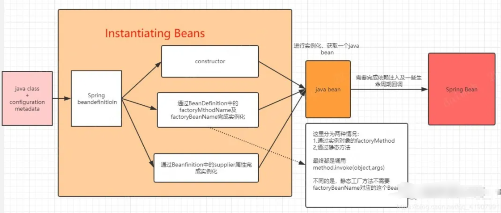
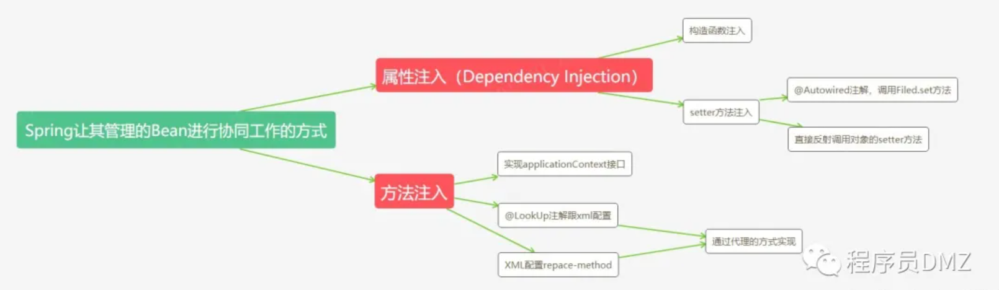
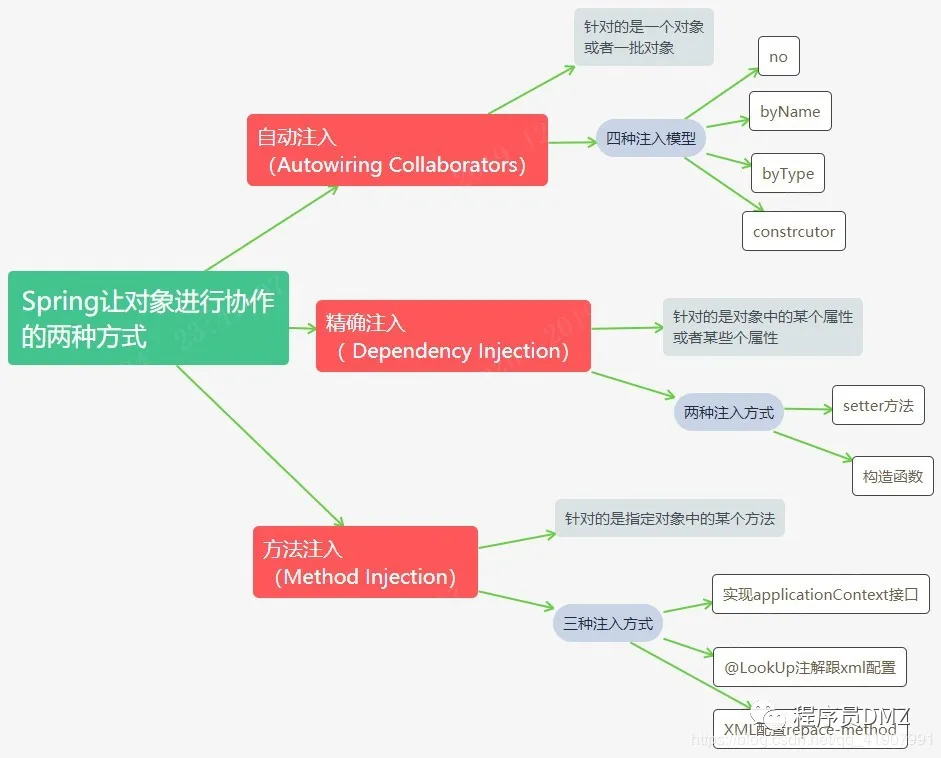
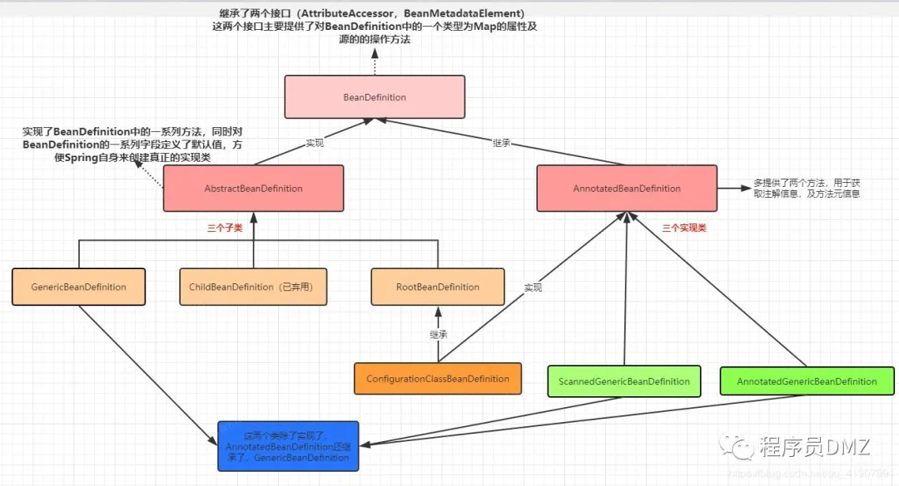
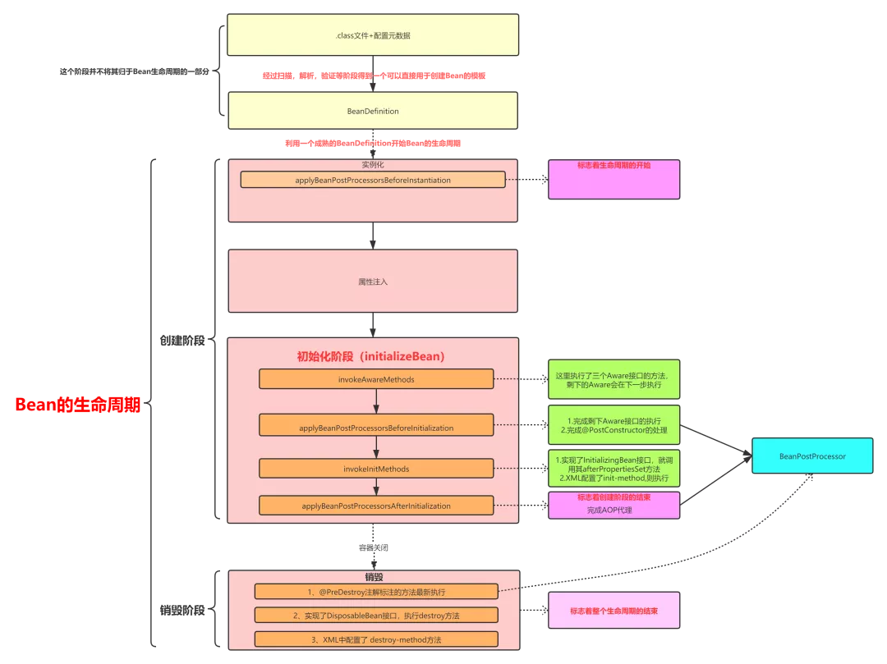
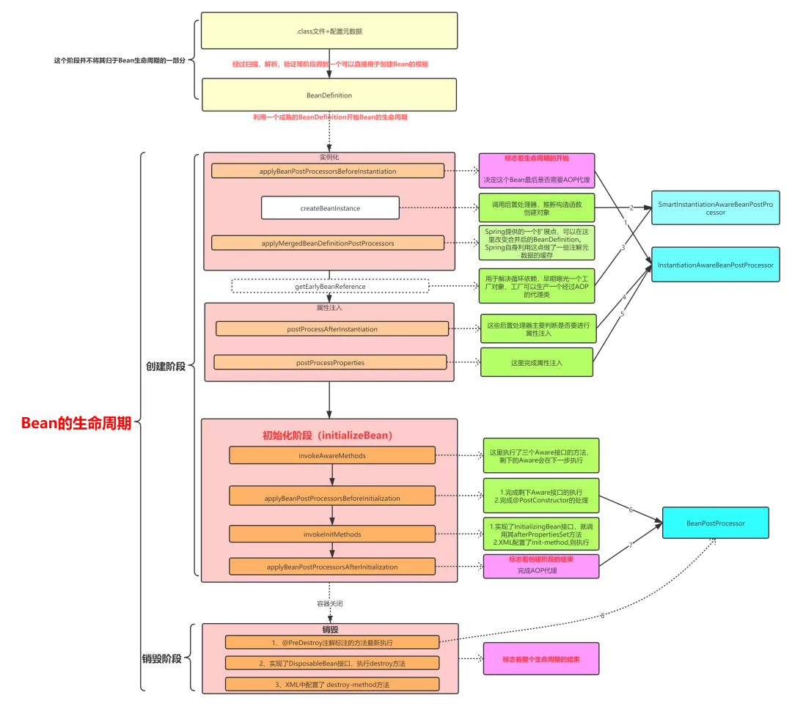
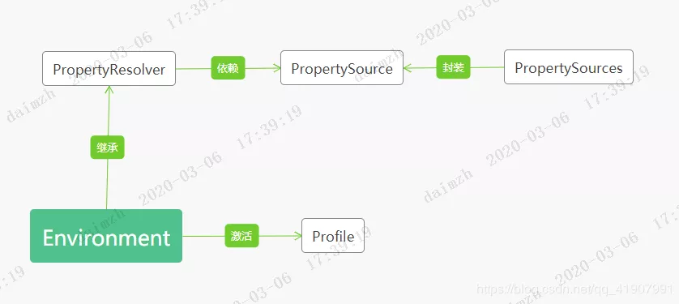

[toc]
# 一、 容器及实例化
## 1.1 容器是什么？
从官方给出的解释来看大致是两点：
- Spring IOC容器就是一个`org.springframework.context.ApplicationContext`的实例化对象
- 容器负责实例化、配置以及装配一个Bean

那么在程序员角度来讲可以说：
- 代码层次：Spring容器就是实现了`ApplicationContext`接口的对象。
- 功能层次：Spring容器时Spring框架的核心，是用来管理对象的。容器将创建对象，把他们连接在一起，配置他们，并管理他们的整个生命周期从创建到销毁。

## 1.2 容器如何工作？
Spring容器通过我们提交的POJO类以及配置元数据产生一个充分配置的可以使用的系统。**实际上这个配置元数据就是XML文件，或注解等。**

## 1.3 如何实例化一个Bean？
- 构造方法
- 静态工厂方法
- 实例工厂方法
在`org.springframework.beans.factory.support.AbstractAutowireCapableBeanFactory#createBeanInstance`中选择不同的方式进行实例化。
1. 没有特殊操作的时候默认会使用无参构造函数进行对象的实例化。
2. `@Bean`会通过反射调用静态工厂,使用工厂实例化，实例化的对象是根据BeanName去BD里面找。
3. 直接通过静态工厂方法模式创建对象，**不需要被Spring管理**。直接通过`<bean>`标签获得对象，调用`Method.invoke()`，不需要经过BD等。
4. 实例工厂方法，和@Bean是一样的。

## 1.4 实例化总结
1. 对象实例化，只是得到一个对象，还不是一个完全的Spring中的Bean，我们实例化后的这个对象还没有完成依赖注入，没有走完一系列的声明周期。
2. Spring官网指明了，在Spring中实例化一个对象有三种方式。
   - 构造方法
   - 实力工厂方法
   - 静态工厂方法


# 二、依赖注入以及方法注入
## 2.1 依赖注入

1. 构造函数注入
2. Setter方法注入

**`@Autowired`直接加到字段上跟加到set方法上有什么区别？为什么验证的时候需要将其添加到setter方法上？**
- 首先，直接添加@Autowired注解到字段上，不需要提供setter方法也能完成注入。调用Filed.set()方法
- 将`@Autowired`添加到setter方法时,对于这种方式来说，最终是通过`Method.invoke(object,args)`的方式反射来完成注入的，这里的method对象就是我们的setter方法

**`@Autowired`为什么加到构造函数上可以指定使用这个构造函数？**
- **在默认的注入模型下**，Spring如果同时找到了两个符合要求的构造函数，那么Spring会采用默认的无参构造进行实例化，如果这个时候没有无参构造，那么此时会报错java.lang.NoSuchMethodException。什么叫符合要求的构造函数呢？就是构造函数中的参数Spring能找到，参数被Spring所管理。
**这里需要着重记得：一，默认注入模型；二，符合要求的构造函数**
**所以要把autowired加到构造函数上指定。**

**如果同时采用构造注入加属性注入会怎么样呢？**
- Spring虽然能在构造函数里完成属性注入，但是这属于**实例化对象阶段**做的事情，那么在后面真正进行属性注入的时候，肯定会将其覆盖掉。 

**那么基于构造器注入和Setter注入的区别？**
- 构造函数注入跟setter方法注入可以混用
- 对于一些强制的依赖，最好使用构造器注入，对于可选的依赖可以采用setter
- Spring团队推荐使用构造器注入

## 2.2 方法注入
对于方法注入不是很熟悉..大致上分为
- 通过注入上下文
- @LookUp
- replace-method

## 2.3 总结
首先明确什么是依赖：一个对象的依赖就是他自身的属性，**Spring中的依赖注入就是属性注入。**

依赖注入跟方法注入的总结：
- 我们知道一个对象由两部分组成：属性+行为（方法），可以说Spring通过属性注入+方法注入的方式掌控的整个bean。
- 属性注入跟方法注入都是Spring提供给我们用来处理Bean之间协作关系的手段
- 属性注入有两种方式：构造函数，Setter方法。
- 方法注入（LookUp Method跟Replace Method）需要依赖动态代理完成
- 方法注入对属性注入进行了一定程度上的补充，因为属性注入的情况下，原型对象可能会失去原型的意义。


# 三、自动注入
先要对**自动注入及精确注入**有一个大概的了解，所谓**精确注入**就是指，我们通过构造函数或者setter方法指定了我们对象之间的依赖，也就是我依赖注入，然后Spring根据我们指定的依赖关系，精确的给我们完成了注入。

**那么自动注入是什么？**
```xml
<?xml version="1.0" encoding="UTF-8"?>
<beans xmlns="http://www.springframework.org/schema/beans"
    xmlns:xsi="http://www.w3.org/2001/XMLSchema-instance"
    xsi:schemaLocation="http://www.springframework.org/schema/beans http://www.springframework.org/schema/dbeans/spring-beans.xsd"
>
 <bean id="auto" class="com.dmz.official.service.AutoService" autowire="byType"/>
 /*重点就是这个属性*/
 <bean id="dmzService" class="com.dmz.official.service.DmzService"/>
</beans>
```
```java
public class AutoService {
 DmzService service;
 public void setService(DmzService dmzService){
  System.out.println("注入dmzService"+dmzService);
  service = dmzService;
 }
}
public class DmzService {

}
public class Main03 {
 public static void main(String[] args) {
  ClassPathXmlApplicationContext cc =
    new ClassPathXmlApplicationContext("application.xml");
  System.out.println(cc.getBean("auto"));
 }
}
```
从上述代码中可以看出：
- 我们没有采用注解@Autowired进行注入
- XML中没有指定属性标签<property>
- 没有使用构造函数

**但是结果：**
```java
注入dmzServicecom.dmz.official.service.DmzService@73a8dfcc  // 这里完成了注入
com.dmz.official.service.AutoService@1963006a
```
`AutoService`的标签中新增了一个属性`autowire="byType"`完成了自动注入这个任务。
自动注入的优点：
- 自动注入减少指定属性或构造参数的必要
- 自动装配可以随着对象的演化更新配置

**注入模型：**
- no：Spring默认的注入模型及关闭自动注入。必须要通过setter方法或构造函数完成依赖注入。
- byName：这种方式为了让Spring完成自动注入需要两个条件。1. 提供setter方法。2.注入属性的方法命必须规范`setXxx`()---找不到对应name的时候不会报错，也不会注入
- byType：`autowire="byType"`。1.找不到合适的，不注入不报异常。2. 找到多个合适的，报异常。
- constructor
  这种注入模型，Spring会根据构造函数查找有没有对应参数名称的bean,有的话完成注入 **（跟byName差不多）** ，如果根据名称没找到，那么它会再根据类型进行查找，如果根据类型还是没找到，就会报错

**自动注入的缺陷：**
官方其实极其不愿意用户使用。。一直在说缺点：
1. 精确注入会覆盖自动注入，并且不能注入基本数据类型，字符串等
2. 自动注入不如精确注入准确，依赖关系不明确
3. 自动注入出错很可能不抛出异常

## 总结

- 从关注的点上来看，自动注入是针对的整个对象，或者一整批对象。比如我们如果将`autoService`这个`bean`的注入模型设置为`byName`，Spring会为我们去寻找所有符合要求的名字（通过set方法）bean并注入到`autoService`中。而精确注入这种方式，是我们针对对象中的某个属性，比如我们在`autoService`中的`dmzService`这个属性字段上添加了`@AutoWired`注解，代表我们要精确的注入`dmzService`这个属性。而方法注入主要是基于方法对对象进行注入。
- 我们通常所说 **byName,byType跟我们在前文提到的注入模型中的byName,byType是完全不一样的。** 通常我们说的byName,byType是Spring寻找bean的手段。比如，当我们注入模型为constructor时，Spring会先通过名称找对符合要求的bean，这种通过名称寻找对应的bean的方式我们可以称为byName。我们可以将一次注入分为两个阶段，首先是寻找符合要求的bean，其次再是将符合要求的bean注入。

**注意：** **现在annotation-based configuration对注入的精细程度可以有多个维度的控制，已经没有很鲜明的所谓自动注入vs精细注入了。**

# 三、BeanDefinition（上）
## 3.1 BeanDefinition是什么？
1. `BeanDefinition`包含了我们对bean做的配置，比如`XML<bean/>`标签的形式进行的配置。
2. Spring将我们对bean的定义信息进行了抽象，抽象后的实体就是`BeanDefinition`,并且Spring会以此作为标准来对Bean进行创建
3. `BeanDefinition`包含以下元数据：
   - 一个全限定类名
   - bean的行为配置元素
   - bean的依赖信息
   - 其他配置信息等

**相比于正常new一个对象，spring中通过BD创建对象有什么区别？**
相比于正常的对象的创建过程，Spring对其管理的bean没有直接采用new的方式，而是先通过解析配置数据以及根据对象本身的一些定义而获取其对应的beandefinition,并将这个beandefinition作为之后创建这个bean的依据。同时Spring在这个过程中**提供了一些扩展点**。

## 3.2 BD的方法分析
```java
// 获取父BeanDefinition,主要用于合并，下节中会详细分析
String getParentName();

// 对于的bean的ClassName
void setBeanClassName(@Nullable String beanClassName);

// Bean的作用域，不考虑web容器，主要两种，单例/原型，见官网中1.5内容
void setScope(@Nullable String scope);

// 是否进行懒加载
void setLazyInit(boolean lazyInit);

// 是否需要等待指定的bean创建完之后再创建
void setDependsOn(@Nullable String... dependsOn);

// 是否作为自动注入的候选对象
void setAutowireCandidate(boolean autowireCandidate);

// 是否作为主选的bean
void setPrimary(boolean primary);

// 创建这个bean的类的名称
void setFactoryBeanName(@Nullable String factoryBeanName);

// 创建这个bean的方法的名称
void setFactoryMethodName(@Nullable String factoryMethodName);

// 构造函数的参数
ConstructorArgumentValues getConstructorArgumentValues();

// setter方法的参数
MutablePropertyValues getPropertyValues();

// 生命周期回调方法，在bean完成属性注入后调用
void setInitMethodName(@Nullable String initMethodName);

// 生命周期回调方法，在bean被销毁时调用
void setDestroyMethodName(@Nullable String destroyMethodName);

// Spring可以对bd设置不同的角色,了解即可，不重要
// 用户定义 int ROLE_APPLICATION = 0;
// 某些复杂的配置    int ROLE_SUPPORT = 1;
// 完全内部使用   int ROLE_INFRASTRUCTURE = 2;
void setRole(int role);

// bean的描述，没有什么实际含义
void setDescription(@Nullable String description);

// 根据scope判断是否是单例
boolean isSingleton();

// 根据scope判断是否是原型
boolean isPrototype();

// 跟合并beanDefinition相关，如果是abstract，说明会被作为一个父beanDefinition，不用提供class属性
boolean isAbstract();

// bean的源描述，没有什么实际含义 
String getResourceDescription();

// cglib代理前的BeanDefinition
BeanDefinition getOriginatingBeanDefinition();
```

**为什么需要派生抽象类`AbstractBeanDefinition`**
对比`BeanDefinition`的源码我们可以发现，`AbstractBeanDefinition`对`BeanDefinition`的大部分方法做了实现（没有实现`parentName`相关方法）。同时定义了一系列的常量及默认字段。这是因为`BeanDefinition`接口过于顶层，如果我们依赖`BeanDefinition`这个接口直接去创建其实现类的话过于麻烦，所以通过`AbstractBeanDefinition`做了一个下沉，并给很多属性赋了默认值。

**AbstractBeanDefinition的三个子类**
1. GenericBeanDefinition
2. ChildBeanDefinition
3. RootBeanDefinition

**AnnotatedBeanDefinition?**（从注解方式定义bean）
这个接口继承了我们的`BeanDefinition`接口，实际上这个接口相比于`BeanDefinition`， 仅仅多提供了两个方法：
- `getMetadata()`,主要用于获取注解元素据。从接口的命名上我们也能看出，这类主要用于保存通过注解方式定义的bean所对应的`BeanDefinition`。所以它多提供了一个关于获取注解信息的方法
- `getFactoryMethodMetadata()`,这个方法跟我们的`@Bean`注解相关。当我们在一个配置类中使用了`@Bean`注解时，被`@Bean`注解标记的方法，就被解析成了`FactoryMethodMetadata`。

**AnnotatedBeanDefinition的三个实现类**
1. AnnotatedGenericBeanDefinition：
- 通过形如下面的API注册的bean都是`AnnotatedGenericBeanDefinition`
```java
public static void main(String[] args) {
    AnnotationConfigApplicationContext ac = new AnnotationConfigApplicationContext();
    ac.register(Config.class);
}

```
这里的`config`对象，最后在Spring容器中就是一个`AnnotatedGenericBeanDefinition`。
- 通过`@Import`注解导入的类，最后都是解析为`AnnotatedGenericBeanDefinition`。
2. ScannedGenericBeanDefinition
都过**注解扫描的类**，如`@Service`,`@Compent`等方式配置的Bean都是`ScannedGenericBeanDefinition`
3. ConfigurationClassBeanDefinition
通过`@Bean`的方式配置的Bean为`ConfigurationClassBeanDefinition`

## 中间总结一下
1. 什么是BeanDefinition，总结起来就是一句话，Spring创建bean时的建模对象。
2. BeanDefinition的具体使用的子类，以及Spring在哪些地方使用到了它们。画图总结如下：


# 四、BeanDefinition（下）BD合并
## 4.1 什么是合并？
一个`BeanDefinition`包含了很多的配置信息，包括构造参数，setter 方法的参数还有容器特定的一些配置信息，比如初始化方法，静态工厂方法等等。一个子的`BeanDefinition`可以从它的父`BeanDefinition`继承配置信息，不仅如此，还可以覆盖其中的一些值或者添加一些自己需要的属性。**使用`BeanDefinition`的父子定义可以减少很多的重复属性的设置，父`BeanDefinition`可以作为`BeanDefinition`定义的模板。**

**合并总结：**
- 子BD会从父BD中继承没有的属性
- 这个过程中子BD中已经存在的属性不会被父BD中所覆盖

==合并需要注意的点：==
- 子BeanDefinition中的class属性如果为 null，同时父BeanDefinition又指定了class属性，那么子BeanDefinition也会继承这个class属性。
- 子BeanDefinition必须要兼容父BeanDefinition中的所有属性。我们在父BeanDefinition中指定了 name 跟 age 属性，但是如果子BeanDefinition中子提供了一个 name 的 setter 方法，这个时候 Spring 在启动的时候会报错。因为子BeanDefinition不能承接所有来自父BeanDefinition的属性
- 关于BeanDefinition中abstract属性的说明：
  1. 并不是作为父BeanDefinition就一定要设置abstract属性为 true，abstract只代表了这个BeanDefinition是否要被 Spring 进行实例化并被创建对应的 Bean，如果为 true，代表容器不需要去对其进行实例化。
  2. 如果一个BeanDefinition被当作父BeanDefinition使用，并且没有指定其class属性。那么必须要设置其abstract为 true
  3. abstract=true一般会跟父BeanDefinition一起使用，因为当我们设置某个BeanDefinition的abstract=true时，一般都是要将其当作BeanDefinition的模板使用，否则这个BeanDefinition也没有意义，除非我们使用其它BeanDefinition来继承它的属性
## 4.2 Spring在哪些地方做了合并
1. 扫描并获取到bd
2. 实例化：Spring 在实例化一个对象也会进行bd的合并。

## 4.3 为什么需要合并？
1. 在扫描阶段，之所以发生了合并，是因为 Spring 需要拿到指定了实现了BeanDefinitionRegistryPostProcessor接口的bd的名称，也就是说，Spring 需要用到bd的名称。所以进行了一次bd的合并。
2. 在实例化阶段，是因为 Spring 需要用到bd中的一系列属性做判断所以进行了一次合并。
**总结起来，其实就是一个原因：Spring 需要用到bd的属性，要保证获取到的bd的属性是正确的。**

**4.4 为什么获取到的bd中属性可能不正确呢？**
1. 作为子bd,属性本身就有可能缺失，比如属性在父BD中，子BD没有。
2. Spring 提供了很多扩展点，在启动容器的时候，可能会修改bd中的属性。比如一个正常实现了BeanFactoryPostProcessor就能修改容器中的任意的bd的属性。

## 总结
我们要明白 Spring 为什么要进行合并，之所以再每次需要用到BeanDefinition都进行一次合并，是为了**每次都拿到最新的，最有效的BeanDefinition**，因为利用容器提供了一些扩展点我们可以修改BeanDefinition中的属性。

# 五、容器扩展点
容器的扩展点可以分类三类，BeanPostProcessor,BeanFactoryPostProcessor以及FactoryBean。
## 5.1 BeanFactoryPostProcessor
这个可以修改BD
1. `BeanFactoryPostProcessor`可以对Bean配置元数据进行操作。也就是说，Spring容器允许`BeanFactoryPostProcessor`读取指定Bean的配置元数据，并可以在Bean被实例化之前修改它。这里说的配置元数据其实就是我们之前讲过的`BeanDefinition`。
2. 我们可以配置多个`BeanFactoryPostProcessor`，并且只要我们配置的`BeanFactoryPostProcessor`同时实现了Ordered接口的话，我们还可以控制这些`BeanFactoryPostProcessor`执行的顺序

**几个问题：**
1. **可不可以在BeanFactoryPostProcessor去创建一个Bean，这样有什么问题？**
从技术上来说这样是可以的，但是正常情况下我们不该这样做，这是因为可能会存在该执行的Bean工厂的后置处理器的逻辑没有被应用到这个Bean上。
2. **BeanFactoryPostProcessor可以被配置为懒加载吗？**
不能配置为懒加载，即使配置了也不会生效。我们将Bean工厂后置处理器配置为懒加载这个行为就没有任何意义

**`BeanFactoryPostProcessor`执行的顺序，总结如下：**
- 执行直接实现了`BeanDefinitionRegistryPostProcessor`接口的后置处理器，所有实现了`BeanDefinitionRegistryPostProcessor`接口的类有两个方法，一个是特有的`postProcessBeanDefinitionRegistry`方法，一个是继承子父接口的`postProcessBeanFactory`方法。
- - `postProcessBeanDefinitionRegistry`方法早于`postProcessBeanFactory`方法执行，对于`postProcessBeanDefinitionRegistry`的执行顺序又遵循如下原子
- - 执行完所有的`postProcessBeanDefinitionRegistry`方法后，再执行实现了`BeanDefinitionRegistryPostProcessor`接口的类中的`postProcessBeanFactory`方法
  1. 先执行实现了`PriorityOrdered`接口的类中的`postProcessBeanDefinitionRegistry`方法
  2. 再执行实现了Ordered接口的类中的`postProcessBeanDefinitionRegistry`的方法
  3. 最后执行没有实现上面两个接口的类中的`postProcessBeanDefinitionRegistry`的方法
- 再执行直接实现了`BeanFactoryPostProcessor`接口的后置处理器
  1. 先执行实现了`PriorityOrdered`接口的类中的`postProcessBeanFactory`方法
  2. 再执行实现了`Ordered`接口的类中的`postProcessBeanFactory`的方法
  3. 最后执行没有实现上面两个接口的类中的`postProcessBeanFactory`的方法

## 5.2 FactoryBean
提供了一种特殊的创建Bean的手段，能让我们将一个对象直接放入到容器中，成为Spring所管理的一个Bean。

1. **FactoryBean主要用来定制化Bean的创建逻辑**
2. 当我们实例化一个Bean的逻辑很复杂的时候，使用FactoryBean是很必要的，这样可以规避我们去使用冗长的XML配置

### 5.2.1 跟FactoryBean相关常见的面试题:
1. FactoryBean跟BeanFactory的区别
- `FactoryBean`是Spring提供的一个扩展点，适用于复杂的Bean的创建。mybatis在跟Spring做整合时就用到了这个扩展点。并且FactoryBean所创建的Bean跟普通的Bean不一样。我们可以说FactoryBean是Spring创建Bean的另外一种手段。
- `BeanFactory`是Spring IOC容器的顶级接口，其实现类有`XMLBeanFactory，DefaultListableBeanFactory以及AnnotationConfigApplicationContext`等。BeanFactory为Spring管理Bean提供了一套通用的规范。
  
2. 如何把一个对象交给Spring管理
   “对象”要划重点，**我们通常采用的注解如@Compent或者XML配置这种类似的操作并不能将一个对象交给Spring管理，而是让Spring根据我们的配置信息及类信息创建并管理了这个对象，**形成了Spring中一个Bean。
   把一个对象交给Spring管理主要有两种方式:
   - 就是用我们这篇文章中的主角，`FactoryBean`，我们直接在`FactoryBean`的getObject方法直接返回需要被管理的对象即可.(类似mybatis)
   - @Bean注解，同样通过@Bean注解标注的方法直接返回需要被管理的对象即可。

### 总结
FactoryBean是Spring中特殊的一个Bean，Spring利用它提供了另一种创建Bean的方式。
## 5.3 BeanPostProcessor
BeanPostProcessor它主要干预的是Spring中Bean的整个生命周期（实例化---属性填充---初始化---销毁）。
1. `BeanPostProcessor`接口定义了两个回调方法，通过实现这两个方法我们可以提供自己的实例化以及依赖注入等逻辑。而且，如果我们想要在Spring容器完成实例化，配置以及初始化一个Bean后进行一些定制的逻辑，我们可以插入一个甚至更多的`BeanPostProcessor`的实现。
2. 我们可以配置多个`BeanPostProcessor`，并且只要我们配置的`BeanFactoryPostProcessor`同时实现了Ordered接口的话，我们还可以控制这些`BeanPostProcessor`执行的顺序

# 第五章总结
**三个容器的扩展点就学习完了，可以简单总结如下：**
1. BeanPostProcessor，主要用于干预Bean的创建过程。
2. BeanFactroyPostProcessor，主要用于针对容器中的BeanDefinition。
3. FactoryBean，主要用于将一个对象直接放入到Spring容器中，同时可以封装复杂的对象的创建逻辑。

# 六、 Bean的生命周期总结
Bean的生命周期应该从哪里开始？
个人认为**从第一次调用后置处理器中的`applyBeanPostProcessorsBeforeInstantiation`方法开始的，即实例化前调用后置处理器。而`applyBeanPostProcessorsAfterInitialization`方法调用意味着Bean生命周期中的创建阶段结束。


需要注意的是，对于`BeanDefinion`的扫描，解析，验证**并不属于Bean的生命周期的一部分**。整个Bean的生命周期，我将其分为了两部分
- 创建
- 销毁
## 6.1 实例化
createBean流程分析
```java
protected Object createBean(String beanName, RootBeanDefinition mbd, @Nullable Object[] args)
   throws BeanCreationException {

  RootBeanDefinition mbdToUse = mbd;
  
    // 第一步：解析BeanDefinition中的beanClass属性
  Class<?> resolvedClass = resolveBeanClass(mbd, beanName);
  if (resolvedClass != null && !mbd.hasBeanClass() && mbd.getBeanClassName() != null) {
   mbdToUse = new RootBeanDefinition(mbd);
   mbdToUse.setBeanClass(resolvedClass);
  }
    
  try {
            // 第二步：处理lookup-method跟replace-method，判断是否存在方法的重载
   mbdToUse.prepareMethodOverrides();
  }
  catch (BeanDefinitionValidationException ex) {
   throw new BeanDefinitionStoreException(mbdToUse.getResourceDescription(),
     beanName, "Validation of method overrides failed", ex);
  }

  try {
   // 第三步：判断这个类在之后是否需要进行AOP代理
   Object bean = resolveBeforeInstantiation(beanName, mbdToUse);
   if (bean != null) {
    return bean;
   }
  }
  catch (Throwable ex) {
   throw new BeanCreationException(mbdToUse.getResourceDescription(), beanName,
     "BeanPostProcessor before instantiation of bean failed", ex);
  }

  try {
            // 开始创建Bean
   Object beanInstance = doCreateBean(beanName, mbdToUse, args);
   return beanInstance;
  }
  catch (BeanCreationException | ImplicitlyAppearedSingletonException ex) {
   throw ex;
  }
  catch (Throwable ex) {
   throw new BeanCreationException(
     mbdToUse.getResourceDescription(), beanName, "Unexpected exception during bean creation", ex);
  }
 }
```
第一步跟第二步还是在对`BeanDefinition`中的一些属性做处理，它并不属于我们Bean的生命周期的一部分，**直接跳过**，接下来看第三步的代码：
```java
protected Object resolveBeforeInstantiation(String beanName, RootBeanDefinition mbd) {
    Object bean = null;
    if (!Boolean.FALSE.equals(mbd.beforeInstantiationResolved)) {
        // 不是合成类，并且有实例化后置处理器。这个判断基本上恒成立
        if (!mbd.isSynthetic() && hasInstantiationAwareBeanPostProcessors()) {
            // 获取这个BeanDefinition的类型
            Class<?> targetType = determineTargetType(beanName, mbd);
            if (targetType != null) {
                // 这里执行的主要是AbstractAutoProxyCreator这个类中的方法，决定是否要进行AOP代理
                bean = applyBeanPostProcessorsBeforeInstantiation(targetType, beanName);
                // 这里执行了一个短路操作，如果在这个后置处理中直接返回了一个Bean,那么后面相关的操作就不会执行了，只会执行一个AOP的代理操作
                if (bean != null) {
                    // 虽然这个Bean被短路了，意味着不需要经过后面的初始化阶段，但是如果需要代理的话，还是要进行AOP代理，这个地方的短路操作只是意味着我们直接在后置处理器中提供了一个准备充分的的Bean，这个Bean不需要进行初始化，但需不需要进行代理，任然由AbstractAutoProxyCreator的applyBeanPostProcessorsBeforeInstantiation方法决定。在这个地方还是要调用一次Bean的初始化后置处理器保证Bean被完全的处理完
                    bean = applyBeanPostProcessorsAfterInitialization(bean, beanName);
                }
            }
        }
        // bean != null基本会一直返回false,所以beforeInstantiationResolved这个变量也会一直为false
        mbd.beforeInstantiationResolved = (bean != null);
    }
    return bean;
}
```
对于`AbstractAutoProxyCreator`中`applyBeanPostProcessorsBeforeInstantiation`这个方法的分析我们暂且不管，等到AOP学习阶段在进行详细分析。我们暂且**只需要知道这个方法会决定在后续中要不要为这个Bean产生代理对象**。
## 6.2 doCreateBean流程分析
```java
protected Object doCreateBean(final String beanName, final RootBeanDefinition mbd, final @Nullable Object[] args)
   throws BeanCreationException {

  BeanWrapper instanceWrapper = null;
  if (mbd.isSingleton()) {
            // 第一步：单例情况下，看factoryBeanInstanceCache这个缓存中是否有
   instanceWrapper = this.factoryBeanInstanceCache.remove(beanName);
  }
  if (instanceWrapper == null) {
            // 第二步：这里创建对象
   instanceWrapper = createBeanInstance(beanName, mbd, args);
  }
  final Object bean = instanceWrapper.getWrappedInstance();
  Class<?> beanType = instanceWrapper.getWrappedClass();
  if (beanType != NullBean.class) {
   mbd.resolvedTargetType = beanType;
  }

  synchronized (mbd.postProcessingLock) {
   if (!mbd.postProcessed) {
    try {
                    // 第三步：后置处理器处理
     applyMergedBeanDefinitionPostProcessors(mbd, beanType, beanName);
    }
    catch (Throwable ex) {
     // 省略异常处理
    }
    mbd.postProcessed = true;
   }
  }
  
        // 判断是否要循环引用相关，源码阅读阶段再来解读这段代码，暂且就关注以下后置处理器的调用时机
  boolean earlySingletonExposure = (mbd.isSingleton() && this.allowCircularReferences &&
    isSingletonCurrentlyInCreation(beanName));
  if (earlySingletonExposure) {
   // 第四步：调用后置处理器，早期曝光一个工厂对象
   addSingletonFactory(beanName, () -> getEarlyBeanReference(beanName, mbd, bean));
  }

  Object exposedObject = bean;
  try {
            // 第五步：属性注入
   populateBean(beanName, mbd, instanceWrapper);
            // 第六步：初始化
   exposedObject = initializeBean(beanName, exposedObject, mbd);
  }
  catch (Throwable ex) {
   if (ex instanceof BeanCreationException && beanName.equals(((BeanCreationException) ex).getBeanName())) {
    throw (BeanCreationException) ex;
   }
   else {
    // 省略异常处理
   }
  }

  if (earlySingletonExposure) {
   Object earlySingletonReference = getSingleton(beanName, false);
   if (earlySingletonReference != null) {
    if (exposedObject == bean) {
     exposedObject = earlySingletonReference;
    }
    else if (!this.allowRawInjectionDespiteWrapping && hasDependentBean(beanName)) {
     String[] dependentBeans = getDependentBeans(beanName);
     Set<String> actualDependentBeans = new LinkedHashSet<>(dependentBeans.length);
     for (String dependentBean : dependentBeans) {
      if (!removeSingletonIfCreatedForTypeCheckOnly(dependentBean)) {
       actualDependentBeans.add(dependentBean);
      }
     }
     if (!actualDependentBeans.isEmpty()) {
      // 省略异常处理
     }
    }
   }
  }

  try {
            // 第七步：注册需要销毁的Bean,放到一个需要销毁的Map中（disposableBeans）
   registerDisposableBeanIfNecessary(beanName, bean, mbd);
  }
  catch (BeanDefinitionValidationException ex) {
   // 省略异常处理
  }

  return exposedObject;
 }
```
**第一步：factoryBeanInstanceCache什么时候不为空？**
```java
if (mbd.isSingleton()) {
    // 第一步：单例情况下，看factoryBeanInstanceCache这个缓存中是否有
    instanceWrapper = this.factoryBeanInstanceCache.remove(beanName);
}
```
**属性注入的一个操作：**
假设Spring现在知道`IndexService`要注入一个类型为A的属性，所以它会遍历所有的解析出来的`BeanDefinition`，然后每一个`BeanDefinition`中的类型是不是A类型。
这种判断大部分情况下是成立的，**但是对于一种特殊的Bean是不行的，就是我们之前介绍过的`FactoryBean`，因为我们配置`FactoacryBean`的目的并不是直接使用`FactoryBean`这个Bean自身，而是想要通过它的`getObject`方法将一个对象放到Spring容器中，**所以当我们遍历到一个`BeanDefinition`，并且这个`BeanDefinition`是一个`FactoacryBean`时就需要做特殊处理，我们知道`FactoacryBean`中有一个`getObjectType`方法，通过这个方法我们可以得到要被这个`FactoacryBean`创建的对象的类型，如果我们能调用这个方法的话，那么我们就可以来判断这个类型是不是一个A了。

**第二步：创建对象（createBeanInstance）**
```java
  // 获取到解析后的beanClass
  Class<?> beanClass = resolveBeanClass(mbd, beanName);
  
     // 忽略异常处理
  Supplier<?> instanceSupplier = mbd.getInstanceSupplier();
  if (instanceSupplier != null) {
   return obtainFromSupplier(instanceSupplier, beanName);
  }
  
     // 获取工厂方法，用于之后创建对象 
  if (mbd.getFactoryMethodName() != null) {
   return instantiateUsingFactoryMethod(beanName, mbd, args);
  }

  // 原型情况下避免多次解析
  boolean resolved = false;
  boolean autowireNecessary = false;
  if (args == null) {
   synchronized (mbd.constructorArgumentLock) {
    if (mbd.resolvedConstructorOrFactoryMethod != null) {
     resolved = true;
     autowireNecessary = mbd.constructorArgumentsResolved;
    }
   }
  }
  if (resolved) {
   if (autowireNecessary) {
    return autowireConstructor(beanName, mbd, null, null);
   }
   else {
    return instantiateBean(beanName, mbd);
   }
  }

  // 跟后置处理器相关，我们主要关注这行代码
  Constructor<?>[] ctors = determineConstructorsFromBeanPostProcessors(beanClass, beanName);
  if (ctors != null || mbd.getResolvedAutowireMode() == AUTOWIRE_CONSTRUCTOR ||
    mbd.hasConstructorArgumentValues() || !ObjectUtils.isEmpty(args)) {
   return autowireConstructor(beanName, mbd, ctors, args);
  }

  // Preferred constructors for default construction?
  ctors = mbd.getPreferredConstructors();
  if (ctors != null) {
   return autowireConstructor(beanName, mbd, ctors, null);
  }

  // 默认使用无参构造函数创建对象
  return instantiateBean(beanName, mbd);
 }
 ```
 暂且知道在创建对象的过程中，Spring会调用一个后置处理器来推断构造函数。
 **第三步：applyMergedBeanDefinitionPostProcessors**
 应用合并后的BeanDefinition，Spring自身利用这点做了一些注解元数据的缓存。
我们就以AutowiredAnnotationBeanPostProcessor这个类的对应方法看一下其大概作用.
```java
public void postProcessMergedBeanDefinition(RootBeanDefinition beanDefinition, Class<?> beanType, String beanName) {
    // 这个方法就是找到这个正在创建的Bean中需要注入的字段，并放入缓存中
    InjectionMetadata metadata = findAutowiringMetadata(beanName, beanType, null);
    metadata.checkConfigMembers(beanDefinition);
}
```
**第四步：getEarlyBeanReference**
```java
protected Object getEarlyBeanReference(String beanName, RootBeanDefinition mbd, Object bean) {
    Object exposedObject = bean;
    if (!mbd.isSynthetic() && hasInstantiationAwareBeanPostProcessors()) {
        for (BeanPostProcessor bp : getBeanPostProcessors()) {
            if (bp instanceof SmartInstantiationAwareBeanPostProcessor) {
                SmartInstantiationAwareBeanPostProcessor ibp = (SmartInstantiationAwareBeanPostProcessor) bp;
                // 在这里保证注入的对象是一个代理的对象（如果需要代理的话），主要用于循环依赖
                exposedObject = ibp.getEarlyBeanReference(exposedObject, beanName);
            }
        }
    }
    return exposedObject;
}
```
## 6.3 属性注入
**第五步：属性注入（populateBean）**
```java
protected void populateBean(String beanName, RootBeanDefinition mbd, @Nullable BeanWrapper bw) {
  if (bw == null) {
   if (mbd.hasPropertyValues()) {
    // 省略异常
   }
   else {
    return;
   }
  }

  boolean continueWithPropertyPopulation = true;

  if (!mbd.isSynthetic() && hasInstantiationAwareBeanPostProcessors()) {
   for (BeanPostProcessor bp : getBeanPostProcessors()) {
    if (bp instanceof InstantiationAwareBeanPostProcessor) {
     InstantiationAwareBeanPostProcessor ibp = (InstantiationAwareBeanPostProcessor) bp;
     if (!ibp.postProcessAfterInstantiation(bw.getWrappedInstance(), beanName)) {   // 主要判断之后是否需要进行属性注入
      continueWithPropertyPopulation = false;
      break;
     }
    }
   }
  }

  if (!continueWithPropertyPopulation) {
   return;
  }

  PropertyValues pvs = (mbd.hasPropertyValues() ? mbd.getPropertyValues() : null);
  
        // 自动注入模型下，找到合适的属性，在后续方法中再进行注入
  if (mbd.getResolvedAutowireMode() == AUTOWIRE_BY_NAME || mbd.getResolvedAutowireMode() == AUTOWIRE_BY_TYPE) {
   MutablePropertyValues newPvs = new MutablePropertyValues(pvs);
   // Add property values based on autowire by name if applicable.
   if (mbd.getResolvedAutowireMode() == AUTOWIRE_BY_NAME) {
    autowireByName(beanName, mbd, bw, newPvs);
   }
   // Add property values based on autowire by type if applicable.
   if (mbd.getResolvedAutowireMode() == AUTOWIRE_BY_TYPE) {
    autowireByType(beanName, mbd, bw, newPvs);
   }
   pvs = newPvs;
  }
  
  boolean hasInstAwareBpps = hasInstantiationAwareBeanPostProcessors();
  boolean needsDepCheck = (mbd.getDependencyCheck() != AbstractBeanDefinition.DEPENDENCY_CHECK_NONE);

  PropertyDescriptor[] filteredPds = null;
  if (hasInstAwareBpps) {
   if (pvs == null) {
    pvs = mbd.getPropertyValues();
   }
   for (BeanPostProcessor bp : getBeanPostProcessors()) {
    if (bp instanceof InstantiationAwareBeanPostProcessor) {
     InstantiationAwareBeanPostProcessor ibp = (InstantiationAwareBeanPostProcessor) bp;
                    // 精确注入下，在这里完成属性注入
     PropertyValues pvsToUse = ibp.postProcessProperties(pvs, bw.getWrappedInstance(), beanName);
                    // 一般不会进行这个方法
     if (pvsToUse == null) {
      if (filteredPds == null) {
       filteredPds = filterPropertyDescriptorsForDependencyCheck(bw, mbd.allowCaching);
      }
      pvsToUse = ibp.postProcessPropertyValues(pvs, filteredPds, bw.getWrappedInstance(), beanName);
      if (pvsToUse == null) {
       return;
      }
     }
     pvs = pvsToUse;
    }
   }
  }
  if (needsDepCheck) {
   if (filteredPds == null) {
    filteredPds = filterPropertyDescriptorsForDependencyCheck(bw, mbd.allowCaching);
   }
   checkDependencies(beanName, mbd, filteredPds, pvs);
  }

  if (pvs != null) {
            // XML配置，或者自动注入，会将之前找到的属性在这里进行注入
   applyPropertyValues(beanName, mbd, bw, pvs);
  }
 }
 ```
 在上面整个流程中，我们主要关注一个方法，`postProcessProperties`，这个方法会将之前通过`postProcessMergedBeanDefinition`方法找到的注入点，在这一步进行注入。完成属性注入后，就开始初始化了。
 ## 6.4 总体流程图
 
 首先，整个Bean的生命周期我们将其划分为两个部分
- 创建
- 销毁
对于创建阶段，我们又将其分为三步
- 实例化
- 属性注入
- 初始化
我们可以看到，在整个过程中**BeanPostPorcessor**穿插执行，辅助Spring完成了整个Bean的生命周期。

# 七、ApplicationContext
1、ApplicationContext的继承关系
- MessageSource，主要用于国际化
- ApplicationEventPublisher，提供了事件发布功
- EnvironmentCapable，可以获取容器当前运行的环境
- ResourceLoader，主要用于加载资源文件
- BeanFactory，负责配置、创建、管理Bean，IOC功能的实现主要就依赖于该接口子类实现。

2、ApplicationContext的功能
- Spring中的国际化（MessageSource）
- Spring中的环境（Environment）

## 7.1 国际化（空）

## 7.2 Spring中的环境（Environment）
`ApplicationContext`这个接口继承了一个`EnvironmentCapable`接口，而这个接口的定义非常简单
```java
public interface EnvironmentCapable {
 Environment getEnvironment();
}
```
**什么是环境（Environment）？**
代表了当前Spring容器的运行环境，比如JDK环境，系统环境；每个环境都有自己的配置数据，如System.getProperties()可以拿到JDK环境数据、System.getenv()可以拿到系统变量，ServletContext.getInitParameter()可以拿到Servlet环境配置数据。Spring抽象了一个Environment来表示Spring应用程序环境配置，它整合了各种各样的外部环境，并且提供统一访问的方法。

## 部分总结
对于国际化而言，首先我们要知道国际化到底是什么？简而言之，**国际化就是为每种语言提供一套相应的资源文件，并以规范化命名的方式保存在特定的目录中，由系统自动根据客户端语言选择适合的资源文件。**其次，我们也一起了解了java中的国际化，最后学习了Spring对java国际化的一些封装，也就是MessageSource接口

对于Spring中环境的抽象（Environment）这块内容比较多，主要要知道Environment完成了两个功能：
1. 为程序运行提供不同的剖面，即Profile
2. 操作程序运行中的属性资源
   
整个Environment体系可以用下图表示：

**对上图的解释：**
- Environment可以激活不同的`Profile`而为程序选择不同的剖面，一个`Profile`其实就是一组Spring中的Bean
- `Environment`继承了`PropertyResolver`，从而可以操作程序运行时中的属性资源。而`PropertyResolver`的实现依赖于`PropertySource`，同时`PropertySource`一般不会独立使用，而是被封装进一个`PropertySources`对象中。

## 7.3 Spring中的资源管理（空）


## 7.4 Spring中的事件监听（publish-event）
`ApplicationContext`接口继承了`ApplicationEventPublisher`接口，能够进行事件发布监听。

**什么是监听者模式？**
事件源经过事件的封装传给监听器，当事件源触发事件后，监听器接收到事件对象可以回调事件的方法。

**注解方式实现事件发布机制**
```java
@ComponentScan("com.dmz.official.event")
public class Main02 {
 public static void main(String[] args) {
  ApplicationEventPublisher publisher = new AnnotationConfigApplicationContext(Main02.class);
  publisher.publishEvent(new Event("注解事件"));
        // 程序打印：
        // 接收到事件:注解事件
        // 处理事件
 }

 static class Event {
  String name;

  Event(String name) {
   this.name = name;
  }

  @Override
  public String toString() {
   return name;
  }
 }

 @Component
 static class Listener {
  @EventListener
  public void listen(Event event) {
   System.out.println("接收到事件:" + event);
   System.out.println("处理事件");
  }
 }
}
```
我们使用一个`@EventListener`注解，直接标注了`Listener`类中的一个方法是一个事件监听器，并且通过方法的参数类型`Event`指定了这个监听器监听的事件类型为`Event`类型。在这个例子中，第一，我们事件不需要去继承特定的类，第二，我们的监听器也不需要去实现特定的接口，极大的方便了我们的开发。

**另外还有两个注解`@EnableAsync`以及`@Async`可以异步监听等。**

## 7.4 BeanFactory
BeanFactory接口定义
```java
public interface BeanFactory {
 
    // FactroyBean的前缀，如果getBean的时候BeanName有这个前缀，会去获取对应的FactroyBean
    // 而不是获取FactroyBean的getObject返回的Bean
 String FACTORY_BEAN_PREFIX = "&";
 
    // 都是用于获取指定的Bean，根据名称获取指定类型获取
 Object getBean(String name) throws BeansException;
 <T> T getBean(String name, Class<T> requiredType) throws BeansException;
 Object getBean(String name, Object... args) throws BeansException;
 <T> T getBean(Class<T> requiredType) throws BeansException;
 <T> T getBean(Class<T> requiredType, Object... args) throws BeansException;
 
    // 获取指定的Bean的ObjectProvider,这个有个问题，ObjectProvider是什么？请参考我《Spring杂谈》相关文章
    <T> ObjectProvider<T> getBeanProvider(Class<T> requiredType);
 <T> ObjectProvider<T> getBeanProvider(ResolvableType requiredType);
 
    // 检查容器中是否含有这个名称的Bean
 boolean containsBean(String name);
 
    // 判断指定的Bean是否为单例
 boolean isSingleton(String name) throws NoSuchBeanDefinitionException;
 
    // 判断指定的Bean是否为原型
 boolean isPrototype(String name) throws NoSuchBeanDefinitionException;
 
    // 判断指定的Bean类型是否匹配，关于ResolvableType我已经专门写文章介绍过了，请参考我《Spring杂谈》相关文章
 boolean isTypeMatch(String name, ResolvableType typeToMatch) throws NoSuchBeanDefinitionException;
 boolean isTypeMatch(String name, Class<?> typeToMatch) throws NoSuchBeanDefinitionException;
 
    // 返回指定Bean的类型
 Class<?> getType(String name) throws NoSuchBeanDefinitionException;
 
    // 返回指定Bean的别名
 String[] getAliases(String name);

}
```
BeanFactory接口主要提供了查找Bean，创建Bean（在getBean调用的时候也会去创建Bean）,以及针对容器中的Bean做一些判断的方法。

# 第八章 AOP
**面向对象编程解决了业务模块的封装复用的问题**，但是对于某些模块，**其本身并不独属于摸个业务模块，而是根据不同的情况，贯穿于某几个或全部的模块之间的**。例如登录验证，其只开放几个可以不用登录的接口给用户使用（一般登录使用拦截器实现，但是其切面思想是一致的）；再比如性能统计，其需要记录每个业务模块的调用，并且监控器调用时间。可以看到，**这些横贯于每个业务模块的模块，如果使用面向对象的方式，那么就需要在已封装的每个模块中添加相应的重复代码，对于这种情况，面向切面编程就可以派上用场了**。面向切面编程，指的是将一定的切面逻辑按照一定的方式编织到指定的业务模块中，从而将这些业务模块的调用包裹起来。

**关键词**
连接点：所有能将通知应用到的地方都是连接点。约等于所有的方法，出构造方法。
通知：aop执行的方法
切点：在连接点的基础上，来定义切入点。即具体回使用aop的地方就是aop。
切面：切点跟通知组成切面。

目标对象：**引入中所提到的目标类**，也就是要被通知的对象，也就是真正的业务逻辑，他可以在毫不知情的情况下，被织入切面，而自己专注于业务本身的逻辑。
代理对象：**将切面织入目标对象后所得到的就是代理对象**。代理对象是正在具备通知所定义的功能，并且被引入了的对象。

**织入：** 把切面应用到目标对象来创建新的代理对象的过程。切面的织入有三种方式
- 编译时织入
- 类加载时期织入
- 运行时织入(都用这个)

## 8.2 AOP的应用
1. 全局异常处理器
2. 利用AOP打印接口日志
3. 等待

### 8.3 全局异常处理
需要用到两个注解：`@RestControllerAdvice`及`@ExceptionHandler``,总共分为以下几步：
- 定义自己项目中用到的错误码及对应异常信息
- 封装自己的异常
- 申明全局异常处理器并针对业务中的异常做统一处理

其实SpringMVC中提供了一个异常处理的基类（`org.springframework.web.servlet.mvc.method.annotation.ResponseEntityExceptionHandler`）。我们只需要将自定义的异常处理类继承这个`ResponseEntityExceptionHandler`然后复写对应的方法即可完成全局异常处理。
### 8.4 接口日志
使用AOP来简化代码，按照以下几步即可：
1. 自定义一个注解
2. 申明切面

### 8.5 异步注解的问题
1. 无法解决循环依赖。
   @Async注解导致的循环依赖应该属于AOP对象间的循环依赖。解决AOP对象间循环依赖的核心方法是三级缓存，在三级缓存缓存了一个工厂对象，这个工厂对象会调用getEarlyBeanReference方法来获取一个早期的代理对象的引用。**但是早期暴露的对象跟最终放入容器中的对象不是同一个，所以报错了。**
   ==解决：== **只需要在为B注入A时添加一个@Lazy注解即可**，这个注解的作用在于，当为B注入A时，会为A生成一个代理对象注入到B中，当真正调用代理对象的方法时，底层会调用getBean(a)去创建A对象，然后调用方法。

2. 默认线程池不会复用线程
- 为每个任务新起一个线程
- 默认线程数不做限制
- 不复用线程
  ==解决：== 最好的办法就是使用自定义的线程池，主要有这么几种配置方法.1. 通过`AsyncConfigurer`来配置使用的线程池。2. 直接在@Async注解中配置要使用的线程池的名称
