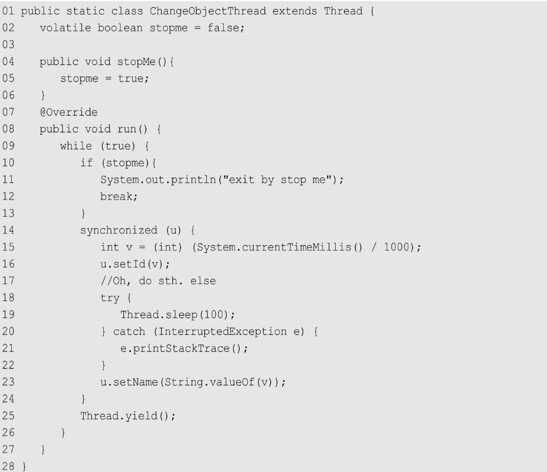

## 实战 Java 高并发程序设计

## 第二章 Java 并行基础

### 2.2 初始线程：线程基本操作

#### 2.1 新建线程

不要用 run()方法来开启新线程。它只会在当前线程中串行执行 run()方法中的代码。
默认的 Thread.run()方法就是直接调用内部的 Runnable 接口。因此，使用 Runnable 接口告诉线程该做什么，更为合理

#### 2.2 线程终止

stop()方法是一个被标注为废弃的方法，stop()方法过于暴力，强行把执行到一半的线程终止，可能会引起一些数据不一致的问题。
**如何正确终止线程**
如果需要停止一个线程，那么应该怎么做呢？其实方法很简单，只需要由我们自行决定线程何时退出就可以了。

==第 2 行代码定义了一个标记变量 stopme(volatile)，用于指示线程是否需要退出==。当 stopMe()方法被调用，stopme 就被设置为 true，此时，在第 10 行代码检测到这个改动时，线程就自动退出了

#### 线程中断

严格地讲，线程中断并不会使线程立即退出，而是给线程发送一个通知，告知目标线程，有人希望你退出。至于目标线程接到通知后如何处理，则完全由目标线程自行决定。==如果立即中断，就和 stop()方法一样的问题了==
三个方法：

`Thread.interrupt()`方法是一个实例方法。它通知目标线程中断，也就是设置中断标志位。中断标志位表示当前线程已经被中断了。
`Thread.isInterrupted()`方法也是实例方法，它判断当前线程是否被中断（通过检查中断标志位）。
静态方法`Thread.interrupted()`也可用来判断当前线程的中断状态，但同时会==清除==当前线程的中断标志位状态。

`Thread.sleep()`方法会让当前线程休眠若干时间，它会抛出一个`InterruptedException`中断异常。`InterruptedException`不是运行时异常，也就是说程序必须捕获并且处理它，当线程在`sleep()`休眠时，如果被中断，这个异常就会产生。

**注意：**`Thread.sleep()`方法由于中断而抛出异常，此时，==它会清除中断标记==，如果不加处理，那么在下一次循环开始时，就无法捕获这个中断，故在异常处理中，再次设置中断标记位。
所以在 `run()`方法内会有一个捕获异常的 catch，并且再次给当前线程设置中断`interrupt()`。

#### 等待（wait）和通知（notify）

等待`wait()`方法和通知 `notify()`方法。==这两个方法并不是在 Thread 类中的，而是输出 `Object` 类==。这也意味着任何对象都可以调用这两个方法
当在一个对象实例上调用`wait()`方法后，当前线程就会在这个对象上等待。如果一个线程调用了`object.wait()`方法，那么它就会进入`object`对象的等待队列。这个等待队列中，可能会有多个线程，因为系统运行多个线程同时等待某一个对象。当 `object.notify()`方法被调用时，它就会从这个等待队列中**随机选择**一个线程，并将其唤醒。
`Object.wait()`方法并不能随便调用。它必须包含在对应的`synchronzied`语句中，无论是`wait()`方法或者`notify()`方法都需要==首先获得目标对象的一个监视器。==**记住，wait()之后，会释放锁，即释放监视器**
**注意：**`Object.wait()`方法和`Thread.sleep()`方法都可以让线程等待若干时间。除`wait()`方法可以被唤醒外，另外一个主要区别就是`wait()`方法会释放目标对象的锁，而`Thread.sleep()`方法不会释放任何资源。

#### 挂起（suspend）和继续执行（resume）线程

不推荐使用 suspend()方法去挂起线程是因为 suspend()方法在导致线程暂停的同时，并不会释放任何锁资源。
这玩意会死锁...跳过

#### 等待线程结束（join）和谦让（yeild）

很多时候，一个线程的输入可能非常依赖于另外一个或者多个线程的输出，此时，这个线程就需要等待依赖线程执行完毕，才能继续执行。JDK 提供了`join()`操作来实现这个功能。**阻塞调用 join()方法的线程，直到该线程 run()结束，才会继续执行**

==join()方法的本质是让调用线程 wait()方法在当前线程对象实例上。==

```java
while(isAlive()){
    wait(0);
}
```

它让调用线程在当前线程对象上进行等待。当线程执行完成后，被等待的线程会在退出前调用 notifyAll()方法通知所有的等待线程继续执行。
**值得注意的一点是：** 不要在应用程序中，在 Thread 对象实例（不要再线程实例上）上使用类似 wait()方法或者 notify()方法（我们使用这两个锁对象实例）等，因为这很有可能会影响系统 API 的工作，或者被系统 API 所影响.

`Thread.yield()`:静态方法，一旦执行，它会使当前线程让出 CPU。但要注意，让出 CPU 并不表示当前线程不执行了。当前线程在让出 CPU 后，还会进行 CPU 资源的争夺，但是是否能够再次被分配到就不一定了。
