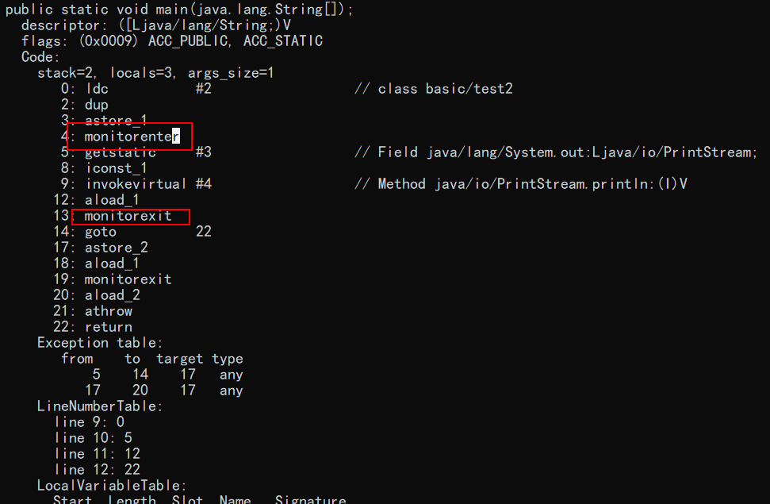

[TOC]

# Java 并发进阶常见面试题总结

## 1. synchronized 关键字

### 1.1. 说一说自己对于 synchronized 关键字的了解

synchronized 关键字解决的是多个线程之间访问资源的同步性，synchronized 关键字可以保证==被它修饰的**方法或者代码块**在任意时刻只能有一个线程执行==。

另外，在 Java 早期版本中，synchronized 属于重量级锁，效率低下，因为监视器锁（monitor）是依赖于底层的操作系统的 Mutex Lock 来实现的，Java 的线程是映射到操作系统的原生线程之上的。如果要挂起或者唤醒一个线程，都需要操作系统帮忙完成，而操作系统实现线程之间的切换时需要从**用户态转换到内核态**，这个状态之间的转换需要相对比较长的时间，时间成本相对较高，这也是为什么早期的 synchronized 效率低的原因。庆幸的是在 Java 6 之后 Java 官方对从 JVM 层面对 synchronized 较大优化，所以现在的 synchronized 锁效率也优化得很不错了。JDK1.6 对锁的实现引入了大量的优化，如自旋锁、适应性自旋锁、锁消除、锁粗化、偏向锁、轻量级锁等技术来减少锁操作的开销。
**（涉及到用户态和内核态的转换都会导致效率极低）**

### 1.2. 说说自己是怎么使用 synchronized 关键字，在项目中用到了吗

synchronized 是 Java 中解决并发问题的一种最常用的方法，也是最简单的一种方法。Synchronized 的作用主要有三个：

1. 确保线程互斥的访问同步代码
2. 保证内存可见性
3. 解决指令重排序问题

**synochronized 关键字，内置锁或者监视器锁，也是==互斥锁==，一次只允许一个线程进入被锁住的代码块。**

**作用：** 保证线程的原子性和可见性。

synchronized 修饰**静态方法获取的是类锁**(类的字节码文件对象)，synchronized 修饰**普通方法或代码块获取的是对象锁**。
==它俩是不冲突的，也就是说：获取了类锁的线程和获取了对象锁的线程是不冲突的！==

**synchronized 关键字最主要的三种使用方式：**

- **修饰实例(普通)方法:** 作用于当前对象实例加锁，进入同步代码前要获得当前对象实例的锁
- **修饰静态方法:** 也就是给==当前类加锁，会作用于类的所有对象实例==，因为静态成员不属于任何一个实例对象，是类成员（ static 表明这是该类的一个静态资源，不管 new 了多少个对象，只有一份）。所以如果一个线程 A 调用一个实例对象的非静态 synchronized 方法，而线程 B 需要调用这个实例对象所属类的静态 synchronized 方法，是允许的，不会发生互斥现象，**因为访问静态 synchronized 方法占用的锁是当前类的锁，而访问非静态 synchronized 方法占用的锁是当前实例对象锁**。
- **修饰代码块:** 指定加锁对象，对给定对象加锁，进入同步代码库前要获得给定对象的锁。

```java
public class Test {

    private static int count = 10;

    private int i = 0;

    // 同步代码块： 锁定的是当前对象
    public void m1(){
        synchronized (this){
            i++;
            System.out.println("i = " + i);
        }
    }

    // 同步普通方法： 锁定的是当前对象
    public synchronized void m2(){
        i++;
        System.out.println("i = " + i);
    }

    // 同步静态方法： 锁定的是类对象，Test.class对象
    public synchronized static void m3(){
        count--;
        System.out.println(Thread.currentThread().getName() + "count = " + count);
    }

    // 同步代码块，主动锁定类对象
    public static void m4(){
        synchronized(Test.class){
            count--;
        }
    }
}
```

**总结：** synchronized 关键字加到 static 静态方法和 synchronized(class)代码块上都是是给 Class 类上锁。synchronized 关键字加到实例方法上是给对象实例上锁。**尽量不要使用 synchronized(String a) 因为 JVM 中，字符串常量池具有缓存功能！**

下面我以一个常见的面试题为例讲解一下 synchronized 关键字的具体使用。

面试中面试官经常会说：“单例模式了解吗？来给我手写一下！给我解释一下双重检验锁方式实现单例模式的原理呗！”

**双重校验锁实现对象单例（线程安全）**

```java
public class Singleton {

    private volatile static Singleton uniqueInstance;//保证uniqueInstance的可见性

    private Singleton() {
    }

    public static Singleton getUniqueInstance() {
       //先判断对象是否已经实例过，没有实例化过才进入加锁代码
        if (uniqueInstance == null) { //①
            //类对象加锁 
            synchronized (Singleton.class) {//②
                //上锁后再此检测是否是null，以防止在上述①，②之间被别的线程创建了实例。这就是双重检测
                if (uniqueInstance == null) {
                    uniqueInstance = new Singleton();
                }
            }
        }
        return uniqueInstance;
    }
}
```

另外，需要注意 uniqueInstance 采用 volatile 关键字修饰也是很有必要。

uniqueInstance 采用 volatile 关键字修饰也是很有必要的， uniqueInstance = new Singleton(); 这段代码其实是分为三步执行：

1. 为 uniqueInstance 分配内存空间
2. 初始化 uniqueInstance
3. 将 uniqueInstance 指向分配的内存地址

但是由于 JVM 具有指令重排的特性，执行顺序有可能变成 1->3->2。**指令重排在单线程环境下不会出现问题，但是在多线程环境下会导致一个线程获得还没有初始化的实例。** 例如，线程 T1 执行了 1 和 3，此时 T2 调用 getUniqueInstance() 后发现 uniqueInstance 不为空，因此返回 uniqueInstance，但此时 uniqueInstance 还未被初始化。

**使用 volatile 可以禁止 JVM 的指令重排，保证在多线程环境下也能正常运行。**

### 1.3. 讲一下 synchronized 关键字的底层原理

**synchronized 关键字底层原理属于 JVM 层面。**

**① synchronized 同步语句块的情况**

```java
public class SynchronizedDemo {
	public void method() {
		synchronized (this) {
			System.out.println("synchronized 代码块");
		}
	}
}

```

通过 JDK 自带的 javap 命令查看 SynchronizedDemo 类的相关字节码信息：首先切换到类的对应目录执行 `javac SynchronizedDemo.java` 命令生成编译后的 .class 文件，然后执行`javap -c -s -v -l SynchronizedDemo.class`。



从上面我们可以看出：

**synchronized 同步语句块的实现使用的是 monitorenter 和 monitorexit 指令，其中 monitorenter 指令指向同步代码块的==开始位置==，monitorexit 指令则指明同步代码块的==结束位置==。** 当执行 monitorenter 指令时，线程试图获取锁也就是获取 monitor(_monitor 对象存在于每个 Java 对象的对象头中，synchronized 锁便是通过这种方式获取锁的，也是为什么 Java 中任意对象可以作为锁的原因_,**JVM 中对象内部的布局之对象头存储的信息**) 的持有权。当计数器为 0 则可以成功获取，获取后将锁计数器设为 1 也就是加 1。相应的在执行 monitorexit 指令后，将锁计数器设为 0，表明锁被释放。**如果获取对象锁失败，那当前线程就要阻塞等待，直到锁被另外一个线程释放为止**。

**② synchronized 修饰方法的的情况**

```java
public class SynchronizedDemo2 {
	public synchronized void method() {
		System.out.println("synchronized 方法");
	}
}

```


synchronized 修饰的方法并没有 monitorenter 指令和 monitorexit 指令，取得代之的确实是 ACC_SYNCHRONIZED 标识，该标识指明了该方法是一个同步方法，JVM 通过该 ACC_SYNCHRONIZED 访问标志来辨别一个方法是否声明为同步方法，从而执行相应的同步调用。

### 1.4. 说说 JDK1.6 之后的 synchronized 关键字底层做了哪些优化，可以详细介绍一下这些优化吗

JDK1.6 对锁的实现引入了大量的优化，如偏向锁、轻量级锁、自旋锁、适应性自旋锁、锁消除、锁粗化等技术来减少锁操作的开销。

锁主要存在四种状态，依次是：无锁状态、偏向锁状态、轻量级锁状态、重量级锁状态，他们会随着竞争的激烈而逐渐升级。注意锁可以升级不可降级，这种策略是为了提高获得锁和释放锁的效率。

关于这几种优化的详细信息在我的《深入JVM虚拟机》笔记最后一节中。

### 1.5. 谈谈 synchronized 和 ReentrantLock 的区别

**① 两者都是可重入锁**

两者都是可重入锁。“可重入锁”概念是：自己可以再次获取自己的内部锁。比如一个线程获得了某个对象的锁，此时这个对象锁还没有释放，当其再次想要获取这个对象的锁的时候还是可以获取的，如果不可锁重入的话，就会造成死锁。同一个线程每次获取锁，锁的计数器都自增 1，所以要等到锁的计数器下降为 0 时才能释放锁。

**② synchronized 依赖于 JVM 而 ReentrantLock 依赖于 API**

synchronized 是依赖于 JVM 实现的，前面我们也讲到了 虚拟机团队在 JDK1.6 为 synchronized 关键字进行了很多优化，但是这些优化都是在虚拟机层面实现的，并没有直接暴露给我们。ReentrantLock 是 JDK 层面实现的（也就是 API 层面，需要 lock() 和 unlock() 方法配合 try/finally 语句块来完成），所以我们可以通过查看它的源代码，来看它是如何实现的。

**③ ReentrantLock 比 synchronized 增加了一些高级功能**

相比 synchronized，ReentrantLock 增加了一些高级功能。主要来说主要有三点：

**① 等待可中断；② 可实现公平锁；③ 可实现选择性通知（锁可以绑定多个条件）**

- - **ReentrantLock 提供了一种能够中断等待锁的线程的机制**，通过 lock.lockInterruptibly()来实现这个机制。也就是说正在等待的线程可以选择放弃等待，改为处理其他事情。
- - **ReentrantLock 可以指定是公平锁还是非公平锁。而 synchronized 只能是非公平锁。所谓的公平锁就是先等待的线程先获得锁。** `ReentrantLock` 默认情况是非公平的，可以通过 `ReentrantLock` 类的`ReentrantLock(boolean fair)`构造方法来制定是否是公平的。
- - `synchronized` 关键字与 wait()和 notify()/notifyAll()方法相结合可以实现等待/唤醒机制。
  `ReentrantLock` 类也可以实现，但是需要借助于 `Condition` 接口与 `newCondition()` `方法。Condition` 是 JDK1.5 之后才有的，它具有很好的灵活性，比如可以**实现多路通知功能**也就是在一个 Lock 对象中可以创建多个 `Condition` 实例（即对象监视器），**线程对象可以注册在指定的 Condition 中，从而可以有选择性的进行线程通知，在调度线程上更加灵活。 在使用 notify()/notifyAll()方法进行通知时，被通知的线程是由 JVM 选择的，用 ReentrantLock 类结合 Condition 实例可以实现“选择性通知”** ，这个功能非常重要，而且是 Condition 接口默认提供的。而 synchronized 关键字就相当于整个 Lock 对象中只有一个 Condition 实例，所有的线程都注册在它一个身上。如果执行 notifyAll()方法的话就会通知所有处于等待状态的线程这样会造成很大的效率问题，而 Condition 实例的 signalAll()方法 只会唤醒注册在该 Condition 实例中的所有等待线程。

**④ 性能已不是选择标准**
- 具体表示为：synchronized 关键字吞吐量随线程数的增加，下降得非常严重。

## 2. volatile 关键字

### 2.1. 讲一下 Java 内存模型

在 JDK1.2 之前，Java 的内存模型实现总是从**主存**（即共享内存）读取变量，是不需要进行特别的注意的。而在当前的 Java 内存模型下，线程可以把变量保存**本地内存（工作内存-cache）**（比如机器的寄存器）中，而不是直接在主存中进行读写。这就可能造成一个线程在主存中修改了一个变量的值，而另外一个线程还继续使用它在寄存器中的变量值的拷贝，造成**数据的不一致**。


要解决这个问题，就需要把变量声明为**volatile**，这就指示 JVM，这个变量是不稳定的，每次使用它都到主存中进行读取。

说白了， **volatile** 关键字的主要作用就是保证变量的可见性然后还有一个作用是防止指令重排序。


### 2.2. 说说 synchronized 关键字和 volatile 关键字的区别

synchronized 关键字和 volatile 关键字比较

- **volatile 关键字**是线程同步的**轻量级实现**，所以**volatile 性能肯定比 synchronized 关键字要好**。但是**volatile 关键字只能用于变量而 synchronized 关键字可以修饰方法以及代码块**。synchronized 关键字在 JavaSE1.6 之后进行了主要包括为了减少获得锁和释放锁带来的性能消耗而引入的偏向锁和轻量级锁以及其它各种优化之后执行效率有了显著提升，**实际开发中使用 synchronized 关键字的场景还是更多一些**。
- **多线程访问 volatile 关键字==不会发生阻塞==，而 synchronized 关键字可能会发生阻塞**
- **volatile 关键字能保证数据的可见性，但不能保证数据的原子性。synchronized 关键字两者都能保证。**
- **volatile 关键字主要用于解决变量在多个线程之间的可见性，而 synchronized 关键字解决的是多个线程之间访问资源的同步性。**

## 3. ThreadLocal

### 3.1. ThreadLocal 简介

通常情况下，我们创建的变量是可以被任何一个线程访问并修改的。**如果想实现每一个线程都有自己的专属本地变量该如何解决呢？** JDK 中提供的`ThreadLocal`类正是为了解决这样的问题。 **`ThreadLocal`类主要解决的就是让每个线程绑定自己的值，可以将`ThreadLocal`类形象的比喻成存放数据的盒子，盒子中可以存储每个线程的私有数据。**

**如果你创建了一个`ThreadLocal`变量，那么访问这个变量的每个线程都会有这个变量的本地副本，这也是`ThreadLocal`变量名的由来。他们可以使用 `get（）` 和 `set（）` 方法来获取默认值或将其值更改为当前线程所存的副本的值，从而避免了线程安全问题。**

再举个简单的例子：

比如有两个人去宝屋收集宝物，这两个共用一个袋子的话肯定会产生争执，但是给他们两个人每个人分配一个袋子的话就不会出现这样的问题。如果把这两个人比作线程的话，那么 ThreadLocal 就是用来避免这两个线程竞争的。

### 3.2. ThreadLocal 示例

相信看了上面的解释，大家已经搞懂 ThreadLocal 类是个什么东西了。

```java
import java.text.SimpleDateFormat;
import java.util.Random;

public class ThreadLocalExample implements Runnable{

     // SimpleDateFormat 不是线程安全的，所以每个线程都要有自己独立的副本
    private static final ThreadLocal<SimpleDateFormat> formatter = ThreadLocal.withInitial(() -> new SimpleDateFormat("yyyyMMdd HHmm"));

    public static void main(String[] args) throws InterruptedException {
        ThreadLocalExample obj = new ThreadLocalExample();
        for(int i=0 ; i<10; i++){
            Thread t = new Thread(obj, ""+i);
            Thread.sleep(new Random().nextInt(1000));
            t.start();
        }
    }

    @Override
    public void run() {
        System.out.println("Thread Name= "+Thread.currentThread().getName()+" default Formatter = "+formatter.get().toPattern());
        try {
            Thread.sleep(new Random().nextInt(1000));
        } catch (InterruptedException e) {
            e.printStackTrace();
        }
        //formatter pattern is changed here by thread, but it won't reflect to other threads
        formatter.set(new SimpleDateFormat());

        System.out.println("Thread Name= "+Thread.currentThread().getName()+" formatter = "+formatter.get().toPattern());
    }

}

```

Output:

```
Thread Name= 0 default Formatter = yyyyMMdd HHmm
Thread Name= 0 formatter = yy-M-d ah:mm
Thread Name= 1 default Formatter = yyyyMMdd HHmm
Thread Name= 2 default Formatter = yyyyMMdd HHmm
Thread Name= 1 formatter = yy-M-d ah:mm
Thread Name= 3 default Formatter = yyyyMMdd HHmm
Thread Name= 2 formatter = yy-M-d ah:mm
Thread Name= 4 default Formatter = yyyyMMdd HHmm
Thread Name= 3 formatter = yy-M-d ah:mm
Thread Name= 4 formatter = yy-M-d ah:mm
Thread Name= 5 default Formatter = yyyyMMdd HHmm
Thread Name= 5 formatter = yy-M-d ah:mm
Thread Name= 6 default Formatter = yyyyMMdd HHmm
Thread Name= 6 formatter = yy-M-d ah:mm
Thread Name= 7 default Formatter = yyyyMMdd HHmm
Thread Name= 7 formatter = yy-M-d ah:mm
Thread Name= 8 default Formatter = yyyyMMdd HHmm
Thread Name= 9 default Formatter = yyyyMMdd HHmm
Thread Name= 8 formatter = yy-M-d ah:mm
Thread Name= 9 formatter = yy-M-d ah:mm
```

从输出中可以看出，Thread-0 已经改变了 formatter 的值，但仍然是 thread-2 默认格式化程序与初始化值相同，其他线程也一样。

上面有一段代码用到了创建 `ThreadLocal` 变量的那段代码用到了 Java8 的知识，它等于下面这段代码，如果你写了下面这段代码的话，IDEA 会提示你转换为 Java8 的格式(IDEA 真的不错！)。因为 ThreadLocal 类在 Java 8 中扩展，使用一个新的方法`withInitial()`，将 Supplier 功能接口作为参数。

```java
 private static final ThreadLocal<SimpleDateFormat> formatter = new ThreadLocal<SimpleDateFormat>(){
        @Override
        protected SimpleDateFormat initialValue()
        {
            return new SimpleDateFormat("yyyyMMdd HHmm");
        }
    };
```

### 3.3. ThreadLocal 原理

从 `Thread`类源代码入手。

```java
public class Thread implements Runnable {
 ......
//与此线程有关的ThreadLocal值。由ThreadLocal类维护
ThreadLocal.ThreadLocalMap threadLocals = null;

//与此线程有关的InheritableThreadLocal值。由InheritableThreadLocal类维护
ThreadLocal.ThreadLocalMap inheritableThreadLocals = null;
 ......
}
```

从上面`Thread`类 源代码可以看出`Thread` 类中有一个 `threadLocals` 和 一个 `inheritableThreadLocals` 变量，它们都是 `ThreadLocalMap` 类型的变量,我们可以把 `ThreadLocalMap` 理解为`ThreadLocal` 类实现的定制化的 `HashMap`。默认情况下这两个变量都是 null，只有当前线程调用 `ThreadLocal` 类的 `set`或`get`方法时才创建它们，实际上调用这两个方法的时候，我们调用的是`ThreadLocalMap`类对应的 `get()`、`set()`方法。

`ThreadLocal`类的`set()`方法

```java
    public void set(T value) {
        Thread t = Thread.currentThread();
        ThreadLocalMap map = getMap(t);
        if (map != null)
            map.set(this, value);
        else
            createMap(t, value);
    }
    ThreadLocalMap getMap(Thread t) {
        return t.threadLocals;
    }
```

通过上面这些内容，我们足以通过猜测得出结论：**最终的变量是放在了当前线程的 `ThreadLocalMap` 中，并不是存在 `ThreadLocal` 上，`ThreadLocal` 可以理解为只是`ThreadLocalMap`的封装，传递了变量值。** `ThrealLocal` 类中可以通过`Thread.currentThread()`获取到当前线程对象后，直接通过`getMap(Thread t)`可以访问到该线程的`ThreadLocalMap`对象。

**每个`Thread`中都具备一个`ThreadLocalMap`，而`ThreadLocalMap`可以存储以`ThreadLocal`为 key ，Object 对象为 value 的键值对。**

```java
ThreadLocalMap(ThreadLocal<?> firstKey, Object firstValue) {
 ......
}
```

比如我们在同一个线程中声明了两个 `ThreadLocal` 对象的话，会使用 `Thread`内部都是使用仅有那个`ThreadLocalMap` 存放数据的，`ThreadLocalMap`的 key 就是 `ThreadLocal`对象，value 就是 `ThreadLocal` 对象调用`set`方法设置的值。


`ThreadLocalMap`是`ThreadLocal`的静态内部类。


### 3.4. 这个重要：ThreadLocal 内存泄露问题

`ThreadLocalMap` 中**使用的 key 为 `ThreadLocal` 的弱引用,而 value 是强引用**。所以，如果 `ThreadLocal` 没有被外部强引用的情况下，在垃圾回收的时候，key 会被清理掉，而 value 不会被清理掉。这样一来，`ThreadLocalMap` 中就会出现 key 为 null 的 Entry。假如我们不做任何措施的话，value 永远无法被 GC 回收，这个时候就可能会产生内存泄露。ThreadLocalMap 实现中已经考虑了这种情况，在调用 `set()`、`get()`、`remove()` 方法的时候，会清理掉 key 为 null 的记录。使用完 `ThreadLocal`方法后 最好手动调用`remove()`方法

```java
      static class Entry extends WeakReference<ThreadLocal<?>> {
            /** The value associated with this ThreadLocal. */
            Object value;

            Entry(ThreadLocal<?> k, Object v) {
                super(k);
                value = v;
            }
        }
```

**弱引用：**

> 如果一个对象只具有弱引用，那就类似于**可有可无的生活用品**。弱引用与软引用的区别在于：只具有弱引用的对象拥有更短暂的生命周期。在垃圾回收器线程扫描它 所管辖的内存区域的过程中，一旦发现了只具有弱引用的对象，不管当前内存空间足够与否，都会回收它的内存。不过，由于垃圾回收器是一个优先级很低的线程， 因此不一定会很快发现那些只具有弱引用的对象。
>
> 弱引用可以和一个引用队列（ReferenceQueue）联合使用，如果弱引用所引用的对象被垃圾回收，Java 虚拟机就会把这个弱引用加入到与之关联的引用队列中。

## 4. 线程池

### 4.1. 为什么要用线程池？

> **池化技术的思想主要是为了减少每次获取资源的消耗，提高对资源的利用率。**

**线程池**提供了一种限制和管理资源（包括执行一个任务）。 每个**线程池**还维护一些基本统计信息，例如已完成任务的数量。

**使用线程池的好处**：

- **降低资源消耗**。通过重复利用已创建的线程降低线程创建和销毁造成的消耗。
- **提高响应速度**。当任务到达时，任务可以不需要的等到线程创建就能立即执行。
- **提高线程的可管理性**。线程是稀缺资源，如果无限制的创建，不仅会消耗系统资源，还会降低系统的稳定性，使用线程池可以进行统一的分配，调优和监控。

### 4.2. 实现 Runnable 接口和 Callable 接口的区别

`Runnable`自 Java 1.0 以来一直存在，但`Callable`仅在 Java 1.5 中引入,目的就是为了来处理`Runnable`不支持的用例。**`Runnable` 接口**不会返回结果或抛出检查异常，但是 **`Callable` 接口** 可以。所以，==如果任务不需要返回结果或抛出异常推荐使用 **`Runnable` 接口**，== 代码看起来会更加简洁。

工具类 `Executors` 可以实现 `Runnable` 对象和 `Callable` 对象之间的**相互转换**。（`Executors.callable（Runnable task`）或 `Executors.callable（Runnable task，Object resule）`）。

`Runnable.java`

```java
@FunctionalInterface
public interface Runnable {
   /**
    * 被线程执行，没有返回值也无法抛出异常
    */
    public abstract void run();
}
```

`Callable.java`

```java
@FunctionalInterface
public interface Callable<V> {
    /**
     * 计算结果，或在无法这样做时抛出异常。
     * @return 计算得出的结果
     * @throws 如果无法计算结果，则抛出异常
     */
    V call() throws Exception;
}
```

### 4.3. 执行 execute()方法和 submit()方法的区别是什么呢？

1. **`execute()`方法用于提交不需要返回值的任务，所以无法判断任务是否被线程池执行成功与否；**
2. **`submit()`方法用于提交需要返回值的任务。线程池会返回一个 `Future` 类型的对象，通过这个 `Future` 对象可以判断任务是否执行成功**，并且==可以通过 `Future` 的 `get()`方法来获取返回值，`get()`方法会阻塞当前线程直到任务完成==，而使用 `get（long timeout，TimeUnit unit）`方法则会阻塞当前线程一段时间后立即返回，这时候有可能任务没有执行完。

以 **`AbstractExecutorService`** 接口中的一个 `submit` 方法为例子来看看源代码：

```java
    public Future<?> submit(Runnable task) {
        if (task == null) throw new NullPointerException();
        RunnableFuture<Void> ftask = newTaskFor(task, null);
        execute(ftask);
        return ftask;
    }
```

上面方法调用的 `newTaskFor` 方法返回了一个 `FutureTask` 对象。

```java
    protected <T> RunnableFuture<T> newTaskFor(Runnable runnable, T value) {
        return new FutureTask<T>(runnable, value);
    }
```

我们再来看看`execute()`方法：

```java
    public void execute(Runnable command) {
      ...
    }
```

### 4.4. 如何创建线程池

《阿里巴巴 Java 开发手册》中强制线程池不允许使用 Executors 去创建，而是通过 ThreadPoolExecutor 的方式，这样的处理方式明确线程池的运行规则，规避资源耗尽的风险

> Executors 返回线程池对象的弊端如下：
>
> - **FixedThreadPool 和 SingleThreadExecutor** ： 允许请求的队列长度为 Integer.MAX_VALUE ，可能堆积大量的请求，从而导致 OOM。
> - **CachedThreadPool 和 ScheduledThreadPool** ： 允许创建的线程数量为 Integer.MAX_VALUE ，可能会创建大量线程，从而导致 OOM。

**方式一：通过构造方法实现**

**方式二：通过 Executor 框架的工具类 Executors 来实现**
我们可以创建三种类型的 ThreadPoolExecutor：

- **FixedThreadPool** ： 该方法返回一个固定线程数量的线程池。该线程池中的线程数量始终不变。当有一个新的任务提交时，线程池中若有空闲线程，则立即执行。若没有，则新的任务会被暂存在一个任务队列中，待有线程空闲时，便处理在任务队列中的任务。
- **SingleThreadExecutor：** 方法返回一个只有一个线程的线程池。若多余一个任务被提交到该线程池，任务会被保存在一个任务队列中，待线程空闲，按先入先出的顺序执行队列中的任务。
- **CachedThreadPool：** 该方法返回一个可根据实际情况调整线程数量的线程池。线程池的线程数量不确定，但若有空闲线程可以复用，则会优先使用可复用的线程。若所有线程均在工作，又有新的任务提交，则会创建新的线程处理任务。所有线程在当前任务执行完毕后，将返回线程池进行复用。

对应 Executors 工具类中的方法如图所示：


### 4.5 ThreadPoolExecutor 类分析

`ThreadPoolExecutor` 类中提供的四个构造方法。我们来看最长的那个，其余三个都是在这个构造方法的基础上产生（其他几个构造方法说白点都是给定某些默认参数的构造方法比如默认制定拒绝策略是什么），这里就不贴代码讲了，比较简单。

```java
    /**
     * 用给定的初始参数创建一个新的ThreadPoolExecutor。
     */
    public ThreadPoolExecutor(int corePoolSize,
                              int maximumPoolSize,
                              long keepAliveTime,
                              TimeUnit unit,
                              BlockingQueue<Runnable> workQueue,
                              ThreadFactory threadFactory,
                              RejectedExecutionHandler handler) {
        if (corePoolSize < 0 ||
            maximumPoolSize <= 0 ||
            maximumPoolSize < corePoolSize ||
            keepAliveTime < 0)
            throw new IllegalArgumentException();
        if (workQueue == null || threadFactory == null || handler == null)
            throw new NullPointerException();
        this.corePoolSize = corePoolSize;
        this.maximumPoolSize = maximumPoolSize;
        this.workQueue = workQueue;
        this.keepAliveTime = unit.toNanos(keepAliveTime);
        this.threadFactory = threadFactory;
        this.handler = handler;
    }
```

**以下参数极其重要**
#### 4.5.1 `ThreadPoolExecutor`构造函数重要参数分析

**`ThreadPoolExecutor` 3 个最重要的参数：**

- **`corePoolSize` :** 核心线程数线程数定义了最小可以同时运行的线程数量。
- **`maximumPoolSize` :** 当队列中存放的任务达到队列容量的时候，当前可以同时运行的线程数量变为最大线程数。
- **`workQueue`:** 当新任务来的时候会先判断当前运行的线程数量是否达到核心线程数，如果达到的话，新任务就会被存放在队列中。

`ThreadPoolExecutor`其他常见参数:

1. **`keepAliveTime`**:当线程池中的线程数量大于 `corePoolSize` 的时候，如果这时没有新的任务提交(**存在空闲线程**)，核心线程外的线程不会立即销毁，而是会等待，直到等待的时间超过了 `keepAliveTime`才会被回收销毁；
2. **`unit`** : `keepAliveTime` 参数的时间单位。
3. **`threadFactory`** :executor 创建新线程的时候会用到。
4. **`handler`** :饱和策略。关于饱和策略下面单独介绍一下。

#### 4.5.2 `ThreadPoolExecutor` 饱和策略

**`ThreadPoolExecutor` 饱和策略定义:**

**如果当前同时运行的线程数量达到最大线程数量并且队列也已经被放满了时**，`ThreadPoolTaskExecutor` 定义一些策略:

- **`ThreadPoolExecutor.AbortPolicy`**：抛出 `RejectedExecutionException`来拒绝新任务的处理。
- **`ThreadPoolExecutor.CallerRunsPolicy`**：调用执行自己的线程运行任务。您不会任务请求。但是这种策略会降低对于新任务提交速度，影响程序的整体性能。另外，这个策略喜欢增加队列容量。如果您的应用程序可以承受此延迟并且==不能任务丢弃任何一个任务请求的话，你可以选择这个策略==。
- **`ThreadPoolExecutor.DiscardPolicy`：** 不处理新任务，直接丢弃掉。
- **`ThreadPoolExecutor.DiscardOldestPolicy`：** 此策略将丢弃最早的未处理的任务请求。

举个例子： Spring 通过 `ThreadPoolTaskExecutor` 或者我们直接通过 `ThreadPoolExecutor` 的构造函数创建线程池的时候，当我们不指定 `RejectedExecutionHandler` 饱和策略的话来配置线程池的时候默认使用的是 `ThreadPoolExecutor.AbortPolicy`。在默认情况下，`ThreadPoolExecutor` 将抛出 `RejectedExecutionException` 来拒绝新来的任务 ，这代表你将丢失对这个任务的处理。 对于可伸缩的应用程序，建议使用 `ThreadPoolExecutor.CallerRunsPolicy`。==当最大池被填满时，此策略为我们提供可伸缩队列==。（这个直接查看 `ThreadPoolExecutor` 的构造函数源码就可以看出，比较简单的原因，这里就不贴代码了）

### 4.6 一个简单的线程池 Demo:`Runnable`+`ThreadPoolExecutor`

为了让大家更清楚上面的面试题中的一些概念，我写了一个简单的线程池 Demo。

首先创建一个 `Runnable` 接口的实现类（当然也可以是 `Callable` 接口，我们上面也说了两者的区别。）

`MyRunnable.java`

```java
import java.util.Date;

/**
 * 这是一个简单的Runnable类，需要大约5秒钟来执行其任务。
 * @author shuang.kou
 */
public class MyRunnable implements Runnable {

    private String command;

    public MyRunnable(String s) {
        this.command = s;
    }

    @Override
    public void run() {
        System.out.println(Thread.currentThread().getName() + " Start. Time = " + new Date());
        processCommand();
        System.out.println(Thread.currentThread().getName() + " End. Time = " + new Date());
    }

    private void processCommand() {
        try {
            Thread.sleep(5000);
        } catch (InterruptedException e) {
            e.printStackTrace();
        }
    }

    @Override
    public String toString() {
        return this.command;
    }
}

```

编写测试程序，我们这里以阿里巴巴推荐的使用 `ThreadPoolExecutor` 构造函数自定义参数的方式来创建线程池。

`ThreadPoolExecutorDemo.java`

```java
import java.util.concurrent.ArrayBlockingQueue;
import java.util.concurrent.ThreadPoolExecutor;
import java.util.concurrent.TimeUnit;

public class ThreadPoolExecutorDemo {

    private static final int CORE_POOL_SIZE = 5;
    private static final int MAX_POOL_SIZE = 10;
    private static final int QUEUE_CAPACITY = 100;
    private static final Long KEEP_ALIVE_TIME = 1L;
    public static void main(String[] args) {

        //使用阿里巴巴推荐的创建线程池的方式
        //通过ThreadPoolExecutor构造函数自定义参数创建
        ThreadPoolExecutor executor = new ThreadPoolExecutor(
                CORE_POOL_SIZE,
                MAX_POOL_SIZE,
                KEEP_ALIVE_TIME,
                TimeUnit.SECONDS,
                new ArrayBlockingQueue<>(QUEUE_CAPACITY),
                new ThreadPoolExecutor.CallerRunsPolicy());

        for (int i = 0; i < 10; i++) {
            //创建WorkerThread对象（WorkerThread类实现了Runnable 接口）
            Runnable worker = new MyRunnable("" + i);
            //执行Runnable
            executor.execute(worker);
        }
        //终止线程池
        executor.shutdown();
        while (!executor.isTerminated()) {
        }
        System.out.println("Finished all threads");
    }
}

```

可以看到我们上面的代码指定了：

1. `corePoolSize`: 核心线程数为 5。
2. `maximumPoolSize` ：最大线程数 10
3. `keepAliveTime` : 等待时间为 1L。
4. `unit`: 等待时间的单位为 TimeUnit.SECONDS。
5. `workQueue`：任务队列为 `ArrayBlockingQueue`，并且容量为 100;
6. `handler`:饱和策略为 `CallerRunsPolicy`。

**Output：**

```
pool-1-thread-2 Start. Time = Tue Nov 12 20:59:44 CST 2019
pool-1-thread-5 Start. Time = Tue Nov 12 20:59:44 CST 2019
pool-1-thread-4 Start. Time = Tue Nov 12 20:59:44 CST 2019
pool-1-thread-1 Start. Time = Tue Nov 12 20:59:44 CST 2019
pool-1-thread-3 Start. Time = Tue Nov 12 20:59:44 CST 2019
pool-1-thread-5 End. Time = Tue Nov 12 20:59:49 CST 2019
pool-1-thread-3 End. Time = Tue Nov 12 20:59:49 CST 2019
pool-1-thread-2 End. Time = Tue Nov 12 20:59:49 CST 2019
pool-1-thread-4 End. Time = Tue Nov 12 20:59:49 CST 2019
pool-1-thread-1 End. Time = Tue Nov 12 20:59:49 CST 2019
pool-1-thread-2 Start. Time = Tue Nov 12 20:59:49 CST 2019
pool-1-thread-1 Start. Time = Tue Nov 12 20:59:49 CST 2019
pool-1-thread-4 Start. Time = Tue Nov 12 20:59:49 CST 2019
pool-1-thread-3 Start. Time = Tue Nov 12 20:59:49 CST 2019
pool-1-thread-5 Start. Time = Tue Nov 12 20:59:49 CST 2019
pool-1-thread-2 End. Time = Tue Nov 12 20:59:54 CST 2019
pool-1-thread-3 End. Time = Tue Nov 12 20:59:54 CST 2019
pool-1-thread-4 End. Time = Tue Nov 12 20:59:54 CST 2019
pool-1-thread-5 End. Time = Tue Nov 12 20:59:54 CST 2019
pool-1-thread-1 End. Time = Tue Nov 12 20:59:54 CST 2019

```

### 4.7 线程池原理分析

承接 4.6 节，我们通过代码输出结果可以看出：**线程池每次会同时执行 5 个任务，这 5 个任务执行完之后，剩余的 5 个任务才会被执行。** 大家可以先通过上面讲解的内容，分析一下到底是咋回事？（自己独立思考一会）

现在，我们就分析上面的输出内容来简单分析一下线程池原理。

**为了搞懂线程池的原理，首先分析一下 `execute`方法。** 在 4.6 节中的 Demo 中使用 `executor.execute(worker)`来提交一个任务到线程池中去，这个方法非常重要，下面是它的源码：

```java
   // 存放线程池的运行状态 (runState) 和线程池内有效线程的数量 (workerCount)
   private final AtomicInteger ctl = new AtomicInteger(ctlOf(RUNNING, 0));

    private static int workerCountOf(int c) {
        return c & CAPACITY;
    }

    private final BlockingQueue<Runnable> workQueue;

    public void execute(Runnable command) {
        // 如果任务为null，则抛出异常。
        if (command == null)
            throw new NullPointerException();
        // ctl 中保存的线程池当前的一些状态信息
        int c = ctl.get();

        //  下面会涉及到 3 步 操作
        // 1.首先判断当前线程池中之行的任务数量是否小于 corePoolSize
        // 如果小于的话，通过addWorker(command, true)新建一个线程，并将任务(command)添加到该线程中；然后，启动该线程从而执行任务。
        if (workerCountOf(c) < corePoolSize) {
            if (addWorker(command, true))
                return;
            c = ctl.get();
        }
        // 2.如果当前之行的任务数量大于等于 corePoolSize 的时候就会走到这里
        // 通过 isRunning 方法判断线程池状态，线程池处于 RUNNING 状态才会被并且队列可以加入任务，该任务才会被加入进去
        if (isRunning(c) && workQueue.offer(command)) {
            int recheck = ctl.get();
            // 再次获取线程池状态，如果线程池状态不是 RUNNING 状态就需要从任务队列中移除任务，并尝试判断线程是否全部执行完毕。同时执行拒绝策略。
            if (!isRunning(recheck) && remove(command))
                reject(command);
                // 如果当前线程池为空就新创建一个线程并执行。
            else if (workerCountOf(recheck) == 0)
                addWorker(null, false);
        }
        //3. 通过addWorker(command, false)新建一个线程，并将任务(command)添加到该线程中；然后，启动该线程从而执行任务。
        //如果addWorker(command, false)执行失败，则通过reject()执行相应的拒绝策略的内容。
        else if (!addWorker(command, false))
            reject(command);
    }
```


现在，让我们在回到 4.6 节我们写的 Demo， 现在应该是不是很容易就可以搞懂它的原理了呢？


> 我们在代码中模拟了 10 个任务，我们配置的核心线程数为 5 、等待队列容量为 100 ，所以每次只可能存在 5 个任务同时执行，剩下的 5 个任务会被放到等待队列中去。当前的 5 个任务之行完成后，才会之行剩下的 5 个任务。入如果模拟1000个任务，等待队列会爆满，按照拒绝策略执行。

## 5. Atomic 原子类

### 5.1. 介绍一下 Atomic 原子类

Atomic 是指一个操作是不可中断的。即使是在多个线程一起执行的时候，一个操作一旦开始，就不会被其他线程干扰。

所以，所谓原子类说简单点就是具有原子/原子操作特征的类。

并发包 `java.util.concurrent` 的原子类都存放在`java.util.concurrent.atomic`下,如下图所示。


### 5.2. JUC 包中的原子类是哪 4 类?

**基本类型**

使用原子的方式更新基本类型

- AtomicInteger：整形原子类
- AtomicLong：长整型原子类
- AtomicBoolean：布尔型原子类

**数组类型**

使用原子的方式更新数组里的某个元素

- AtomicIntegerArray：整形数组原子类
- AtomicLongArray：长整形数组原子类
- AtomicReferenceArray：引用类型数组原子类

**引用类型**

- AtomicReference：引用类型原子类
- AtomicStampedReference：原子更新引用类型里的字段原子类
- AtomicMarkableReference ：原子更新带有标记位的引用类型

**对象的属性修改类型**

- AtomicIntegerFieldUpdater：原子更新整形字段的更新器
- AtomicLongFieldUpdater：原子更新长整形字段的更新器
- AtomicStampedReference：原子更新带有版本号的引用类型。该类将整数值与引用关联起来，可用于解决原子的更新数据和数据的版本号，可以解决使用 CAS 进行原子更新时可能出现的 ABA 问题。

### 5.3. 讲讲 AtomicInteger 的使用

**AtomicInteger 类常用方法**

```java
public final int get() //获取当前的值
public final int getAndSet(int newValue)//获取当前的值，并设置新的值
public final int getAndIncrement()//获取当前的值，并自增
public final int getAndDecrement() //获取当前的值，并自减
public final int getAndAdd(int delta) //获取当前的值，并加上预期的值
boolean compareAndSet(int expect, int update) //如果输入的数值等于预期值，则以原子方式将该值设置为输入值（update）
public final void lazySet(int newValue)//最终设置为newValue,使用 lazySet 设置之后可能导致其他线程在之后的一小段时间内还是可以读到旧的值。
```

**AtomicInteger 类的使用示例**

使用 AtomicInteger 之后，不用对 increment() 方法加锁也可以保证线程安全。

```java
class AtomicIntegerTest {
        private AtomicInteger count = new AtomicInteger();
      //使用AtomicInteger之后，不需要对该方法加锁，也可以实现线程安全。
        public void increment() {
                  count.incrementAndGet();
        }

       public int getCount() {
                return count.get();
        }
}

```

### 5.4. 简单介绍一下 AtomicInteger 类的原理

AtomicInteger 线程安全原理简单分析

AtomicInteger 类的部分源码：

```java
    // setup to use Unsafe.compareAndSwapInt for updates（更新操作时提供“比较并替换”的作用）
    private static final Unsafe unsafe = Unsafe.getUnsafe();
    private static final long valueOffset;

    static {
        try {
            valueOffset = unsafe.objectFieldOffset
                (AtomicInteger.class.getDeclaredField("value"));
        } catch (Exception ex) { throw new Error(ex); }
    }

    private volatile int value;
```

AtomicInteger 类主要**利用 CAS (compare and swap) + volatile 和 native 方法来保证原子操作**，从而避免 synchronized 的高开销，执行效率大为提升。

==CAS 的原理是==拿期望的值和原本的一个值作比较，如果相同(**说明我在比较的这一瞬间之前没有被其他线程更改过**)则更新成新的值。UnSafe 类的 objectFieldOffset() 方法是一个本地方法，这个方法是用来拿到“原来的值”的内存地址，返回值是 valueOffset。另外 value 是一个 volatile 变量，在内存中可见，因此 JVM 可以保证任何时刻任何线程总能拿到该变量的最新值。


## 6. AQS

### 6.1. AQS 介绍

AQS 的全称为（AbstractQueuedSynchronizer），这个类在 java.util.concurrent.locks 包下面。


AQS 是一个用来构建锁和同步器的框架，使用 AQS 能简单且高效地构造出应用广泛的大量的同步器，比ReentrantLock，Semaphore，其他的诸如 ReentrantReadWriteLock，SynchronousQueue，FutureTask 等等皆是基于 AQS 的。当然，我们自己也能利用 AQS 非常轻松容易地构造出符合我们自己需求的同步器。

### 6.2. AQS 原理分析

AQS 原理这部分参考了部分博客，在 5.2 节末尾放了链接。

> 在面试中被问到并发知识的时候，大多都会被问到“请你说一下自己对于 AQS 原理的理解”。

#### 6.2.1. AQS 原理概览

**AQS 核心思想是，如果被请求的共享资源空闲，则将当前请求资源的线程设置为有效的工作线程，并且将共享资源设置为锁定状态。如果被请求的共享资源被占用，那么就需要一套线程阻塞等待以及被唤醒时锁分配的机制，这个机制 AQS 是用 CLH 队列锁实现的，即将暂时获取不到锁的线程加入到队列中。**

> CLH(Craig,Landin,and Hagersten)队列是一个虚拟的双向队列（虚拟的双向队列即不存在队列实例，仅存在结点之间的关联关系）。AQS 是将每条请求共享资源的线程封装成一个 CLH 锁队列的一个结点（Node）来实现锁的分配。

看个 AQS(AbstractQueuedSynchronizer)原理图：


AQS 使用一个 int 成员变量来表示同步状态，通过内置的 FIFO 队列来完成获取资源线程的排队工作。AQS 使用 CAS 对该同步状态进行原子操作实现对其值的修改。

```java
private volatile int state;//共享变量，使用volatile修饰保证线程可见性
```

状态信息通过 protected 类型的 getState，setState，compareAndSetState 进行操作

```java

//返回同步状态的当前值
protected final int getState() {
        return state;
}
 // 设置同步状态的值
protected final void setState(int newState) {
        state = newState;
}
//原子地（CAS操作）将同步状态值设置为给定值update如果当前同步状态的值等于expect（期望值）
protected final boolean compareAndSetState(int expect, int update) {
        return unsafe.compareAndSwapInt(this, stateOffset, expect, update);
}
```

#### 6.2.2. AQS 对资源的共享方式

**AQS 定义两种资源共享方式**

- **Exclusive**（独占）：只有一个线程能执行，如 ReentrantLock。又可分为公平锁和非公平锁：
  - 公平锁：按照线程在队列中的排队顺序，先到者先拿到锁
  - 非公平锁：当线程要获取锁时，无视队列顺序直接去抢锁，谁抢到就是谁的
- **Share**（共享）：多个线程可同时执行，如 `Semaphore`/`CountDownLatch`。`Semaphore`、`CountDownLatch`、 `CyclicBarrier、ReadWriteLock` 我们都会在后面讲到。

`ReentrantReadWriteLock` 可以看成是组合式，因为`ReentrantReadWriteLock` 也就是读写锁允许多个线程同时对某一资源进行读。

不同的自定义同步器争用共享资源的方式也不同。自定义同步器在实现时只需要实现共享资源 state 的获取与释放方式即可，至于具体线程等待队列的维护（如获取资源失败入队/唤醒出队等），AQS 已经在底层实现好了。

#### 6.2.3. AQS 底层使用了模板方法模式

同步器的设计是基于模板方法模式的，如果需要自定义同步器一般的方式是这样（模板方法模式很经典的一个应用）：

1. 使用者继承 AbstractQueuedSynchronizer 并重写指定的方法。（这些重写方法很简单，无非是对于共享资源 state 的获取和释放）
2. 将 AQS 组合在自定义同步组件的实现中，并调用其模板方法，而这些模板方法会调用使用者重写的方法。

这和我们以往通过实现接口的方式有很大区别，这是模板方法模式很经典的一个运用。

**AQS 使用了模板方法模式，自定义同步器时需要重写下面几个 AQS 提供的模板方法：**

```java
isHeldExclusively()//该线程是否正在独占资源。只有用到condition才需要去实现它。
tryAcquire(int)//独占方式。尝试获取资源，成功则返回true，失败则返回false。
tryRelease(int)//独占方式。尝试释放资源，成功则返回true，失败则返回false。
tryAcquireShared(int)//共享方式。尝试获取资源。负数表示失败；0表示成功，但没有剩余可用资源；正数表示成功，且有剩余资源。
tryReleaseShared(int)//共享方式。尝试释放资源，成功则返回true，失败则返回false。

```

默认情况下，每个方法都抛出 `UnsupportedOperationException`。 这些方法的实现必须是内部线程安全的，并且通常应该简短而不是阻塞。AQS 类中的其他方法都是 final ，所以无法被其他类使用，只有这几个方法可以被其他类使用。

以 ReentrantLock 为例，state 初始化为 0，表示未锁定状态。A 线程 lock()时，会调用 tryAcquire()独占该锁并将 state+1。此后，其他线程再 tryAcquire()时就会失败，直到 A 线程 unlock()到 state=0（即释放锁）为止，其它线程才有机会获取该锁。当然，释放锁之前，A 线程自己是可以重复获取此锁的（state 会累加），这就是可重入的概念。但要注意，获取多少次就要释放多么次，这样才能保证 state 是能回到零态的。

再以 CountDownLatch 以例，任务分为 N 个子线程去执行，state 也初始化为 N（注意 N 要与线程个数一致）。这 N 个子线程是并行执行的，每个子线程执行完后 countDown()一次，state 会 CAS(Compare and Swap)减 1。等到所有子线程都执行完后(即 state=0)，会 unpark()主调用线程，然后主调用线程就会从 await()函数返回，继续后余动作。

一般来说，自定义同步器要么是独占方法，要么是共享方式，他们也只需实现`tryAcquire-tryRelease`、`tryAcquireShared-tryReleaseShared`中的一种即可。但 AQS 也支持自定义同步器同时实现独占和共享两种方式，如`ReentrantReadWriteLock`。

AQS 原理和相关源码分析的文章：

- http://www.cnblogs.com/waterystone/p/4920797.html
- https://www.cnblogs.com/chengxiao/archive/2017/07/24/7141160.html

### 6.3. AQS 组件总结

- **Semaphore(信号量)-允许多个线程同时访问：** synchronized 和 ReentrantLock 都是一次只允许一个线程访问某个资源，Semaphore(信号量)可以指定多个线程同时访问某个资源。
- **CountDownLatch （倒计时器）：** CountDownLatch 是一个同步工具类，用来协调多个线程之间的同步。这个工具通常用来控制线程等待，它可以让某一个线程等待直到倒计时结束，再开始执行。
- **CyclicBarrier(循环栅栏)：** CyclicBarrier 和 CountDownLatch 非常类似，它也可以实现线程间的技术等待，但是它的功能比 CountDownLatch 更加复杂和强大。主要应用场景和 CountDownLatch 类似。CyclicBarrier 的字面意思是可循环使用（Cyclic）的屏障（Barrier）。它要做的事情是，让一组线程到达一个屏障（也可以叫同步点）时被阻塞，直到最后一个线程到达屏障时，屏障才会开门，所有被屏障拦截的线程才会继续干活。CyclicBarrier 默认的构造方法是 CyclicBarrier(int parties)，其参数表示屏障拦截的线程数量，每个线程调用 await()方法告诉 CyclicBarrier 我已经到达了屏障，然后当前线程被阻塞。


#   JDK 提供的并发容器总结

JDK提供的这些容器大部分在 `java.util.concurrent` 包中。


- **ConcurrentHashMap:** 线程安全的HashMap
- **CopyOnWriteArrayList:** 线程安全的List，在读多写少的场合性能非常好，远远好于Vector.(快照--弱一致性)
- **ConcurrentLinkedQueue:** 高效的并发队列，使用链表实现。可以看做一个线程安全的 LinkedList，这是一个无界非阻塞队列。
- **BlockingQueue:** 这是一个接口，JDK内部通过链表、数组等方式实现了这个接口。表示阻塞队列，非常适合用于作为数据共享的通道。
- **ConcurrentSkipListMap:** 跳表的实现。这是一个Map，使用跳表的数据结构进行快速查找。

##  ConcurrentHashMap

我们知道 HashMap 不是线程安全的，在并发场景下如果要保证一种可行的方式是使用 `Collections.synchronizedMap()` 方法来包装我们的 HashMap。但这是通过使用一个全局的锁来同步不同线程间的并发访问，因此会带来不可忽视的性能问题。

所以就有了 HashMap 的线程安全版本—— `ConcurrentHashMap` 。
关于 ConcurrentHashMap 相关问题 [ConcurrentHashMap](../Container/HashMap_ConcurrentHashMap.md#concurrenthashmap-%e6%ba%90%e7%a0%81%e5%88%86%e6%9e%90) 

## 1、CopyOnWriteArrayList

### 1.1 CopyOnWriteArrayList 简介

```java
public class CopyOnWriteArrayList<E>
extends Object
implements List<E>, RandomAccess, Cloneable, Serializable
```

在很多应用场景中，读操作可能会远远大于写操作。由于读操作根本不会修改原有的数据，因此对于每次读取都进行加锁其实是一种资源浪费。我们应该允许多个线程同时访问List的内部数据，毕竟读取操作是安全的。

这和 `ReentrantReadWriteLock` 读写锁的思想非常类似，==读读共享、写写互斥、读写互斥、写读互斥==。JDK中提供了 `CopyOnWriteArrayList` 类比==相比于在读写锁的思想又更进一步。为了将读取的性能发挥到极致，`CopyOnWriteArrayList` 读取是完全不用加锁的，并且更厉害的是：写入也不会阻塞读取操作==。只有写入和写入之间需要进行同步等待。这样一来，读操作的性能就会大幅度提升。**那它是怎么做的呢？**

### 1.2 CopyOnWriteArrayList 是如何做到的？

 `CopyOnWriteArrayList` 类的所有可变操作（add，set等等）都是通过创建底层数组的新副本来实现的。当 List 需要被修改的时候，我并不修改原有内容，而是对原有数据进行一次复制，将修改的内容写入副本。写完之后，再将修改完的副本替换原来的数据，这样就可以保证写操作不会影响读操作了。

从 `CopyOnWriteArrayList` 的名字就能看出`CopyOnWriteArrayList` 是满足`CopyOnWrite` 的ArrayList，所谓`CopyOnWrite` 也就是说：在计算机，如果你想要对一块内存进行修改时，我们不在原有内存块中进行写操作，而是将内存拷贝一份，在新的内存中进行写操作，写完之后呢，就将指向原来内存指针指向新的内存，原来的内存就可以被回收掉了。

### 1.3 CopyOnWriteArrayList 读取和写入源码简单分析

#### 1.3.1 CopyOnWriteArrayList 读取操作的实现

**读取操作没有任何同步控制和锁操作**，==理由就是内部数组 array 不会发生修改，只会被另外一个 array 替换，因此可以保证数据安全。==

```java
    /** The array, accessed only via getArray/setArray. */
    private transient volatile Object[] array;
    public E get(int index) {
        return get(getArray(), index);
    }
    @SuppressWarnings("unchecked")
    private E get(Object[] a, int index) {
        return (E) a[index];
    }
    final Object[] getArray() {
        return array;
    }

```

#### 1.3.2 CopyOnWriteArrayList 写入操作的实现

CopyOnWriteArrayList 写入操作 add() 方法在添加集合的时候加了锁，保证了同步，避免了多线程写的时候会 copy 出多个副本出来。

```java
    /**
     * Appends the specified element to the end of this list.
     *
     * @param e element to be appended to this list
     * @return {@code true} (as specified by {@link Collection#add})
     */
    public boolean add(E e) {
        final ReentrantLock lock = this.lock;
        lock.lock();//加锁
        try {
            Object[] elements = getArray();
            int len = elements.length;
            Object[] newElements = Arrays.copyOf(elements, len + 1);//拷贝新数组
            newElements[len] = e;
            setArray(newElements);
            return true;
        } finally {
            lock.unlock();//释放锁
        }
    }
```

##  ConcurrentLinkedQueue

Java提供的线程安全的 Queue 可以分为**阻塞队列**和**非阻塞队列**，其中阻塞队列的典型例子是 BlockingQueue，非阻塞队列的典型例子是ConcurrentLinkedQueue，在实际应用中要根据实际需要选用阻塞队列或者非阻塞队列。 **阻塞队列通过加锁来实现，非阻塞队列通过 CAS 操作实现。**

从名字可以看出，`ConcurrentLinkedQueue`这个队列使用链表作为其数据结构．ConcurrentLinkedQueue 应该算是在高并发环境中性能最好的队列了。它之所有能有很好的性能，是因为其内部复杂的实现。

ConcurrentLinkedQueue 内部代码我们就不分析了，大家知道ConcurrentLinkedQueue 主要使用 CAS 非阻塞算法来实现线程安全就好了。

ConcurrentLinkedQueue 适合在对性能要求相对较高，同时对队列的读写存在多个线程同时进行的场景，即如果对队列加锁的成本较高则适合使用无锁的ConcurrentLinkedQueue来替代。

##   BlockingQueue

### 1.1 BlockingQueue 简单介绍

阻塞队列（BlockingQueue）被广泛使用在“生产者-消费者”问题中，其原因是BlockingQueue提供了可阻塞的插入和移除的方法。当队列容器已满，生产者线程会被阻塞，直到队列未满；当队列容器为空时，消费者线程会被阻塞，直至队列非空时为止。

BlockingQueue 是一个接口，继承自 Queue，所以其实现类也可以作为 Queue 的实现来使用，而 Queue 又继承自 Collection 接口。下面是 BlockingQueue 的相关实现类：


**下面主要介绍一下:ArrayBlockingQueue、LinkedBlockingQueue、PriorityBlockingQueue，这三个 BlockingQueue 的实现类。**

### 1.2 ArrayBlockingQueue

**ArrayBlockingQueue** 是 BlockingQueue 接口的有界队列实现类，底层采用**数组**来实现。ArrayBlockingQueue==一旦创建，容量不能改变==。其并发控制采用可重入锁来控制，不管是插入操作还是读取操作，都需要获取到锁才能进行操作。当队列容量满时，尝试将元素放入队列将导致操作阻塞;尝试从一个空队列中取一个元素也会同样阻塞。

ArrayBlockingQueue 默认情况下不能保证线程访问队列的公平性，所谓公平性是指严格按照线程等待的绝对时间顺序，即最先等待的线程能够最先访问到 ArrayBlockingQueue。而非公平性则是指访问 ArrayBlockingQueue 的顺序不是遵守严格的时间顺序，有可能存在，当 ArrayBlockingQueue 可以被访问时，长时间阻塞的线程依然无法访问到 ArrayBlockingQueue。如果保证公平性，通常会降低吞吐量。如果需要获得公平性的 ArrayBlockingQueue，可采用如下代码：
对ReentrantLock()传入true，使用公平锁构造器
```java
private static ArrayBlockingQueue<Integer> blockingQueue = new ArrayBlockingQueue<Integer>(10,true);
```

### 1.3 LinkedBlockingQueue

**LinkedBlockingQueue** 底层基于**单向链表**实现的阻塞队列，可以当做无界队列也可以当做有界队列来使用，同样满足FIFO的特性，与ArrayBlockingQueue 相比起来具有更高的吞吐量，为了防止 LinkedBlockingQueue 容量迅速增，损耗大量内存。**通常在创建LinkedBlockingQueue 对象时，会指定其大小，如果未指定，容量等于Integer.MAX_VALUE。**

**相关构造方法:**

```java
    /**
     *某种意义上的无界队列
     * Creates a {@code LinkedBlockingQueue} with a capacity of
     * {@link Integer#MAX_VALUE}.
     */
    public LinkedBlockingQueue() {
        this(Integer.MAX_VALUE);
    }

    /**
     *有界队列
     * Creates a {@code LinkedBlockingQueue} with the given (fixed) capacity.
     *
     * @param capacity the capacity of this queue
     * @throws IllegalArgumentException if {@code capacity} is not greater
     *         than zero
     */
    public LinkedBlockingQueue(int capacity) {
        if (capacity <= 0) throw new IllegalArgumentException();
        this.capacity = capacity;
        last = head = new Node<E>(null);
    }
```

### 1.4 PriorityBlockingQueue

**PriorityBlockingQueue** 是一个支持优先级的无界阻塞队列。默认情况下元素采用自然顺序进行排序，也可以通过自定义类实现 `compareTo()` 方法来指定元素排序规则，或者初始化时通过构造器参数 `Comparator` 来指定排序规则。

PriorityBlockingQueue 并发控制采用的是 **ReentrantLock**，队列为无界队列（ArrayBlockingQueue 是有界队列，LinkedBlockingQueue 也可以通过在构造函数中传入 capacity 指定队列最大的容量，但是 PriorityBlockingQueue 只能指定初始的队列大小，后面插入元素的时候，**如果空间不够的话会自动扩容**）。

简单地说，**它就是 PriorityQueue 的线程安全版本。不可以插入 null 值，同时，插入队列的对象必须是可比较大小的（comparable）**，否则报 ClassCastException 异常。它的插入操作 put 方法不会 block，因为它是无界队列（take 方法在队列为空的时候会阻塞）。

**推荐文章：**

《解读 Java 并发队列 BlockingQueue》

[https://javadoop.com/post/java-concurrent-queue](https://javadoop.com/post/java-concurrent-queue)

##  ConcurrentSkipListMap


**跳表是什么：**

对于一个单链表，即使链表是有序的，如果我们想要在其中查找某个数据，也只能从头到尾遍历链表，这样效率自然就会很低，跳表就不一样了。跳表是一种可以用来快速查找的数据结构，有点类似于平衡树。它们都可以对元素进行快速的查找。但一个重要的区别是：对平衡树的插入和删除往往很可能导致平衡树进行一次全局的调整。而对跳表的插入和删除只需要对整个数据结构的局部进行操作即可。这样带来的好处是：在高并发的情况下，你会需要一个全局锁来保证整个平衡树的线程安全。而对于跳表，你只需要部分锁即可。这样，在高并发环境下，你就可以拥有更好的性能。而就查询的性能而言，跳表的时间复杂度也是 **O(logn)** 所以在并发数据结构中，JDK 使用跳表来实现一个 Map。

跳表的本质是同时维护了多个链表，并且链表是分层的，


最低层的链表维护了跳表内所有的元素，每上面一层链表都是下面一层的子集。

跳表内的所有链表的元素都是排序的。查找时，可以从顶级链表开始找。一旦发现被查找的元素大于当前链表中的取值，就会转入下一层链表继续找。这也就是说在查找过程中，搜索是跳跃式的。如上图所示，在跳表中查找元素18。


查找18 的时候原来需要遍历 18 次，现在只需要 7 次即可。针对链表长度比较大的时候，构建索引查找效率的提升就会非常明显。

从上面很容易看出，**跳表是一种利用空间换时间的算法。**
--->[跳表详解](https://zhuanlan.zhihu.com/p/23370124)

使用跳表实现Map 和使用哈希算法实现Map的另外一个不同之处是：哈希并不会保存元素的顺序，而跳表内所有的元素都是排序的。因此在对跳表进行遍历时，你会得到一个有序的结果。所以，如果你的应用需要有序性，那么跳表就是你不二的选择。JDK 中实现这一数据结构的类是ConcurrentSkipListMap。

