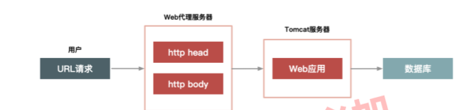
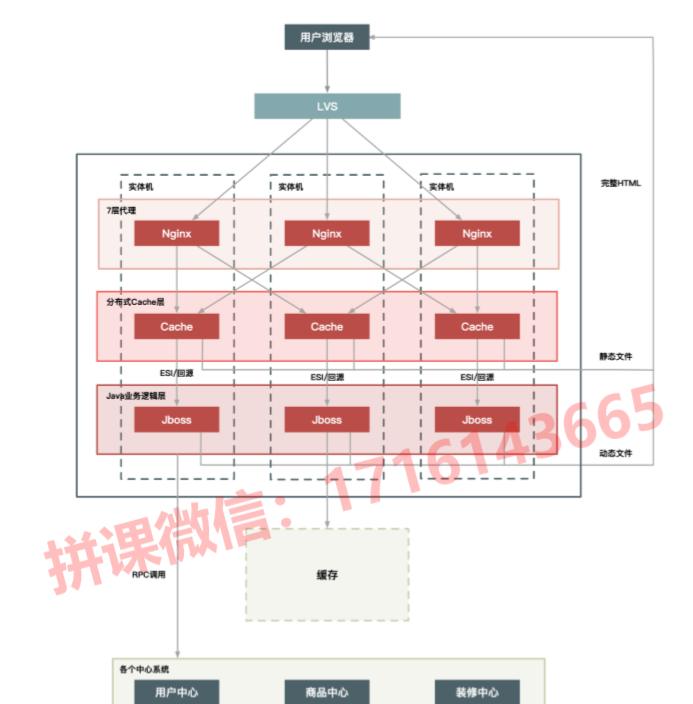
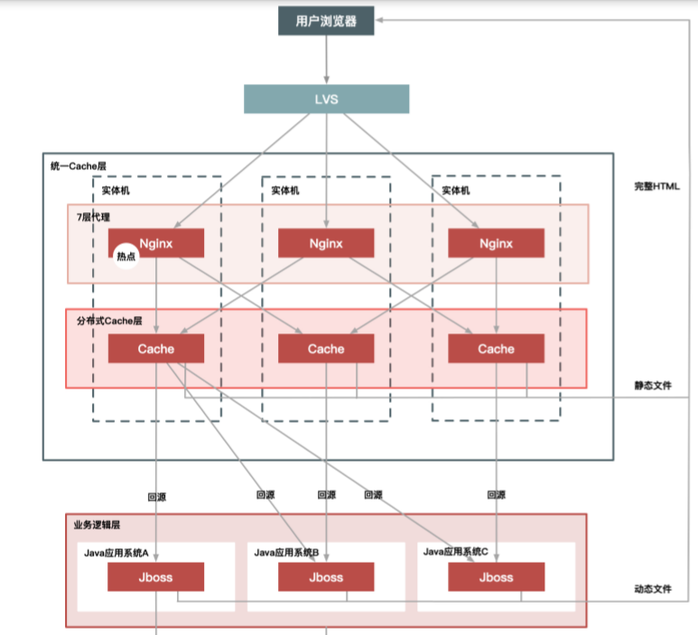
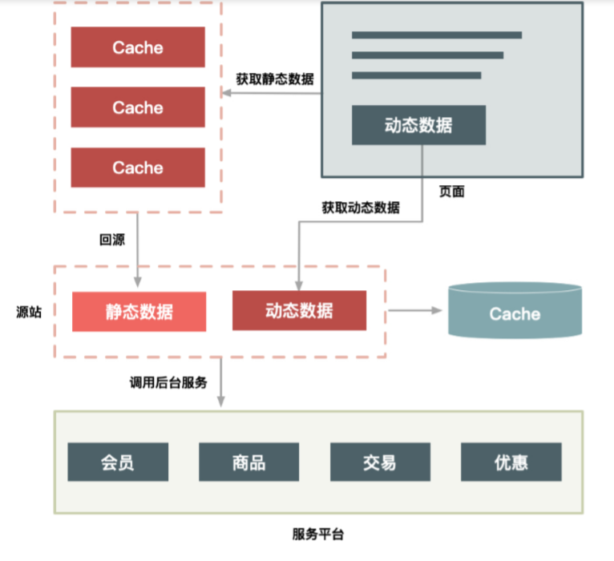
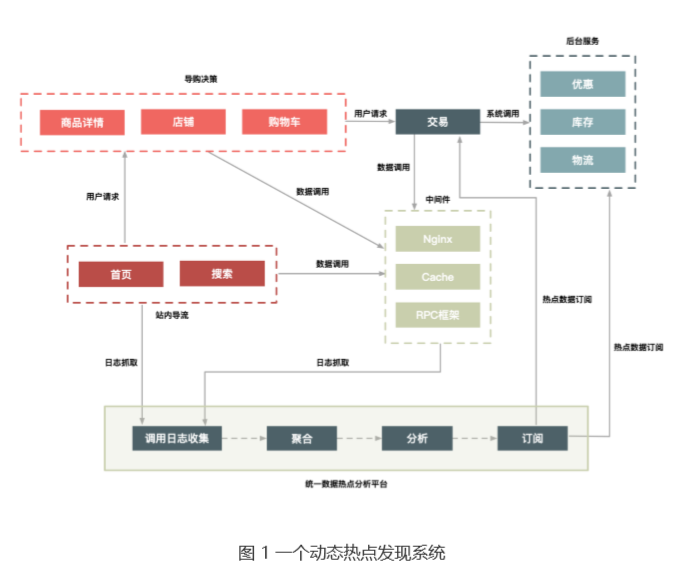
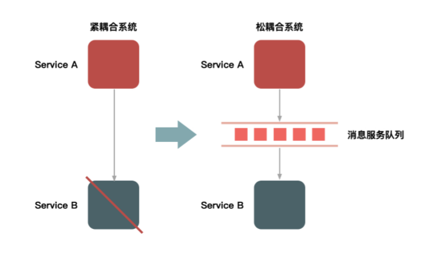
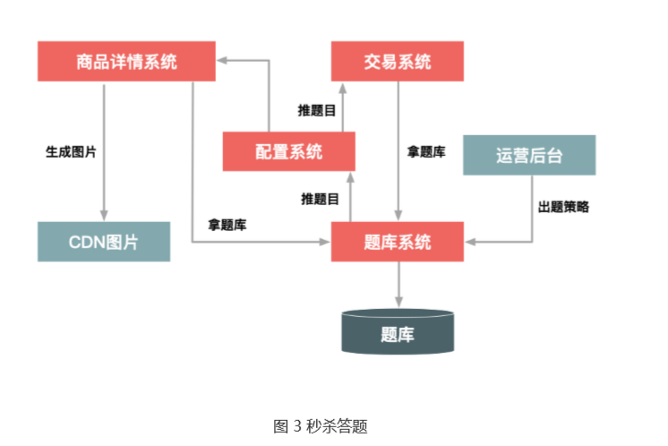
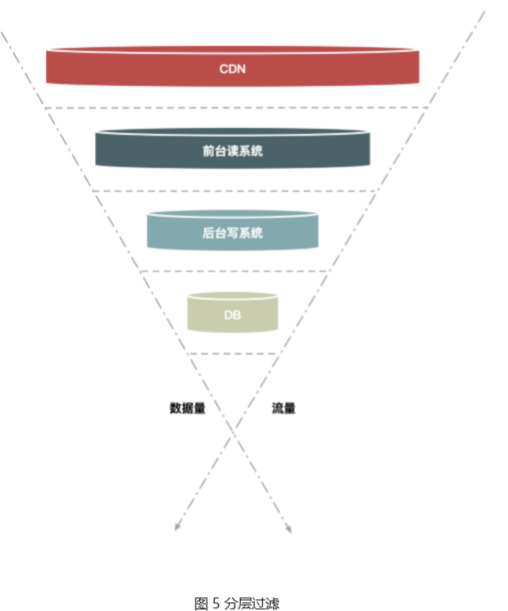
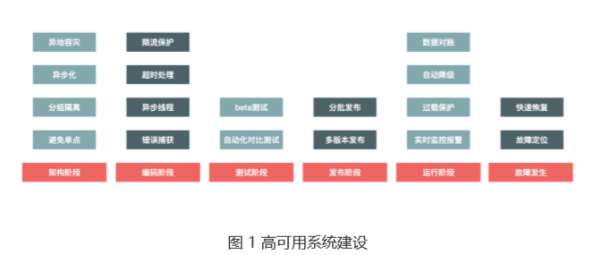
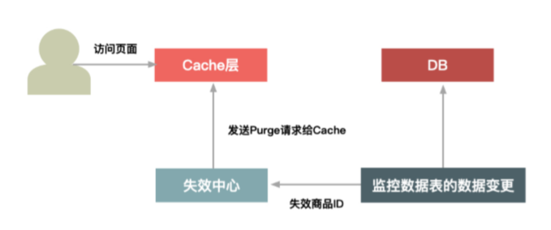

秒杀系统
===
### 秒杀系统架构设计主要有哪些关键点
秒杀系统主要解决两个问题：1. 并发读 2.并发写
**并发读**：核心优化理念是尽量减少用户到服务端来读数据，或者让他们读更少的数据；
**并发写**：他要求我们在数据库层面独立出来一个库，做特殊的处理。
另外还需要对秒杀系统做一些处理，针对意外情况做兜底方案。

**秒杀的整体架构可以概括为"稳，准，快"**
稳：架构要满足高可用性，流量符合预期肯定要稳定，就是超出预期也不能掉链子。
准：保证数据的一致性。库存一致
快：高性能，性能要足够高，能支持大流量，在整个请求链路上都要做到协同的优化。

具体来讲：
**高性能：** 秒杀设计大量的并发读和并发写，因此支持高并发访问很关键。--动静分离方案，热点的发现渔歌哩，请求的削峰和分层过滤，服务端的优化。
**一致性：** 秒杀中商品减库存的实现方式极其关键，有限商品在瞬间多个减库存请求，同时减库存又分为，下单减库存，付款减库存等...在大并发更新过程中都要保证数据的一致性。
**高可用性：**  难免有意外情况出现，设计planB兜底方案。
### 如何才能做好动静分离？有哪些方案可选
如何做到高性能？抽象来讲就是两点：1. 提高单次请求的效率。2. 减少没必要的请求。
秒杀系统只需要点击"刷新"或类似button就可以完成秒杀，这里的本质变化就是动静分离。客户端大幅减少请求的数据量。
即-动静分离：所谓动静分离，就是把用户请求的数据划分为动态数据和静态数据。简单地说，**动态数据和静态数据的主要区别就是看页面中输出的数据是否和URL、浏览者、时间、地域相关、以及是否含有Cookie等私密数据。**
例如：
1. 文章的内容不论是什么用户访问，他都是一样的，所以这是一个典型的静态数据，但它是一个动态页面。
2. 如果访问的是淘宝首页，每个人看到的页面可能都是不一样的，首页中包含了很多访问者的特征信息，而这些个性化数据就可以理解为动态数据。

==数据所谓的动态还是静态，取决于数据中是否含有和访问者相关的个性化信息。==

**如何对静态数据缓存：**
1. 应该把静态数据缓存到离用户最近的地方：常见的就是三种，用户浏览器，CDN，服务端Cache中。
2. 静态化改造就是要直接缓存HTTP连接。相较于普通的数据缓存，静态化改造是直接缓存HTTP连接而不仅仅是数据,这样甚至不用重新组装HTTP协议，请求头都不用解析。
3. 不同语言习得cache软件处理缓存数据的效率各不相同。Java系统本身不擅长大量连接请求，消耗内存过多，servlet容器解析HTTP较慢。不在Java层做缓存，而是直接在web服务器层上做，可以屏蔽Java语言的弱点，例如你滚下，apache更适合大并发的静态文件请求。
   
**如何做动静分离的改造**
以JD/TB为例，页面中有哪些动静数据
1. URL唯一化。商品系统天然的就可以做到URL唯一化，比如每个商品都用ID来表示。这样就可以缓存整个HTTP连接，以URL作为key。
2. 分离浏览者相关的因素。包括是否已登录，登录身份等，这些信息拆分出来动态请求。
3. 分离时间因素。服务端输出的时间也通过动态请求获取。
4. 异步化地域因素。详情页面上与低于相关的因素做成异步方式获取。
5. 去掉Cookie。缓存的静态页面中不含有cookie。

**动态内容方案**
1. ESI方案：在web代理服务器上做动态内容请求，并将请求插入到静态页面中，当用户拿到页面时就是一个完整页面。**这种方式用户体验好，但是对服务端有压力**
2. CSI方案：单独发起一个JS请求，以向服务端获取动态内容，这种方式服务端性能更加，但是用户端页面可能会延迟，体验差。

**动静分离的架构方案**
1. 实体单机部署
   将虚拟机改为实体机，增大cahche的容量，并且采用一致性hash分组方式来提升命中率。==这里的问题就是一致性哈希的问题，数据倾斜，导致chache被击穿==
   nginx+cache+java部署
   
   **优点：**
   - 没有网络瓶颈，而且能使用大内存
   - 能提升命中率和减少Gzip压缩
   - 减少cache失效压力，因为采用定时失效方式。例如只缓存3s，国企自动失效。
   单个Java进程很难用完整个实体机的CPU，一定程度上造成了CPU浪费。另外就是一个实体机上部署了Java应用又作为cache来使用，造成运维上的搞复杂度。
2. 统一cache层
   将单机的cache统一分离出来，形成一个单独的cache集群。    
   
  **优点：**
  - 减少运维成本，方便接入其他静态化系统
  - 减少多个应用接入时使用cache的成本。各自应用只需要维护自身，不用关心cache
  - 便于维护，方便后期的加强监控，配置的自动化等
  - 可以共享内存，最大化利用内存，不同系统之间的内存可以动态切换。
  **缺点：**
  - chcae层内u不交换网络成为瓶颈
  - 缓存服务器的网卡也会是瓶颈
  - 极其少风险较大，挂掉一台就会影响很大一部分缓存数据。
  
  解决以上问题...做缓存备份。
3. CDN
   离用户更近，效果更好。
   有以下几个问题需要解决：
   - **失效问题**。静态数据并不是永远不变，而是相对不变，会有失效时间。我们需要保证CDN可以在秒级时间内，让分布在全国各地的cache同时失效，这对CDN的失效系统要求很高。
   - **命中率**：cache很重要的衡量指标就是高命中率。如果将数据放到全国的CDN上，必然导致cache分散，导致命中可能性降低。
   - **发布更新**。如果业务系统经常需要发布，那么发布系统必须足够简洁高效，还要考虑有问题时快速回滚和排查问题的简便性。   
  
  ==选择 CDN 的二级 Cache 比较合适==，因为二级 Cache 数量偏少，容量 也更大，让用户的请求先回源的 CDN 的二级 Cache 中，如果没命中再回源站获取数据， 部署方式如下图所示：
 
**使用 CDN 的二级 Cache 作为缓存，可以达到和当前服务端静态化 Cache 类似的命中率， 因为节点数不多，Cache 不是很分散，访问量也比较集中，这样也就解决了命中率问题， 同时能够给用户最好的访问体验，是当前比较理想的一种 CDN 化方案。**
除此之外，CDN 化部署方案还有以下几个特点：
1. 把整个页面缓存在用户浏览器中； 
2. 如果强制刷新整个页面，也会请求 CDN；
3. 实际有效请求，只是用户对“秒杀”按钮的点击。

**备注**
**存储在浏览器或 CDN 上，有多大区别？**
区别很大！因为在 CDN 上，我们可以做主动失效，而在用户的浏览器里就更不可控，如果用户不主动刷新的 话，你很难主动地把消息推送给用户的浏览器。
**在什么地方把静态数据和动态数据合并并渲染出一个完整的页面也很关键。**
假如在用户的浏览器里合并，那么服务端可以减少渲染整个页面的 CPU 消耗。
如果在服务端合并的话，就要考虑缓存的数据是否进行 Gzip 压缩了：如果缓存 Gzip 压缩后的静态数据可以减少缓存的数据量，但是进行页面合并渲染时就要先解压，然后再压缩完整的页面数据输出给用户；如果缓存未压缩的静态数据，这样不用解压静态数据，但是会增加缓存容量。
### 有针对性地处理好系统的“热点数据”
**为什么要关注热点数据？**
1. 热点数据会占用大量服务器处理资源，虽然热点数据只占据总请求的亿分之一，但可能会抢占90%的资源，如果这个请求时无用的，那就是完全在浪费服务器。
2. 其次，即使这些热点请求是有效的，我们嫩也要针对性优化。

**什么是热点**
**热点操作：** 例如大量刷新页面，大量的添加购物车等。对于系统来说这些操作可以抽象为，读请求和写请求。但是这两种热点请求的处理方式却不一样。
**热点数据：** 用户的热点请求对应的数据---**分为热点静态数据和热点动态数据**
- 热点静态数据：能够提前预测的热点数据。例如可以通过卖家报名提前筛选出来，通过报名系统对这些热点商品进行打标。
- 热点动态数据：无法提前预测...例如微博热搜

**如何发现热点数据**
1. 发现热点静态数据：通过报名达标，或大数据预测方式，提前得知热点数据。实时性较差
2. 发现热点动态数据：
   - 构建一个**异步的系统**，它可以收集交易链路上各个环节中的中间件产品的热点key(例如nginx，缓存，rpc等中间件)
   - 建立一个热点上报和可以按照需求订阅的热点服务下发规范，目的是通过交易链路上各个系统访问的是检查，把上游发现的热点传递给下游做好交易保护。例如对于大促高峰期，详情系统是最早知道的，统一接入层上nginx模块统计的热点url。
   - 将上游系统收集的热点数据发送到热点服务台，然后下游系统就知道热点数据是啥。。做热点保护

主要是依赖前面的导购 页面（包括首页、搜索页面、商品详情、购物车等）提前识别哪些商品的访问量高，通过这 些系统中的中间件来收集热点数据，并记录到日志中
    
通过部署在每台机器上的 Agent 把日志汇总到聚合和分析集群中，然后把符合一定规则的热点数据，通过订阅分发系统再推送到相应的系统中。你可以是把热点数据填充到 Cache 中，或者直接推送到应用服务器的内存中，还可以对这些数据进行拦截，总之下游 系统可以订阅这些数据，然后根据自己的需求决定如何处理这些数据。
**注意事项：**
1. 异步，方便保证通用性，又不影响中间件自身业务
2. 中间件做好自身热点保护
3. 实时性要高，否则无意义

**如何处理热点数据？**
1. 优化
   最简单的办法，缓存热点数据，如果热点数据做了动静分离，那么可以长期缓存静态数据，采用LRU淘汰策略。

2. 限制
   保护机制。例如对被访问商品的请求id做一致性hash，每个hash桶设置一个处理队列，这样可以把热点商品的请求限制在一个队列里。
3. 隔离
   **秒杀系统的第一个原则就是将热点数据隔离出来，不要让1%的请求影响到另外99%的业务。--单独部署服务器呗**

**具体到“秒杀”业务，我们可以在以下几个层次实现隔离**。
1. **业务隔离**。把秒杀做成一种营销活动，卖家要参加秒杀这种营销活动需要单独报名，从 技术上来说，卖家报名后对我们来说就有了已知热点，因此可以提前做好预热。
2. **系统隔离**。系统隔离更多的是运行时的隔离，可以通过分组部署的方式和另外 99% 分 开。秒杀可以申请单独的域名，目的也是让请求落到不同的集群中。 
3.  **数据隔离**。秒杀所调用的数据大部分都是热点数据，比如会启用单独的 Cache 集群或者 MySQL 数据库来放热点数据，目的也是不想 0.01% 的数据有机会影响 99.99% 数据。

**备注：**
==例如微博==：微博的内容基本是静态数据，发了就不能修改，所以cache应该没问题，而微博的热点比较明显， 所以发现热点和对热点数据进行针对性的优化比较重要。至于要怎么进行优化还要看看微博的数据结构是怎么设计的，微博内容和评论的关系已经发微博 的人和关注的人关系等

### 流量削峰该怎么做？

**为什么要削峰**？
服务器的处理资源是恒定的，你用或者不用它的处理能力都是一样的，所以出现峰值的话，很容易导致忙到处理不过来，闲的时候却又没有什么要处理。**但是由于要保证服务质量，我们的很多处理资源只能按照忙的时候来预估，而这会导致资源的一个浪费。**
削峰，1. 可以让服务端处理变得更加平稳。2.可以节省服务器的资源成本。
针对秒杀这一场景， 削峰从本质上来说就是更多地延缓用户请求的发出，以便减少和过滤掉一些无效请求，它遵 从“请求数要尽量少”的原则。
**流量削峰的一些无损操作**
1. 排队
   最容易的解决方案就是消息队列来缓冲瞬时流量，把同步的直接调用转换成异步的间接推送，中间通过一个队列在一段承接瞬时的流量洪峰，在另一端平滑的消息推送出去。
       
 如果流量峰值持续一段时间**达到了消息队列的处理上限**，例如本机的消息积压达到了 存储空间的上限，**消息队列同样也会被压垮**，这样虽然保护了下游的系统，但是和直接把请求丢弃也没多大的区别.

 除了消息队列，类似的排队方式还有很多：
 - 利用线程池加锁等待方式
 - 先进先出，先进后出等常用内存排队算法
 - 把请求序列化到文件中，在顺序的读文件来恢复请求等方式(例如基于mysql binlog同步机制)
2. 答题--类似验证码
   - 防作弊
   - 延缓请求。原先几毫秒的请求，延缓到2-10S
  秒杀答题的逻辑：
  - 题库生成模块。生成问题和答案
  - 题库模块推送。 题目**提前**推送给详情系统和交易系统
  - 题库的图片生成模块。把题目生成图片格式，并且加上干扰因素。--**题目图片提前布置在CDN上**
3. 分层过滤
   前面两种方式要么是少发请求，要么是缓冲请求。这种方式时过滤无效请求。
          
假如请求分别经过CDN、前台读系统（如商品详情系统）、后台系统（如交易系统）和数据库这几层：
- 大部分数据和流量，在用户浏览器或CDN上获取，这一层可以拦截大部分数据的读取；
- 经过第二层（即前台系统）时数据（包括强一致性的数据）尽量得走Cache，过滤一些 无效的请求；
- 再到第三层后台系统，主要做数据的二次检验，对系统做好保护和限流，这样数据量和请 求就进一步减少；
- 最后在数据层完成数据的强一致性校验

分层过滤的核心思想是：**在不同的层次尽可能地过滤掉无效请求，让“漏斗”最末端的才是 有效请求**。而要达到这种效果，我们就必须对数据做分层的校验。
**分层校验的基本原则**：
1. 将动态请求的读数据缓存（Cache）在 Web 端，过滤掉无效的数据读； 
2. 对读数据不做强一致性校验，减少因为一致性校验产生瓶颈的问题； 
3. 对写数据进行基于时间的合理分片，过滤掉过期的失效请求； 
4. 对写请求做限流保护，将超出系统承载能力的请求过滤掉； 
5. 对写数据进行强一致性校验，只保留最后有效的数据

**分层校验的目的是**：
**在读系统中**，尽量减少由于一致性校验带来的系统瓶颈，但是==尽量将不影响性能的检查条件提前==，如用户是否具有秒杀资格、商品状态是否正常、用户答题是否正确、秒杀是否已经结束、是否非法请求、营销等价物是否充足等；
在**写数据系统中**，主要对写的数据（如“库存”）做一致性检查，最后在数据库层保证数据的最终准确性（如“库存”不能减为负数）。

### **影响性能的因素有哪些？又该如何提高系统的性能**
**影响性能的因素？**
就服务器而言，性能会出现瓶颈的地方有很多，例如 CPU、内存、磁盘以及网络等都可能会导 致瓶颈。此外，不同的系统对瓶颈的关注度也不一样，例如对缓存系统而言，制约它的是内存，而对存储型系统来说 I/O 更容易是瓶颈。
**如何优化系统？**
1. 减少编码
   Java的编码运行比较慢。那么如何才能减少编码呢？**例如，网页输出是可以直接进行流输出的，即用 resp.getOutputStream() 函数写数据，把一些静态的数据提前转化成字节，等到真正往外写的时候再直接用 OutputStream() 函数写，就可以减少静态数据的编码转换。**
2. 减少序列化
   序列化也是 Java 性能的一大天敌，减少 Java 中的序列化操作也能大大提升性能。又因为 序列化往往是和编码同时发生的，所以减少序列化也就减少了编码。
   **序列化大部分是在 RPC 中发生的，因此避免或者减少 RPC 就可以减少序列化**，当然当前的序列化协议也已经做了很多优化来提升性能。有一种新的方案，就是可以将多个关联性比 较强的应用进行“合并部署”，而减少不同应用之间的 RPC 也可以减少序列化的消耗。
3. Java极致优化
   Java 和通用的 Web 服务器相比，在处理大并发的 HTTP 请求时要弱一点，所以一般都会对大流量的 Web 系统做静态化改造，让大部分请求和数据直接在 Nginx 服务器上直接返回 （这样可以减少数据的序列化与反序列化），而 Java 层只需处理少量数据的动态请求。
   针对这些请求，我们可以使用以下手段进行优化：
   - 直接使用Servlet 处理请求。避免使用传统的 MVC 框架，这样可以绕过一大堆复杂且用 处不大的处理逻辑。
   - 直接输出流数据。使用 resp.getOutputStream() 而不是 resp.getWriter() 函数，可以省掉一些不变字符数据的编码，从而提升性能；
   - 数据输出时推荐使用 JSON 而不是模板引擎（一般都是解释执行）来输出页面。
4. 并发读优化
   **采用应用层的 LocalCache，即在秒杀系统的单机上缓存商品相关的数据。**
   那么，又如何缓存（Cache）数据呢？
   你需要划分成动态数据和静态数据分别进行处理：
   - 像商品中的“标题”和“描述”这些本身不变的数据，会在秒杀开始之前全量推送到秒杀 机器上，并一直缓存到秒杀结束；
   - 像库存这类动态数据，会采用“被动失效”的方式缓存一定时间（一般是数秒），失效后 再去缓存拉取最新的数据。 
==**你可能还会有疑问：像库存这种频繁更新的数据，一旦数据不一致，会不会导致超卖？**==
这就要用到前面介绍的读数据的分层校验原则了，**读的场景可以允许一定的脏数据**，因为这 里的误判只会导致少量原本无库存的下单请求被误认为有库存，**可以等到真正写数据时再保 证最终的一致性**，通过在数据的高可用性和一致性之间的平衡，来解决高并发的数据读取问题.
### 减库存设计的核心逻辑
**减库存有哪几种方式：**
1. 下单减库存：当下单后，在商品的总库存中减去买家的购买数量。下单减库存是最简单的方式，下单时直接通过数据库的十五机制控制商品库存，这样一定不会出现超卖。**但是有些人下完单可能不会付款**
2. 付款减库存：买家下单后不立即减库存，而是等有用户付款之后才真正减库存,否则库存一直保留给其他买家。**因为付款才减库存，如果并发比较高，可能出现下单后付不了款的问题**
3. 预扣库存。买家下单后，库存为其保留一定的时间，超过这个时间库存会自动释放，释放后其他买家就可以继续购买。买家付款前，系统会校验该订单的库存是否还有保留：如果没有保留，则再次尝试预扣；如果库存不足，则不允许付款；如果预扣成功，则完成付款并实际的减库存。
**减库存可能存在问题**
1. 下单减库存方式：恶意下单。
2. 付款减库存：库存超卖，如有 100 件商品，就可能出现 300 人下单成功的情况，因为下单时不会减库存，所以也 就可能出现下单成功数远远超过真正库存数的情况。
3. 预扣库存。这种方案确实可以在一定程度上缓解上面的问题，！针对 恶意下单这种情况，虽然把有效的付款时间设置为 10 分钟，但是恶意买家完全可以在 10 分钟后再次下单，或者采用一次下单很多件的方式把库存减完。针对这种情况，解决办法还 是要结合安全和反作弊的措施来制止。
   - 给经常下单不付款的买家进行识别打标
   - 给某些类目设置最大购买件数
   - 重复下单不付款

**大型秒杀中如何减库存？**
“下单减库存”在数据一致性上，主要就是保证大并发请求时库存数据不能为负数，也就是 要保证数据库中的库存字段值不能为负数.
一般有多种解决方案：
- 一种是在应用程序中通过事务来判断，即保证减后库存不能为负数，否则就回滚；
- 一种办法是直接设置数据库的字段数据为无符号整数，这样减后库存字段值小于零时会直接执行 SQL 语句来报错；
- 有一种就是使用 CASE WHEN 判断语句，例如这样的 SQL 语句：
```sql
UPDATE item SET inventory = CASE WHEN inventory >= xxx THEN inventory-xxx ELSE inventory END
```

**秒杀库存的极致优化**
在交易环节中，“库存”是个关键数据，也是个热点数据，因为交易的各个环节中都可能涉 及对库存的查询。秒杀中并不需要对库存有精确的一致性读，**把库存数据放到缓存（Cache）中，可以大大提升读性能。大并发读问题，可以采用 LocalCache（即在秒杀系统的单机上缓存商品相关的数据）** 和对数据进行分层过滤的方式，但是像减库存这种大并发写无论如何还是避免不了。

**能否把秒杀商品减库存直接放到缓存系统中实现，也就 是直接在缓存中减库存或者在一个带有持久化功能的缓存系统（如 Redis）中完成呢?**
如果秒杀商品的减库存逻辑非常单一，比如没有复杂的SKU库存和总库存这种联动关系的话，我觉得完全可以。但是如果有比较复杂的减库存逻辑，或者需要使用事务，你还是必须在数据库中完成减库存。

MySQL 存储数据的特点，**同一数据在数据库里肯定是一行存储（MySQL），因此会 有大量线程来竞争 InnoDB 行锁，而并发度越高时等待线程会越多**，TPS（Transaction
Per Second，即每秒处理的消息数）会下降，响应时间（RT）会上升，数据库的吞吐量就 会严重受影响。
这就可能引发一个问题，**单个热点商品会影响整个数据库的性能**， 导致 0.01% 的商品 影响 99.99% 的商品的售卖.一个解决思路是隔离，**把热点商品放到单独的热点库中**。但是这无疑会带来维护上的麻烦，比如要做热点数据的动态迁移以及单独的数据库等。
==**但是分离热点商品到单独的数据库还是没有解决并发所的问题**==：
1. 应用层排队：。按照商品维度设置队列顺序执行，这样能减少同一台机器对数据库同一行 记录进行操作的并发度，同时也能控制单个商品占用数据库连接的数量，防止热点商品占 用太多的数据库连接。
2. 数据库层做排队：应用层只能做到单机的排队，但是应用机器数本身很多，这种排队方式 控制并发的能力仍然有限，所以如果能在数据库层做全局排队是最理想的。阿里的数据库 团队开发了针对这种 MySQL 的 InnoDB 层上的补丁程序（patch），可以在数据库层上 对单行记录做到并发排队。

### 设计兜底方案
**高可用建设**

1. **架构阶段**：架构阶段主要考虑系统的可扩展性和容错性，要避免系统出现单点问题。例 如多机房单元化部署，即使某个城市的某个机房出现整体故障，仍然不会影响整体网站 的运转。 
2. **编码阶段**：编码最重要的是保证代码的健壮性，例如涉及远程调用问题时，要设置合理 的超时退出机制，防止被其他系统拖垮，也要对调用的返回结果集有预期，防止返回的 结果超出程序处理范围，最常见的做法就是对错误异常进行捕获，对无法预料的错误要 有默认处理结果。 
3. **测试阶段**：测试主要是保证测试用例的覆盖度，保证最坏情况发生时，我们也有相应的 处理流程。 
4. **发布阶段**：发布时也有一些地方需要注意，因为发布时最容易出现错误，因此要有紧急 的回滚机制。  
5. **运行阶段**：运行时是系统的常态，系统大部分时间都会处于运行态，运行态最重要的是 对系统的监控要准确及时，发现问题能够准确报警并且报警数据要准确详细，以便于排
查问题。 
6. **故障发生**：故障发生时首先最重要的就是及时止损，例如由于程序问题导致商品价格错 误，那就要及时下架商品或者关闭购买链接，防止造成重大资产损失。然后就是要能够 及时恢复服务，并定位原因解决问题。

**针对秒杀系统，我们重点介绍在遇到大流量时，应该从哪些方面来保障系统的稳定运 行，所以更多的是看如何针对运行阶段进行处理，这就引出了接下来的内容：降级、限流和 拒绝服务。**
**降级：**
当系统的容量达到一定程度时，限制或关闭系统的某些非核心功能，从而把有限的资源保留给更多的核心业务。所以降级的核心目标是牺牲次要的功能和用户体验来保证核心业务流程的稳 定，是一个不得已而为之的举措。
**限流**：
降级时牺牲了一部分次要功能和用户的体验效果，限流就是更极端的一种保护措施。限流就是当系统容量达到瓶颈时，我们需要通过限制一部分流量来保护系统。总体来说，限流既可以是在客户端限流，也可以是 在服务端限流。此外，限流的实现方式既要支持 URL 以及方法级别的限流，也要支持基于 QPS 和线程的限流。
- **客户端限流：**
好处是可以限制请求的发出，通过减少发出无用请求从而减少对系统的消耗。
缺点就是当客户端比较分散时，没法设置合理的限流阈值：如果阈值设的太小，会导致服务端没有达到瓶颈时客户端就已经被限制；如果设置太大，起不到限制作用。
- **服务端限流：** 
好处是可以根据服务端的性能设置合理的阈值，
缺点是被限制的请求都是无效请求，处理无效请求也会耗费服务器资源。
**拒绝服务：**
如哦限流还无法解决问题，直接拒绝服务。当系统负载达到一定阈值，，系统直接拒绝所有请求。例如，在最前端的 Nginx 上设置过载保护，当机器负载达到某个值时直接拒绝 HTTP 请求并返回 503 错误码，在 Java 层同样也可以设计过载保护。

### 缓存失效的策略应该怎么定
Cache 的地方就必然存在失效问题。为啥要失效？因为要保证数据的一致性。所以要用到 Cache 必然会问如何保证 Cache 和 DB 的数据一致性，如果 Cache 有分组的话，还要保证一个分组中多个实例之间数据的一致性，就像保证 MySQL 的主从一致一样。
**被动失效：** 主要处理如模板变更和一些对时效性不太敏感数据的失效，采用设置一定时间长度（如只缓存 3 秒钟）这种自动失效的方式。当然，你也要开发一个后台管理界面， 以便能够在紧急情况下手工失效某些 Cache。
**主动失效：** 一般有 Cache 失效中心监控数据库表变化发送失效请求、系统发布也需要清 空 Cache 数据等几种场景。其中失效中心承担了主要的失效功能。


