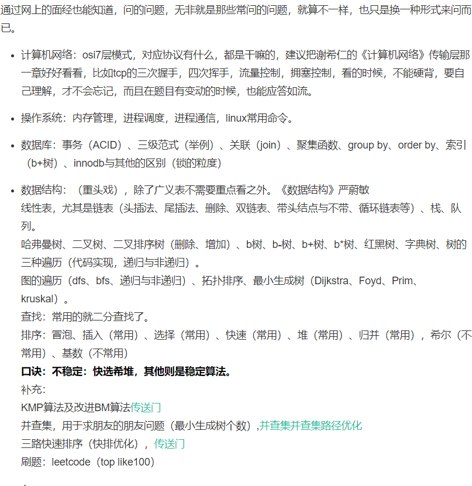
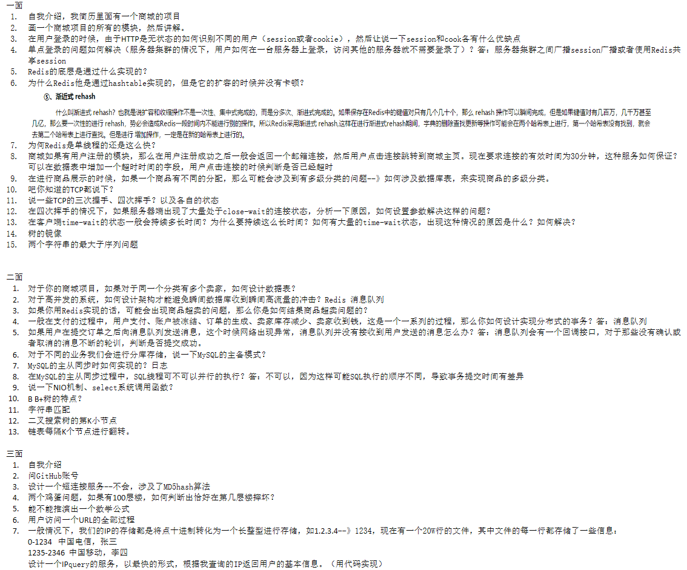
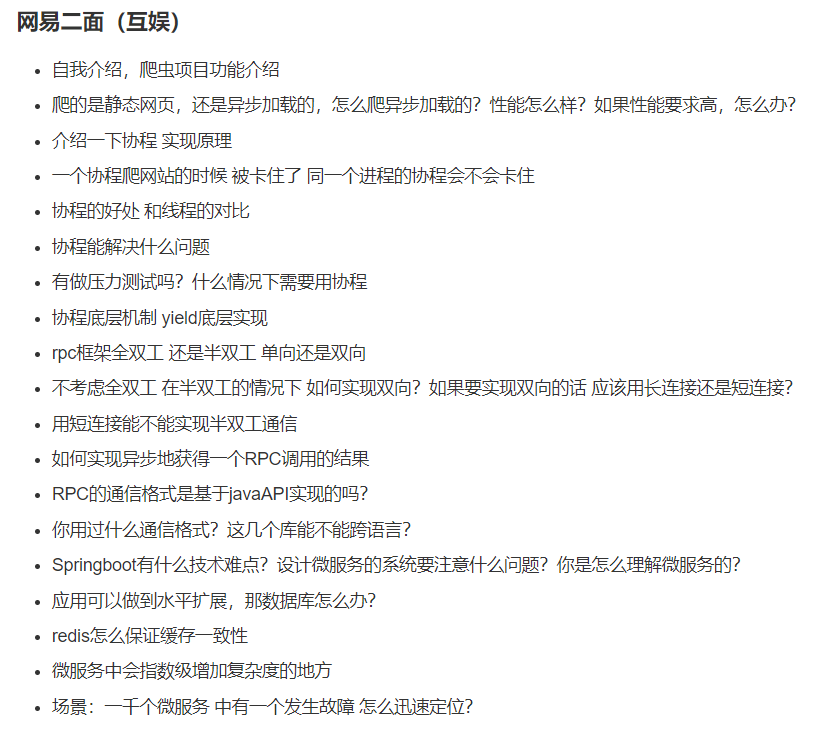
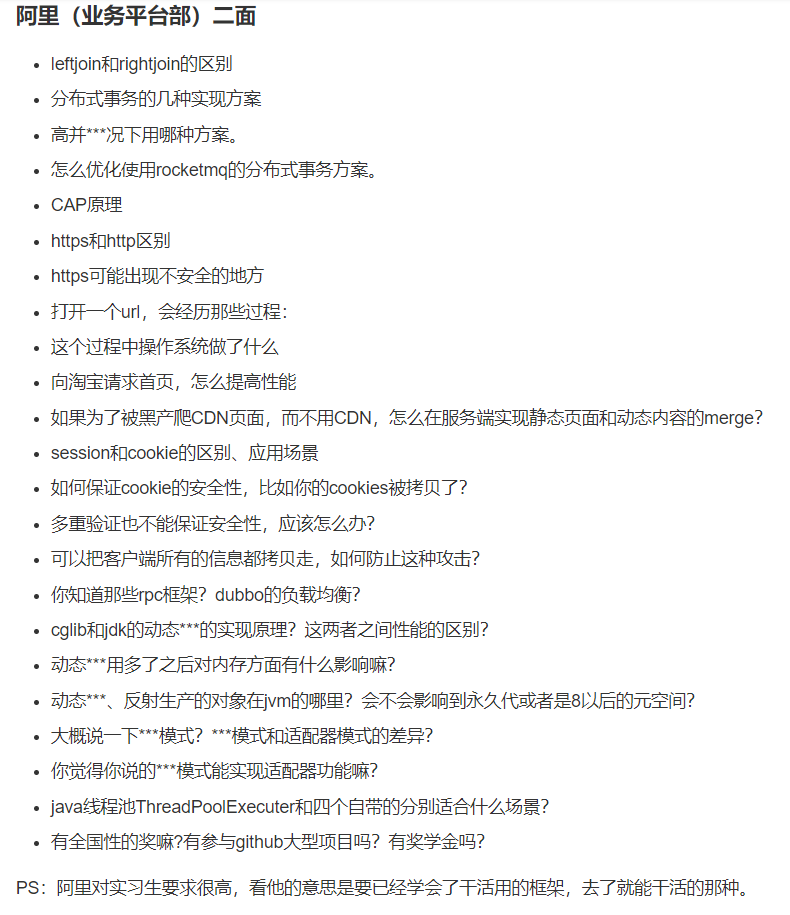
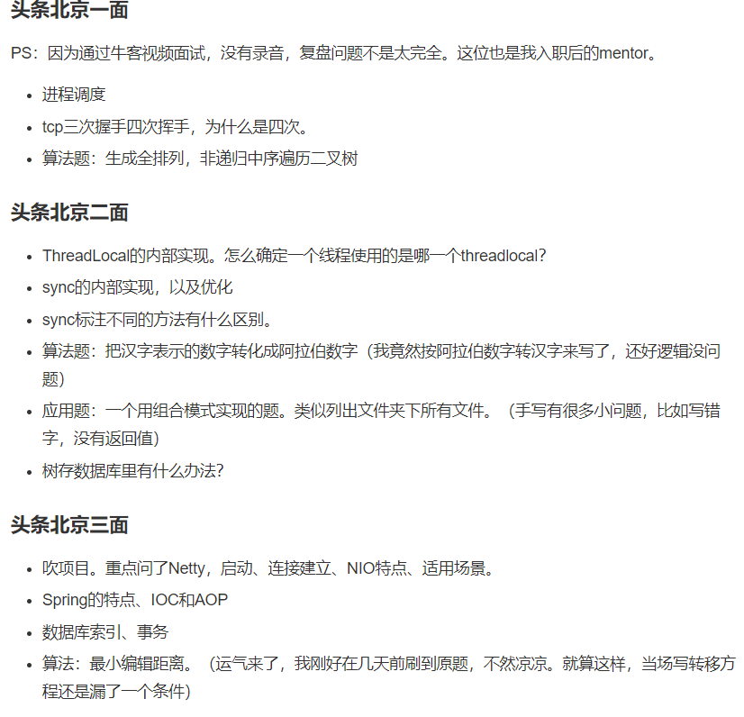
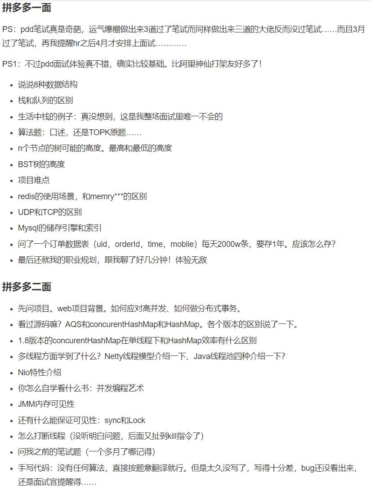

# 2019 春招面经大集合

## [toc]

collabedit 写代码

## **1.算法**

- 以 O(1)时间复杂度取得最小值的栈，要求有 pop push getMin 方法
- 反转数组（代码）
- 排序的时间复杂度，空间复杂度，稳定性
- 排序的原理（快排，归并，堆）
- 散列，冲突处理方法
- 实现 LRU 算法/FIFO--[LinkedHashMap](\Container/LinkedHashMap.md#%e5%88%a9%e7%94%a8linkedhashmap%e5%ae%9e%e7%8e%b0lru%e7%bc%93%e5%ad%98)
- topk 问题思路(堆，几个 top 就扔几个进堆)
- 查找手写
- 爬虫生成的 8G 的 URL 文件，只有 1G 的内存，如何查找出重复的 URL(分布式 Hash-->一致性哈希)--==**布隆过滤器**==
- 四则运算（提示使用栈）
- 判断链表是否有环？单指针方法--判断环的入口-->==相交数组的成环问题==
- 第一题，遍历 list，并删除指定元素，（想考我 foreach 的坑，但是我没接招，使用迭代器完成，fail-fast）
- 手写死锁
- 实现优先队列


## **2.网络：**

- HTTP 方法/协议状态码---`HTTP幂等性及GET、POST(非幂等)、PUT(幂等)、DELETE的区别和有无幂等性`---`HTTP缓存机制`---`既然说 HTTP 是无状态的，那服务器怎么记住上次请求的用户`---`http 安全问题`---`https 如何实现`
- [restful](https://www.zhihu.com/question/28557115)
- [TCP 协议的 TIME_WAIT 状态详解](https://blog.51cto.com/11859650/1917938)
- 三次握手，四次挥手/tcp 和 udp 的区别
- TCP 协议拥塞--网络层的滑动窗口协议---TCP/IP 的五层协议模型和 OSI 的七层协议模型了解么？简单说一下，TCP 协议在哪一层？
- [DNS 实现的机制](https://juejin.im/post/5b0a32a36fb9a07ab979f0b4)
- [TCP 怎么保证可靠传输](https://zhuanlan.zhihu.com/p/104929583)

## **3.Java 基础**

- 集合类遍历时是否可以修改（不可以，fail-fast）---`如果我非要修改呢（CopyonWriteArrayList可以在遍历的时候修改）`[https://blog.csdn.net/sinat_35821285/article/details/80226019]
- ArrayList 和 LinkedList 的区别
- 如何实现 hashmap 的只读不可写，不采用其他工具--[https://blog.csdn.net/codejas/article/details/78688925]
- this 关键字--super 与 this 异同[https://www.nowcoder.com/discuss/179581]
- [main 方法中 String[] args 为什么要使用 String？main 方法的返回值为什么是 void](https://blog.csdn.net/qq_39525442/article/details/89343343)？
- int,double,float 长度（其实等于 java 为什么跨平台）
- [四类八种基础数据类型及其包装类](https://zhuanlan.zhihu.com/p/25439066)，装箱拆箱--从反编译得到的字节码内容可以看出，在装箱的时候自动调用的是 Integer 的 valueOf(int)方法。而在拆箱的时候自动调用的是 Integer 的 intValue 方法。
- object 的方法
- Java Collection-容器---`容器的一个接口路线，从iterator往下，两个，一个map,一个Collection，map下面的hashmap，treemap,Collection下面的list,Set。list下面的ArrayList和LinkedList,Set下面的hashSet和TreeSet等，之后再吹了一下迭代器的快速失败和安全失败`
- 异常你了解吗？有哪些
- 面向对象三大特征---`介绍多态`-**所谓多态就是指程序中定义的引用变量所指向的具体类型和通过该引用变量发出的方法调用在编程时并不确定，而是在程序运行期间才确定，即一个引用变量倒底会指向哪个类的实例对象，该引用变量发出的方法调用到底是哪个类中实现的方法，必须在由程序运行期间才能决定。因为在程序运行时才确定具体的类，这样，不用修改源程序代码，就可以让引用变量绑定到各种不同的类实现上，从而导致该引用调用的具体方法随之改变，即不修改程序代码就可以改变程序运行时所绑定的具体代码，让程序可以选择多个运行状态，这就是多态性**。
  如果向上转型--子类中父类没有的，不能调用；父类有的(重写方法)会被多态绑定到子类的方法上。

```html
对于多态我们可以总结如下：
指向子类的父类引用由于向上转型了，它只能访问父类中拥有的方法和属性，而对于子类中存在而父类中不存在的方法，该引用是不能使用的，尽管是重载该方法。
若子类重写了父类中的某些方法，在调用该些方法的时候，必定是使用子类中定义的这些方法（动态连接、动态调用）。
对于面向对象，多态分为编译时多态和运行时多态。其中编译时多态是静态的，主要是指方法的重载，它是根据参数列表的不同来区分不同的函数，
通过编译之后会变成两个不同的函数，在运行时谈不上多态。而运行时多态是动态的，它是通过动态绑定来实现的，也就是我们所说的多态性。
```

- [抽象类和接口](https://zhuanlan.zhihu.com/p/56789932)
- Java 中类变量和成员变量，类方法和成员方法
- [treemap 底层数据结构，扩容，插入删除效率](https://www.jianshu.com/p/2dcff3634326)
- ※HashMap 源码级别的原理，rehash 是什么---`Hashmap的缩容，扩容机制`---`位运算的好处`---`hashmap和hashtable区别,模运算比较`---`为什么使用红黑树`
- Java 中的 NIO
- IPC 方式[进程间通信方式](https://www.jianshu.com/p/c1015f5ffa74)
- [请求 servlet 的过程](https://www.jianshu.com/p/746a57e47129)-[servlet的生命周期](https://juejin.im/post/5c160422e51d45453c1cdc30)
- [反射机制](https://www.jianshu.com/p/5110834f669f)
- [注解是什么](https://juejin.im/post/5b45bd715188251b3a1db54f)
- ==StringBuilder 和 StringBuffer//String== [为什么设计成 final 不可变](https://juejin.im/post/5aa1ee0c51882555677e2109)？ 是怎么实现不可变的
- static 用法
- [Java 内部类为什么能够访问外部成员变量](https://www.jianshu.com/p/3132b0641883)--[内部类能否引用外部类的 private 成员](https://www.zhihu.com/question/54730071)（**被private修饰的内部类只能在它所属的外部类中访问**）
- [Java 的继承有什么缺点](https://www.zhihu.com/question/20128211)
- i++线程安全吗
- equals 和 hashcode 为什么要一起重写。一个类，如果重写了 Equals(),不重写 HashCode()，会有什么问题（==重写 hashcode()，主要是针对映射相关的操作（Map 接口，依靠具体值生成 hashcode）==，仅仅重载 equals 方法可能会导致实际业务逻辑失败，确保 equals 相同 hashcode 也相同，即保证相同对象的 hashcode 一定相同） 

### **3.1 并发**

- [详细论述几个并发容器](https://juejin.im/post/5d63c7a96fb9a06b2116f5e0)
- juc---`多线程和JUC熟悉吗，我说了AQS、ReentrantLock、线程池、CountDownLatch、CyclicBarrier，然后问了我AQS是什么`---concurrent 包下有哪些常用的类--- `concurrenthashmap，原理/JDK8 的变化`
- 哪些原子性操作--JUC 下 Atomic（Ladder） 包
- 怎么实现 A、B、C 三个线程轮流打印
- ==什么是线程池？线程池的参数？线程池的工作原理？线程池的种类？任务拒绝策略？==
- 线程数设置多大，如果超过了最大的怎么办，有哪些==拒绝策略==，如果抛出异常怎么处理
- 代码执行单元是？（线程）---是线程还是进程申请资源？（进程）--Java 线程状态
- ==Java 中的线程安全==-`线程实现的方式`---`继承Thread类和实现Runale接口`---`进程和线程的区别`---`sleep和wait区别`---`threadlocal`---`start和run方法的区别，什么方法开启线程`---`进程间通讯的方式(后台开发.pdf)`------`各种线程池的应用场景`---`java的线程和操作系统的线程`---`有时候会采用一种无锁化机制去线程同步，有哪些方案`

### **3.2 JVM 是重点**

- 画一下 Java的内存模型(**Java 内存模型来屏蔽掉各种硬件和操作系统的内存访问差**)
- Java内存区域模型
- 栈和堆
- 四种引用类型
- final 关键字底层原理，为什么做到了不可变。--实际上可以使用反射改变
- [volatile 底层原理](http://xianzilei.cn/blog/60)
- [CPU 总是 100%，怎么定位问题，并且解决](https://juejin.im/post/5c21f381518825438f6bb553)---`CPU 时而 100%，内存经常 100%，怎么定位问题，并且解决`---==linux 常见命令==
- ==详细论述 JVM 的垃圾垃圾回收机制==--`GC算法`---`常见的垃圾回收器及他们之间区别，垃圾回收发生在哪里`---`JVM调优命令`---`新生代老年代大小如何划分`---`怎么避免产生浮动垃圾？`
- gcroot 对象有哪些
- 锁机制极其重要 ---`CAS原理/内存可见性/问题`---`※synchronized 锁静态方法和普通方法区别，volitile 关键字的理解`---`lock和synchronized区别`---`栅栏和闭锁的区别`---`锁类型（尤其自旋锁）`
- ==Java 的内存模型-8 个指令==--`java中变量存储的位置`
- 双亲委派模型 本质/用处
- 有几种类加载器
- Java [内存泄漏如何排查排查](https://juejin.im/post/5d0ae117f265da1bc64bc7d7#heading-0)
- JVM虚拟机启动是单线程的还是单进程的？

## **Java 框架**

- servlet --`生命周期/怎么响应浏览器请求`--`浏览器输入一个地址到看到返回内容中间流程`---`dispatcher流程`--`输入一个url，具体到每一个层`
- ==Spring---IOC/DI/AOP==---`AOP有哪几种实现`---`单实例无状态`
- MVC 是什么-`springmvc里session和cookie/区别/联系？`
- springboot 与 springMVC 有什么区别--- SpringBoot 的自动配置流程
- springMVC 执行过程---SpringMVC 中用到了哪个核心的 Servlet ?
- spring bean 的生命周期---Spring 里面有哪些核心的特性？---Spring 注入的方式有哪些？---Spring 的 scope 里面有哪几个属性？bean 成员变量的参数注入有哪种方式？
- 除了@ResponseBody，controller 层如何标准返回给前端所要的数据类型？
- @Autowired 和@Resource 的区别？
- Spring 事务以及传播机制

## **数据库**

- [怎么优化 mysql，mysql 性能分析工具](https://www.kaimingwan.com/post/shu-ju-ku/mysqlxing-neng-fen-xi-fang-fa-gong-ju-jing-yan-zong-jie)---`mysql的查询优化，用explain查询是否用到了索引`
- jdbc 的使用，什么是 sql 注入 mysql 防注入
- JDBC 连接 mysql 的几个步骤、为什么要加载驱动呢，原理是什么、PreparedStatement 和 Statement 区别、返回结果如何查询
- ==[MySQL 的锁机制](https://juejin.im/post/5b82e0196fb9a019f47d1823#heading-1)==---悲观锁和乐观锁呢？悲观和乐观锁的具体实现原理呢？
- ==Mybatis 底层实现==---`一二级缓存，#和\$的区别`
- MVCC 机制的实现原理
- 数据库的隔离级别
- 数据库范式
- mysql 存储引擎以及适用场景 innodb 和 myisam 的区别？
- ==数据库的索引==---`如何建索引`---`索引失效`---`索引底层实现是什么`-`聚簇索引和非聚簇索引`---`除开使用 B+ 树实现的索引，还了解其他数据结构实现的索引吗？`
- 事务的特性---`什么是事务 事物的几种特性 如何理解 mysql事务隔离级别`---`事务的二段提交`
- 为什么 Mysql 索引要用 B+树不用别的数据结构
- MySQL 外键删除策略
- MySQL 分库分表的方案
- SQL 语句 exist 和 in 的区别
- SQL 语句怎么执行的知道吗，底层原理是什么
- 姓名、科目、成绩，写 sql 语句统计总分前三的学生姓名，如果有并列的怎么办？统计这个班的学生选了哪些科目
- mybatis 俩种传参机制（占位符和拼接）
- 时序数据库与常用的 mysql 有什么区别
- mysql 脏读、幻读、不可重复读
- 组合索引吗？怎么实现的？
- 分页原理--、limit 分页为什么慢，怎么优化
- .mysql cpu 过高怎么排查呀（不会，面试官说可以用 error log 看下）

## **设计模式**

- 简单工厂抽象工厂
- 观察者模

## **分布式**

- 一致性哈希-`服务器挂了，数据会丢失吗`
- 分布式锁？分布式锁如何实现
- 负载均衡的策略
- 分布式环境做线程同步
- 分布式 rpc 调度过程中要注意的问题
- 介绍下 HDFS

## **Linux**

- Linux 的常见命令
- select poll 和 epoll 的区别
- linux 下怎么查看一个端口有没有被占用
- linux 的异常退出状态码

## 以下基本是项目里涉及

- 用过哪些日志框架、日志框架间的比较？
- 道哪些 RPC 的方式？有哪些框架？如果让你设计 RPC 数据交换报文格式你会怎么设计？
- 说一下你对高并发的理解
- 如何理解代码规范（阿里巴巴代码规范）
- tomcat 的配置参数有印象吗？优化方面有了解过吗
- 项目中异步化怎么实现的
- jar 包冲突
- sql 里加锁
- Nginx 负载均衡策略---`nginx 是如何实现反向代理`-----`nginx下面有A，B俩系统，如果访问完A后再访问B，B怎么知道（如何实现无密码登陆）`
- 大数据判重
  只有一台机器，数据是 int 范围，给了 3 个思路，一个是 hash 切分大文件为小文件，对小文件用 hashset 去做判重，还有用 BitSet，单机大概 500mb 内存可以解决，最后一个是用布隆过滤器解决，内存利用更小。 然后问我布隆过滤器的误差怎么解决，我说可以加大 hash 数量或者 hash 的范围，还有可以用多个独立的不同的布隆过滤器来解决。
- 跨站脚本攻击 XSS
- 十亿数量，乱序，怎么快速找到中位数
- 服务器怎么做到高可用？怎么保证稳定性
- 影响服务器接收请求数量的因素有哪些？
- I/O 模型五种详解
- 单点登录?看到两次，不知道是啥
- 项目中秒杀流程
- Ajax 是什么，Ajax 实现原理
- 索引分析，索引失效。
- 微服务理解，如何划分
- 分布式的调用有了解吗（远程服务调用）
- 支付宝到银行的转账业务怎么实现

## **eureka**

- 底层原理 gixn 负载均衡的算法有哪些

## **Redis**

- ※edis 有哪些数据结构
- Redis 基本数据类型，持久化方式
- Redis 缓存一致性---缓存的实现方式---Redis 的缓存淘汰策略有哪些
- redis 怎么保证原子性
- redis 分布式锁
- Redis 的跳表
- Redis 一主多从的实现？如果主服务器挂了怎么办？能锁住吗
- key 的写入和删除的原理
- 怎么保证 Redis 的高可用---redis 怎么处理高并发，几种思路
- 问 Redis 为什么快，我答内存数据库、单线程、IO 多路复用的 epoll
- Redis 过期策略
- Redis 有哪些弊端
- list [如何实现的异步消息队列](https://juejin.im/post/5cee4f59f265da1bb679faef)？

## **RabbitMQ**

- 消息中间件的好处
- rabbitMQ 是怎么保证消息不丢失
- rabbitmq 能避免发送重复数据吗\






## 精华面经

秋招简单介绍![https://www.nowcoder.com/discuss/317888]
快手 java[https://www.nowcoder.com/discuss/179560](快手java)
详细带解析 [https://www.nowcoder.com/discuss/171371]
招银总结![https://www.nowcoder.com/discuss/166431]
详细的阿里腾讯头条啊![https://www.nowcoder.com/discuss/342084]
※面试问题解析![https://www.nowcoder.com/discuss/323173]

## 神奇项目大佬的面试

netty 通信的简易 rpc 调用框架：







